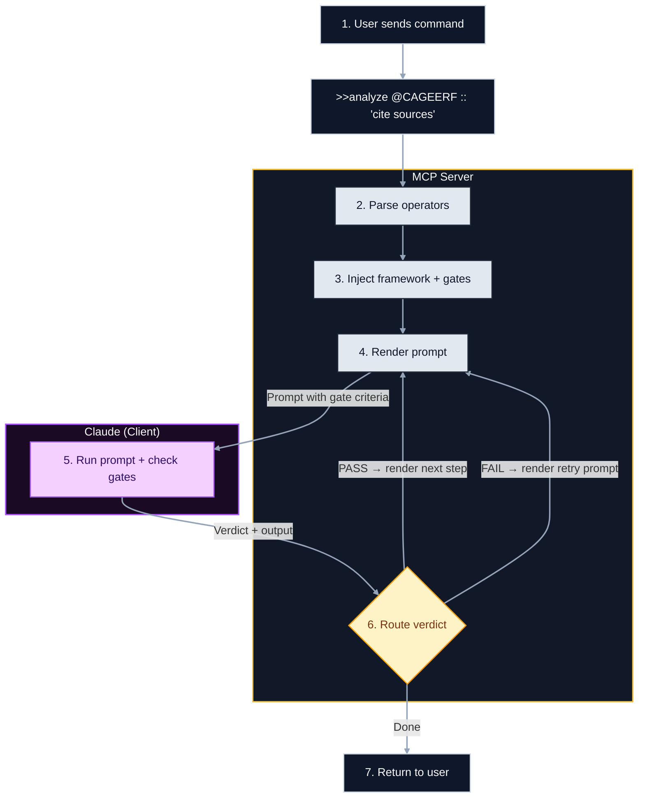

# Claude Prompts MCP Server

<div align="center">


[](https://www.npmjs.com/package/claude-prompts)
<a href="cursor://anysphere.cursor-deeplink/mcp/install?name=claude-prompts&config=eyJjb21tYW5kIjoibnB4IiwiYXJncyI6WyIteSIsImNsYXVkZS1wcm9tcHRzQGxhdGVzdCJdfQ=="></a>
[](https://opensource.org/licenses/MIT)

**Hot-reloadable prompts, structured reasoning, and chain workflows for your AI assistant.**

[Quick Start](#quick-start) • [What You Get](#what-you-get) • [Syntax](#syntax-reference) • [Docs](#documentation)

</div>

---

## Why

Stop copy-pasting prompts. This server turns your prompt library into a programmable engine:

- **Version Control** — Prompts are YAML + templates in git. Track changes, review diffs.
- **Hot Reload** — Edit a template, run it immediately. No restarts.
- **Structured Execution** — Parses operators, injects methodology, enforces quality gates.

---

## How It Works



**The feedback loop:** You send a command with operators → Server parses and injects methodology/gates → Claude executes and self-evaluates → Server routes: next step (PASS), retry (FAIL), or return result (done).

---

## Quick Start

### Claude Code (Recommended)

**Step 1: Add the plugin marketplace** (first time only)
```bash
/plugin marketplace add minipuft/minipuft-plugins
```

**Step 2: Install the plugin**
```bash
/plugin install claude-prompts@minipuft
```

**Step 3: Try it**
```bash
>>tech_evaluation_chain library:'zod' context:'API validation'
```

<details>
<summary><strong>Why hooks matter</strong></summary>

The plugin adds hooks that fix common issues:

| Problem | Hook Fix |
|---------|----------|
| Model ignores `>>analyze` | Detects syntax, suggests correct MCP call |
| Chain step forgotten | Injects `[Chain] Step 2/5 - continue` |
| Gate review skipped | Reminds `GATE_REVIEW: PASS\|FAIL` |

Raw MCP works, but models sometimes miss the syntax. The hooks catch that. → [hooks/README.md](hooks/README.md)

</details>

**User Data**: Custom prompts stored in `~/.local/share/claude-prompts/` persist across updates.

### Gemini CLI

```bash
# Install directly from GitHub
gemini extensions install https://github.com/minipuft/claude-prompts-mcp

# Development Setup (Hot Reload)
# Use a symbolic link to point the extension directory directly to your source code.
# This ensures changes to hooks and prompts are reflected immediately.
rm -rf ~/.gemini/extensions/gemini-prompts
ln -s "$(pwd)" ~/.gemini/extensions/gemini-prompts
```

The extension provides:
- **MCP server** with the same tools (`prompt_engine`, `resource_manager`, `system_control`)
- **GEMINI.md** context file with usage documentation

**Optional hooks** for `>>prompt` syntax detection can be enabled manually - see `GEMINI.md` for setup instructions.

Works with the same prompts, gates, and methodologies as Claude Code.

### Claude Desktop

| Method | Install Time | Updates | Custom Prompts |
|--------|-------------|---------|----------------|
| **Desktop Extension** | 10 seconds | Manual | Built-in config |
| **NPX** | 30 seconds | Automatic | Via env vars |

**Desktop Extension** (one-click):
```
1. Download claude-prompts.mcpb → github.com/minipuft/claude-prompts-mcp/releases
2. Drag into Claude Desktop Settings
3. Done. Optionally set a custom prompts folder when prompted.
```

**NPX** (auto-updates):
```json
// ~/Library/Application Support/Claude/claude_desktop_config.json (macOS)
// %APPDATA%\Claude\claude_desktop_config.json (Windows)
{
  "mcpServers": {
    "claude-prompts": {
      "command": "npx",
      "args": ["-y", "claude-prompts@latest"]
    }
  }
}
```

Restart Claude Desktop. Test it:
```
>>research_chain topic:'remote team policies' purpose:'handbook update'
```
→ Returns a 4-step research workflow with methodology injection and quality gates.

### Other MCP Clients

<details>
<summary><strong>Generic MCP clients (.cursor/mcp.json, etc.)</strong></summary>

Add to your MCP config:

```json
{
  "mcpServers": {
    "claude-prompts": {
      "command": "npx",
      "args": ["-y", "claude-prompts@latest"]
    }
  }
}
```

Test: `resource_manager(resource_type:"prompt", action:"list")`

</details>

<details>
<summary><strong>Cursor 1-click install</strong></summary>

<a href="cursor://anysphere.cursor-deeplink/mcp/install?name=claude-prompts&config=eyJjb21tYW5kIjoibnB4IiwiYXJncyI6WyIteSIsImNsYXVkZS1wcm9tcHRzQGxhdGVzdCJdfQ==">
  
</a>

</details>

<details>
<summary><strong>From Source</strong></summary>

```bash
git clone https://github.com/minipuft/claude-prompts-mcp.git
cd claude-prompts-mcp/server && npm install && npm run build
```

Then point your config to `server/dist/index.js`.

**Transport options**: `--transport=stdio` (default), `--transport=streamable-http` (recommended for HTTP).

</details>

### Custom Resources

Use your own prompts without cloning:

```json
{
  "mcpServers": {
    "claude-prompts": {
      "command": "npx",
      "args": ["-y", "claude-prompts@latest"],
      "env": {
        "MCP_RESOURCES_PATH": "/path/to/your/resources"
      }
    }
  }
}
```

Your resources directory can contain: `prompts/`, `gates/`, `methodologies/`, `styles/`.

| Override Method | Example |
|-----------------|---------|
| All resources | `MCP_RESOURCES_PATH=/path/to/resources` |
| Just prompts | `MCP_PROMPTS_PATH=/path/to/prompts` |
| CLI flag (dev) | `--prompts=/path/to/prompts` |

**Priority:** CLI flags > individual env vars > `MCP_RESOURCES_PATH` > package defaults.

See [CLI Configuration](docs/reference/mcp-tools.md#cli-configuration) for all options.

---

## What You Get

### 🔥 Hot Reload

Edit prompts, test immediately. Better yet—ask Claude to fix them:

```text
User: "The code_review prompt is too verbose"
Claude: resource_manager(action:"update", id:"code_review", ...)
User: "Test it"
Claude: prompt_engine(command:">>code_review")  # Uses updated version instantly
```

### 🔗 Chains

Break complex tasks into steps with `-->`:

```text
analyze code --> identify issues --> propose fixes --> generate tests
```

Each step's output flows to the next. Add quality gates between steps.

### 🧠 Frameworks

Inject structured thinking patterns:

```text
@CAGEERF Review this architecture    # Context → Analysis → Goals → Execution → Evaluation → Refinement
@ReACT Debug this error              # Reason → Act → Observe loops
```

### 🛡️ Gates

Quality criteria Claude self-checks:

```text
Summarize this :: 'under 200 words' :: 'include key statistics'
```

Failed gates can retry automatically or pause for your decision.

### ✨ Judge Selection

Let Claude pick the right tools:

```text
%judge Help me refactor this codebase
```

Claude analyzes available frameworks, gates, and styles, then applies the best combination.

### 📜 Version History

Every update is versioned. Compare, rollback, undo:

```text
resource_manager(action:"history", id:"code_review")
resource_manager(action:"rollback", id:"code_review", version:2, confirm:true)
```

---

## Syntax Reference

| Symbol | Name | What It Does | Example |
|:------:|:-----|:-------------|:--------|
| `>>` | Prompt | Execute template | `>>code_review` |
| `-->` | Chain | Pipe to next step | `step1 --> step2` |
| `@` | Framework | Inject methodology | `@CAGEERF` |
| `::` | Gate | Add quality criteria | `:: 'cite sources'` |
| `%` | Modifier | Toggle behavior | `%clean`, `%judge` |
| `#` | Style | Apply formatting | `#analytical` |

**Modifiers:**
- `%clean` — No framework/gate injection
- `%lean` — Gates only, skip framework
- `%guided` — Force framework injection
- `%judge` — Claude selects best resources

---

## Using Gates

```text
# Inline (quick)
Research AI :: 'use recent sources' --> Summarize :: 'be concise'

# With framework
@CAGEERF Explain React hooks :: 'include examples'

# Programmatic
prompt_engine({
  command: ">>code_review",
  gates: [{ name: "Security", criteria: ["No hardcoded secrets"] }]
})
```

| Severity | Behavior |
|----------|----------|
| Critical/High | Must pass (blocking) |
| Medium/Low | Warns, continues (advisory) |

See [Gates Guide](docs/guides/gates.md) for full schema.

---

## Configuration

Customize via `server/config.json`:

| Section | Setting | Default | Description |
|:--------|:--------|:--------|:------------|
| `prompts` | `directory` | `prompts` | Prompts directory (hot-reloaded) |
| `frameworks` | `injection.systemPrompt` | enabled | Auto-inject methodology guidance |
| `gates` | `definitionsDirectory` | `gates` | Quality gate definitions |
| `execution` | `judge` | `true` | Enable `%judge` resource selection |

---

## The Three Tools

| Tool | Purpose |
|------|---------|
| `prompt_engine` | Execute prompts with frameworks and gates |
| `resource_manager` | CRUD for prompts, gates, methodologies |
| `system_control` | Status, analytics, health checks |

```bash
prompt_engine(command:"@CAGEERF >>analysis topic:'AI safety'")
resource_manager(resource_type:"prompt", action:"list")
system_control(action:"status")
```

---

## Documentation

- **[MCP Tooling Guide](docs/reference/mcp-tools.md)** — Full command reference
- **[Prompt Authoring](docs/guides/prompt-authoring-guide.md)** — Template syntax and schema
- **[Chains](docs/guides/chains.md)** — Multi-step workflows
- **[Gates](docs/guides/gates.md)** — Quality validation
- **[Architecture](docs/architecture/overview.md)** — System internals

---

## Contributing

```bash
cd server
npm install && npm run build
npm test
npm run validate:all  # Full CI check
```

See [CONTRIBUTING.md](CONTRIBUTING.md) for details.

---

## License

[MIT](LICENSE)
