# Claude Prompts MCP Server

<div align="center">


[](https://www.npmjs.com/package/claude-prompts-server)
[](https://opensource.org/licenses/MIT)
[](https://modelcontextprotocol.io)

**Hot-reloadable prompts, structured reasoning, and chain workflows for your AI assistant.**

[Quick Start](#quick-start) • [Features](#features) • [Power Usage](#power-user-features) • [Docs](docs/README.md)

</div>

## Why This Exists

Stop copy-pasting prompts. This server turns your prompt library into a version-controlled, programmable engine.

1.  **Version Control**: Manage prompts as Markdown code in git.
2.  **Hot Reload**: Edit a template and use it instantly—no restarts.
3.  **Structured Execution**: It's not just text. The server parses your command, injects methodology (Frameworks), enforces quality (Gates), and renders a final template for the LLM.
4.  **Pluggable Analysis**: The `analysis` block in `server/config.json` is reserved for future third-party LLM-powered semantic analysis; it’s not active today.

## Quick Start

Get running in 60 seconds.

### 1. Install & Build (Recommended for Prompt Management)

For easy access to prompt files (to view, edit, or create your own), we recommend cloning the repository:

```bash
git clone https://github.com/minipuft/claude-prompts-mcp.git
cd claude-prompts-mcp/server
npm install && npm run build
# Verify it works (STDIO mode)
npm run start:stdio
```

### Alternative: Install via NPM Package

If you primarily want to use the server without modifying its bundled prompts, you can install it directly from npm:

```bash
# Run directly without global installation
npx claude-prompts-server

# Or install globally for easy access
npm install -g claude-prompts-server
claude-prompts-server --help
```

**Note on Prompt Management with NPM Package:** When installed via npm, prompt files are located within your `node_modules` directory. While the server supports loading external prompt configurations (via `MCP_SERVER_ROOT` or by placing `config.json` in your current working directory), direct editing of the bundled prompts is not recommended for npm installations.

### 2. Connect to Claude Desktop

Add this to your `claude_desktop_config.json`:

**Using NPM (No Clone Required):**

```json
{
  "mcpServers": {
    "claude-prompts": {
      "command": "npx",
      "args": ["-y", "claude-prompts-server"]
    }
  }
}
```

**Using Source Build (Windows):**

```json
{
  "mcpServers": {
    "claude-prompts": {
      "command": "node",
      "args": ["C:\\path\\to\\claude-prompts-mcp\\server\\dist\\index.js"]
    }
  }
}
```

**Using Source Build (Mac/Linux):**

```json
{
  "mcpServers": {
    "claude-prompts": {
      "command": "node",
      "args": ["/path/to/claude-prompts-mcp/server/dist/index.js"]
    }
  }
}
```

### 3. Try It

Restart Claude Desktop. In the input bar, type:

```text
prompt_manager list
```

## Core Concepts

Not a static file reader. It's a template **render pipeline** with a feedback loop:

```mermaid
%%{init: {'theme': 'neutral', 'themeVariables': {'background':'#0b1224','primaryColor':'#e2e8f0','primaryBorderColor':'#1f2937','primaryTextColor':'#0f172a','lineColor':'#94a3b8','fontFamily':'"DM Sans","Segoe UI",sans-serif','fontSize':'14px','edgeLabelBackground':'#0b1224'}}}%%
flowchart TB
    classDef actor fill:#0f172a,stroke:#cbd5e1,stroke-width:1.5px,color:#f8fafc;
    classDef server fill:#111827,stroke:#fbbf24,stroke-width:1.8px,color:#f8fafc;
    classDef process fill:#e2e8f0,stroke:#1f2937,stroke-width:1.6px,color:#0f172a;
    classDef client fill:#f4d0ff,stroke:#a855f7,stroke-width:1.6px,color:#2e1065;
    classDef clientbg fill:#1a0a24,stroke:#a855f7,stroke-width:1.8px,color:#f8fafc;
    classDef decision fill:#fef3c7,stroke:#f59e0b,stroke-width:1.6px,color:#78350f;

    linkStyle default stroke:#94a3b8,stroke-width:2px

    User["1. User sends command"]:::actor
    Example[">>analyze @CAGEERF :: 'cite sources'"]:::actor
    User --> Example --> Parse

    subgraph Server["MCP Server"]
        direction TB
        Parse["2. Parse operators"]:::process
        Inject["3. Inject framework + gates"]:::process
        Render["4. Render prompt"]:::process
        Decide{"6. Route verdict"}:::decision
        Parse --> Inject --> Render
    end
    Server:::server

    subgraph Client["Claude (Client)"]
        direction TB
        Execute["5. Run prompt + check gates"]:::client
    end
    Client:::clientbg

    Render -->|"Prompt with gate criteria"| Execute
    Execute -->|"Verdict + output"| Decide

    Decide -->|"PASS → render next step"| Render
    Decide -->|"FAIL → render retry prompt"| Render
    Decide -->|"Done"| Result["7. Return to user"]:::actor
```



**The feedback loop:**

1. **You send** a command with operators (`@framework`, `:: gates`, `-->` chains)
2. **Server parses** operators and injects methodology guidance + gate criteria
3. **Server returns** the rendered prompt (gates appear as self-check instructions at the bottom)
4. **Claude executes** the prompt and evaluates itself against the gate criteria
5. **Claude responds** with a verdict (PASS/FAIL) and its output
6. **Server routes**: renders next chain step (PASS), renders retry with feedback (FAIL), or returns final result (done)

- **Templates**: Markdown files with Nunjucks (`{{var}}`).
- **Frameworks**: Structured thinking patterns (CAGEERF, ReACT, 5W1H, SCAMPER) that guide HOW Claude reasons through problems. When active, frameworks inject:
  - **System prompt guidance**: Step-by-step methodology instructions
  - **Methodology gates**: Auto-applied quality checks specific to the framework's phases
  - **Tool overlays**: Context-aware tool descriptions showing current methodology state
- **Guidance Styles**: Instructional templates (`analytical`, `procedural`, `creative`, `reasoning`) in `server/prompts/guidance/` that shape response format.
- **Gates**: Quality criteria (e.g., "Must cite sources") injected into prompts for Claude to self-check. Use `:: criteria` inline or define in `server/src/gates/definitions/`.

> **Injection Control**: Override defaults with modifiers: `%guided` forces framework injection, `%clean` skips all guidance, `%lean` keeps only gate checks. Configure default frequency in `config.json` under `injection.system-prompt.frequency`. See the [MCP Tooling Guide](docs/mcp-tooling-guide.md#understanding-framework-injection-frequency) for details.

## Features

### 🔥 Hot Reload
**Problem**: Prompt iteration is slow. Edit file → restart server → test → repeat. And you're the one debugging prompt issues.

**Solution**: The server watches `server/prompts/*.md` for changes and reloads instantly. But the real value: **just ask Claude to fix it**. When a prompt underperforms, describe the issue—Claude diagnoses, updates the file via `prompt_manager`, and you test immediately. No manual editing, no restart.

```text
User: "The code_review prompt is too verbose"
Claude: prompt_manager(action:"update", id:"code_review", ...)  # Claude fixes it
User: "Test it"
Claude: prompt_engine(command:">>code_review")                   # Runs updated version instantly
```

**Expect**: Claude iterates on prompts faster than you can. You describe the problem, Claude proposes and applies the fix, you validate. Tight feedback loop.

---

### 🔗 Chains
**Problem**: Complex tasks need multiple reasoning steps, but a single prompt tries to do everything at once.

**Solution**: Break work into discrete steps with `-->`. Each step's output becomes the next step's input. Add quality checks between steps.

```text
analyze code --> identify issues --> propose fixes --> generate tests
```

**Expect**: The server executes steps sequentially, passing context forward. You see each step's output and can intervene if something goes wrong mid-chain.

---

### 🧠 Frameworks
**Problem**: Claude's reasoning varies in structure. Sometimes it's thorough, sometimes it skips steps. You want consistent, methodical thinking.

**Solution**: Frameworks inject a **thinking methodology** into the system prompt. The LLM follows a defined reasoning pattern (e.g., "first gather context, then analyze, then plan, then execute"). Each framework also auto-injects **quality gates** specific to its phases.

```text
@CAGEERF Review this architecture    # Injects structured planning methodology
@ReACT Debug this error              # Injects iterative reason-act-observe loops
```

**Expect**: Claude's response follows the methodology's structure. You'll see labeled phases in the output. The framework's gates validate each phase was completed properly.

---

### 🛡️ Gates
**Problem**: Claude returns plausible-sounding outputs, but you need specific criteria met—and you want Claude to verify this, not you.

**Solution**: Gates inject **quality criteria** into the prompt. Claude self-evaluates against these criteria and reports PASS/FAIL with reasoning. Failed gates can trigger retries or block the chain.

```text
Summarize this document :: 'must be under 200 words' :: 'must include key statistics'
```

**Expect**: Claude's response includes a self-assessment section. If criteria aren't met, the server can auto-retry with feedback or pause for your decision.

---

### ✨ Judge Selection
**Problem**: You have multiple frameworks, styles, and gates available—but you're not sure which combination fits your task.

**Solution**: `%judge` presents Claude with your available resources. Claude analyzes your task and recommends (or auto-applies) the best combination.

```text
%judge Help me refactor this legacy codebase
```

**Expect**: Claude returns a resource menu with recommendations, then makes a follow-up call with the selected operators applied.

## Using Gates

Gates inject quality criteria into prompts. Claude self-checks against them and reports PASS/FAIL.

**Inline — quick natural language checks:**
```text
Help me refactor this function :: 'keep it under 20 lines' :: 'add error handling'
```

**With Framework — methodology + auto-gates:**
```text
@CAGEERF Explain React hooks :: 'include practical examples'
```
> The framework injects its phase-specific gates automatically. Your inline gate (`:: 'include practical examples'`) adds on top.

**Chained — quality checks between steps:**
```text
Research the topic :: 'use recent sources' --> Summarize findings :: 'be concise' --> Create action items
```

| Gate Format | Syntax | Use Case |
|-------------|--------|----------|
| **Inline** | `:: 'criteria text'` | Quick checks, readable commands |
| **Named** | `:: {name, description}` | Reusable gates with clear intent |
| **Full** | `:: {name, criteria[], guidance}` | Complex validation, multiple criteria |

**Structured gates (programmatic):**
```javascript
prompt_engine({
  command: ">>code_review",
  gates: [{
    name: "Security Check",
    criteria: ["No hardcoded secrets", "Input validation on user data"],
    guidance: "Flag vulnerabilities with severity ratings"
  }]
});
```

For the full gate schema, see [Enhanced Gate System](docs/enhanced-gate-system.md).

## Syntax Reference

The `prompt_engine` uses symbolic operators to compose workflows:

| Symbol | Name | What It Does |
|:------:|:-----|:-------------|
| `>>` | **Prompt** | Executes a template by ID (`>>code_review`) |
| `-->` | **Chain** | Pipes output to next step (`step1 --> step2`) |
| `@` | **Framework** | Injects methodology + auto-gates (`@CAGEERF`) |
| `::` | **Gate** | Adds quality criteria (`:: 'cite sources'`) |
| `%` | **Modifier** | Toggles execution mode (`%clean`, `%lean`, `%judge`) |
| `#` | **Style** | Applies tone/persona preset (`#analytical`) |

**Modifiers explained:**
- `%clean` — Skip all framework/gate injection (raw template only)
- `%lean` — Skip framework guidance, keep gates only
- `%guided` — Force framework injection even if disabled by frequency settings
- `%judge` — Claude analyzes task and selects best resources automatically

## Advanced Features

### Gate Retry & Enforcement

The server manages gate failures automatically:

- **Retry Limits**: Failed gates retry up to 2× (configurable) before pausing for input.
- **Enforcement Modes**:
  - `blocking` — Must pass to proceed (Critical/High severity gates)
  - `advisory` — Logs warning, continues anyway (Medium/Low severity)
- **User Choice**: On retry exhaustion, respond with `retry`, `skip`, or `abort`.

### Examples

**1. Judge-Driven Selection (Two-Call Pattern)**
Not sure what style, framework, or gates to use? Let Claude analyze and decide.

```bash
# Phase 1: Get resource menu
prompt_engine(command:"%judge >>code_review")
# Claude sees available options and analyzes your task

# Phase 2: Claude calls back with selections
prompt_engine(command:">>code_review @CAGEERF :: security_review #style(analytical)")
```

_The `%judge` modifier returns a resource menu. Claude analyzes the task, selects appropriate resources, and makes a follow-up call with inline operators._

**2. Chained Reasoning**
Multi-step workflows with quality checks at each stage:

```text
Research AI trends :: 'use 2024 sources' --> Analyze implications --> Write executive summary :: 'keep under 500 words'
```

**3. Iterative Prompt Refinement**
Found an issue with a prompt? Ask Claude to fix it—changes apply immediately:

```text
User: "The code_review prompt is too verbose, make it more concise"
Claude: prompt_manager(action:"update", id:"code_review", ...)

User: "Now test it"
Claude: prompt_engine(command:">>code_review")
# Uses the updated prompt instantly—no restart needed
```

This feedback loop lets you continuously improve prompts as you discover edge cases.

## Configuration

Customize behavior via `server/config.json`. No rebuild required—just restart.

| Section      | Setting                       | Default                      | Description                                                                             |
| :----------- | :---------------------------- | :--------------------------- | :-------------------------------------------------------------------------------------- |
| `prompts`    | `file`                        | `prompts/promptsConfig.json` | Master config defining prompt categories and import paths.                              |
| `prompts`    | `registerWithMcp`             | `true`                       | Exposes prompts to Claude clients. Set `false` for internal-only mode.                  |
| `frameworks` | `enableSystemPromptInjection` | `true`                       | Auto-injects methodology guidance (CAGEERF, etc.) into system prompts.                  |
| `gates`      | `definitionsDirectory`        | `src/gates/definitions`      | Path to custom quality gate definitions (JSON).                                         |
| `judge`      | `enabled`                     | `true`                       | Enables the built-in judge phase (`%judge`) that surfaces framework/style/gate options. |

### Injection Target Modes (Advanced)

By default, framework guidance injects on both step execution and gate reviews. To customize WHERE injection occurs, add an `injection` section to your config:

```json
{
  "injection": {
    "system-prompt": { "enabled": true, "target": "steps" },
    "gate-guidance": { "enabled": true, "target": "gates" }
  }
}
```

| Target  | Behavior                                   |
| :------ | :----------------------------------------- |
| `both`  | Inject on steps and gate reviews (default) |
| `steps` | Inject only during normal step execution   |
| `gates` | Inject only during gate review steps       |

Applies to: `system-prompt`, `gate-guidance`, `style-guidance`

## Documentation

- **[Architecture](docs/architecture.md)**: Deep dive into the execution pipeline.
- **[Tooling Guide](docs/mcp-tooling-guide.md)**: Full command reference.
- **[Authoring Guide](docs/prompt-authoring-guide.md)**: Creating templates and gates.
- **[Chains](docs/chain-workflows.md)**: Building multi-step flows.

## Contributing

See [CONTRIBUTING.md](CONTRIBUTING.md).

```bash
cd server
npm run test        # Run Jest
npm run typecheck   # Verify types
npm run validate:all # Full CI check
```

## License

[MIT](LICENSE)
