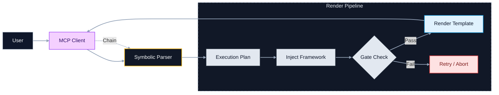

# Claude Prompts MCP Server

<div align="center">


[](https://www.npmjs.com/package/claude-prompts-server)
[](https://opensource.org/licenses/MIT)
[](https://modelcontextprotocol.io)

**Hot-reloadable prompts, structured reasoning, and chain workflows for your AI assistant.**

[Quick Start](#quick-start) • [Features](#features) • [Power Usage](#power-user-features) • [Docs](docs/README.md)

</div>

## Why This Exists

Stop copy-pasting prompts. This server turns your prompt library into a version-controlled, programmable engine.

1.  **Version Control**: Manage prompts as Markdown code in git.
2.  **Hot Reload**: Edit a template and use it instantly—no restarts.
3.  **Structured Execution**: It's not just text. The server parses your command, injects methodology (Frameworks), enforces quality (Gates), and renders a final template for the LLM.
4.  **Pluggable Analysis**: The `analysis` block in `server/config.json` is reserved for future third-party LLM-powered semantic analysis; it’s not active today.

## Quick Start

Get running in 60 seconds.

### 1. Install & Build (Recommended for Prompt Management)

For easy access to prompt files (to view, edit, or create your own), we recommend cloning the repository:

```bash
git clone https://github.com/minipuft/claude-prompts-mcp.git
cd claude-prompts-mcp/server
npm install && npm run build
# Verify it works (STDIO mode)
npm run start:stdio
```

### Alternative: Install via NPM Package

If you primarily want to use the server without modifying its bundled prompts, you can install it directly from npm:

```bash
# Run directly without global installation
npx claude-prompts-server

# Or install globally for easy access
npm install -g claude-prompts-server
claude-prompts-server --help
```

**Note on Prompt Management with NPM Package:** When installed via npm, prompt files are located within your `node_modules` directory. While the server supports loading external prompt configurations (via `MCP_SERVER_ROOT` or by placing `config.json` in your current working directory), direct editing of the bundled prompts is not recommended for npm installations.

### 2. Connect to Claude Desktop

Add this to your `claude_desktop_config.json`:

**Using NPM (No Clone Required):**

```json
{
  "mcpServers": {
    "claude-prompts": {
      "command": "npx",
      "args": ["-y", "claude-prompts-server", "--transport=stdio"]
    }
  }
}
```

**Using Source Build (Windows):**

```json
{
  "mcpServers": {
    "claude-prompts": {
      "command": "node",
      "args": ["C:\\path\\to\\claude-prompts-mcp\\server\\dist\\index.js"]
    }
  }
}
```

**Using Source Build (Mac/Linux):**

```json
{
  "mcpServers": {
    "claude-prompts": {
      "command": "node",
      "args": ["/path/to/claude-prompts-mcp/server/dist/index.js"]
    }
  }
}
```

### 3. Try It

Restart Claude Desktop. In the input bar, type:

```text
prompt_manager list
```

## Core Concepts

Not a static file reader. It's a template **render pipeline**:
`User` -> `MCP Client` -> `Parser` -> `Plan` -> `Framework Injection` -> `Gate Check` -> `Template Render` -> `Client`



- **Templates**: Markdown files with Nunjucks (`{{var}}`).
- **Frameworks**: Thinking methodologies (CAGEERF, ReACT) automatically injected into the system prompt based on configurable frequency. By default, framework guidance appears on every other chain step (1, 3, 5...) to reinforce the methodology without redundancy.
- **Guidance Styles**: Instructional templates (`analytical`, `procedural`, `creative`, `reasoning`) in `server/prompts/guidance/` that shape how Claude approaches responses.
- **Gates**: Quality criteria (e.g., "Must cite sources") injected into prompts for Claude to self-check. Use `:: criteria` inline or define in `server/src/gates/definitions/`.

> **Injection Control**: Override defaults with modifiers: `%guided` forces framework injection, `%clean` skips all guidance, `%lean` keeps only gate checks. Configure default frequency in `config.json` under `injection.system-prompt.frequency`. See the [MCP Tooling Guide](docs/mcp-tooling-guide.md#understanding-framework-injection-frequency) for details.

## Features

- **🔥 Hot Reload**: Edit `server/prompts/my_prompt.md`, save, run `prompt_engine >>my_prompt`. It updates instantly.
- **🔗 Chains**: Run multi-step logic. `analyze --> critique --> fix`.
- **🧠 Frameworks**: Apply structured reasoning (ReACT, CAGEERF) to any prompt.
- **🛡️ Gates**: Enforce quality standards on outputs.
- **✨ Judge-Driven Selection**: Use `%judge` to have Claude analyze your task and select the best guidance style, framework, and gates automatically.

## Power User Features

The `prompt_engine` supports a symbolic language for complex workflows.

### Symbolic Commands

| **Symbol** | **Name**      | **Pipeline Action**                           | **Visual Mnemonics**          |
| :--------: | :------------ | :-------------------------------------------- | :---------------------------- |
|   `-->`    | **Chain**     | **Pipes** output from one step to the next    | 🔗 **Link** steps together    |
|    `@`     | **Framework** | Injects **Thinking Models** (CAGEERF, ReACT)  | 🧠 **Brain** of the operation |
|    `::`    | **Gate**      | Enforces **Quality Checks** before proceeding | 🛡️ **Shield** the output      |
|    `%`     | **Modifier**  | Toggles **Execution Modes** (Menu/Clean/Lean) | ⚙️ **Config** the settings    |
|    `#`     | **Style**     | Applies **Persona/Tone** presets              | 🎨 **Paint** the response     |

### Gate Retry & Enforcement (New)

The system now intelligently manages gate failures:

- **Retry Limits**: Gates auto-retry up to 2 times (configurable) before pausing.
- **Enforcement Modes**:
  - **Blocking**: Must pass to proceed (default for Critical/High severity).
  - **Advisory**: Logs a warning but allows the chain to continue (Medium/Low severity).
- **User Choice**: On exhaustion, you can choose to `retry`, `skip`, or `abort`.

### Using Gates

Gates add quality criteria inline with your prompts using the `::` operator:

**Simple — natural language criteria:**

```text
Help me refactor this function :: 'keep it under 20 lines' :: 'add error handling'
```

**With frameworks — add structured thinking:**

```text
@CAGEERF Explain React hooks :: 'include practical examples' :: 'suitable for beginners'
```

**Chained — multi-step with gates on each:**

```text
Research the topic :: 'use recent sources' --> Summarize findings :: 'be concise' --> Create action items
```

**With style — shape the response format:**

```text
@ReACT Debug this error #style(analytical) :: 'show your reasoning step by step'
```

**Structured — for complex validation:**

```javascript
prompt_engine({
  command: ">>code_review",
  gates: [
    {
      name: "Security Check",
      criteria: ["No hardcoded secrets", "Input validation on user data"],
      guidance: "Flag vulnerabilities with severity ratings",
    },
  ],
});
```

| Gate Format | Syntax                            | Best For                            |
| ----------- | --------------------------------- | ----------------------------------- |
| **Inline**  | `:: 'criteria text'`              | Quick checks, readable commands     |
| **Quick**   | `:: {name, description}`          | Named gates with clear intent       |
| **Full**    | `:: {name, criteria[], guidance}` | Complex validation, multiple checks |

For full gate schema options, see the [Enhanced Gate System docs](docs/enhanced-gate-system.md).

### Examples

**1. Judge-Driven Selection (Two-Call Pattern)**
Not sure what style, framework, or gates to use? Let Claude analyze and decide.

```bash
# Phase 1: Get resource menu
prompt_engine(command:"%judge >>code_review")
# Claude sees available options and analyzes your task

# Phase 2: Claude calls back with selections
prompt_engine(command:">>code_review @CAGEERF :: security_review #style(analytical)")
```

_The `%judge` modifier returns a resource menu. Claude analyzes the task, selects appropriate resources, and makes a follow-up call with inline operators._

**2. Chained Reasoning**
Multi-step workflows with quality checks at each stage:

```text
Research AI trends :: 'use 2024 sources' --> Analyze implications --> Write executive summary :: 'keep under 500 words'
```

**3. Iterative Prompt Refinement**
Found an issue with a prompt? Ask Claude to fix it—changes apply immediately:

```text
User: "The code_review prompt is too verbose, make it more concise"
Claude: prompt_manager(action:"update", id:"code_review", ...)

User: "Now test it"
Claude: prompt_engine(command:">>code_review")
# Uses the updated prompt instantly—no restart needed
```

This feedback loop lets you continuously improve prompts as you discover edge cases.

## Configuration

Customize behavior via `server/config.json`. No rebuild required—just restart.

| Section      | Setting                       | Default                      | Description                                                                             |
| :----------- | :---------------------------- | :--------------------------- | :-------------------------------------------------------------------------------------- |
| `prompts`    | `file`                        | `prompts/promptsConfig.json` | Master config defining prompt categories and import paths.                              |
| `prompts`    | `registerWithMcp`             | `true`                       | Exposes prompts to Claude clients. Set `false` for internal-only mode.                  |
| `frameworks` | `enableSystemPromptInjection` | `true`                       | Auto-injects methodology guidance (CAGEERF, etc.) into system prompts.                  |
| `gates`      | `definitionsDirectory`        | `src/gates/definitions`      | Path to custom quality gate definitions (JSON).                                         |
| `judge`      | `enabled`                     | `true`                       | Enables the built-in judge phase (`%judge`) that surfaces framework/style/gate options. |

### Injection Target Modes (Advanced)

By default, framework guidance injects on both step execution and gate reviews. To customize WHERE injection occurs, add an `injection` section to your config:

```json
{
  "injection": {
    "system-prompt": { "enabled": true, "target": "steps" },
    "gate-guidance": { "enabled": true, "target": "gates" }
  }
}
```

| Target  | Behavior                                   |
| :------ | :----------------------------------------- |
| `both`  | Inject on steps and gate reviews (default) |
| `steps` | Inject only during normal step execution   |
| `gates` | Inject only during gate review steps       |

Applies to: `system-prompt`, `gate-guidance`, `style-guidance`

## Documentation

- **[Architecture](docs/architecture.md)**: Deep dive into the execution pipeline.
- **[Tooling Guide](docs/mcp-tooling-guide.md)**: Full command reference.
- **[Authoring Guide](docs/prompt-authoring-guide.md)**: Creating templates and gates.
- **[Chains](docs/chain-workflows.md)**: Building multi-step flows.

## Contributing

See [CONTRIBUTING.md](CONTRIBUTING.md).

```bash
cd server
npm run test        # Run Jest
npm run typecheck   # Verify types
npm run validate:all # Full CI check
```

## License

[MIT](LICENSE)
