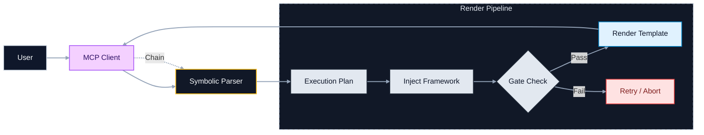

# Claude Prompts MCP Server

<div align="center">


[](https://www.npmjs.com/package/claude-prompts-server)
[](https://opensource.org/licenses/MIT)
[](https://modelcontextprotocol.io)

**Hot-reloadable prompts, structured reasoning, and chain workflows for your AI assistant.**

[Quick Start](#quick-start) • [Features](#features) • [Power Usage](#power-user-features) • [Docs](docs/README.md)

</div>

## Why This Exists

Stop copy-pasting prompts. This server turns your prompt library into a version-controlled, programmable engine.

1.  **Version Control**: Manage prompts as Markdown code in git.
2.  **Hot Reload**: Edit a template and use it instantly—no restarts.
3.  **Structured Execution**: It's not just text. The server parses your command, injects methodology (Frameworks), enforces quality (Gates), and renders a final template for the LLM.
4.  **Pluggable Analysis**: The `analysis` block in `server/config.json` is reserved for future third-party LLM-powered semantic analysis; it’s not active today.

## Quick Start

Get running in 60 seconds.

### 1. Install & Build (Recommended for Prompt Management)

For easy access to prompt files (to view, edit, or create your own), we recommend cloning the repository:

```bash
git clone https://github.com/minipuft/claude-prompts-mcp.git
cd claude-prompts-mcp/server
npm install && npm run build
# Verify it works (STDIO mode)
npm run start:stdio
```

### Alternative: Install via NPM Package

If you primarily want to use the server without modifying its bundled prompts, you can install it directly from npm:

```bash
# Run directly without global installation
npx claude-prompts-server

# Or install globally for easy access
npm install -g claude-prompts-server
claude-prompts-server --help
```
**Note on Prompt Management with NPM Package:** When installed via npm, prompt files are located within your `node_modules` directory. While the server supports loading external prompt configurations (via `MCP_SERVER_ROOT` or by placing `config.json` in your current working directory), direct editing of the bundled prompts is not recommended for npm installations.

### 2. Connect to Claude Desktop

Add this to your `claude_desktop_config.json`:

**Using NPM (No Clone Required):**

```json
{
  "mcpServers": {
    "claude-prompts": {
      "command": "npx",
      "args": ["-y", "claude-prompts-server", "--transport=stdio"]
    }
  }
}
```

**Using Source Build (Windows):**

```json
{
  "mcpServers": {
    "claude-prompts": {
      "command": "node",
      "args": ["C:\\path\\to\\claude-prompts-mcp\\server\\dist\\index.js"]
    }
  }
}
```

**Using Source Build (Mac/Linux):**

```json
{
  "mcpServers": {
    "claude-prompts": {
      "command": "node",
      "args": ["/path/to/claude-prompts-mcp/server/dist/index.js"]
    }
  }
}
```

### 3. Try It

Restart Claude Desktop. In the input bar, type:

```text
prompt_manager list
```

## Core Concepts

This isn't a static file reader. It's a **render pipeline**:
`User` -> `MCP Client` -> `Parser` -> `Plan` -> `Framework Injection` -> `Gate Check` -> `Template Render` -> `Client`



- **Templates**: Markdown files with Nunjucks (`{{var}}`).
- **Frameworks**: Thinking methodologies (CAGEERF, ReACT) injected **once per prompt execution** into the system prompt to guide _how_ the AI thinks. You control when and how often this reminder appears using execution modifiers (`%clean`, `%guided`, etc.).
- **Guidance Resources**: Markdown files (`analytical.md`, `procedural.md`, `creative.md`) containing structural patterns or specific instructions that can be dynamically injected into a prompt based on semantic analysis.
- **Gates**: Quality checks (e.g., "Must cite sources") enforced before or during execution.

> **Framework Injection Frequency**: Methodology guidance is a per-execution reminder, not a continuous injection. Use `@Framework` when starting new analytical work, `%clean` for follow-ups where the methodology is already established. See the [MCP Tooling Guide](docs/mcp-tooling-guide.md#understanding-framework-injection-frequency) for detailed control options.

## Features

- **🔥 Hot Reload**: Edit `server/prompts/my_prompt.md`, save, run `prompt_engine >>my_prompt`. It updates instantly.
- **🔗 Chains**: Run multi-step logic. `analyze --> critique --> fix`.
- **🧠 Frameworks**: Apply structured reasoning (ReACT, CAGEERF) to any prompt.
- **🛡️ Gates**: Enforce quality standards on outputs.
- **✨ Resource-Driven Guidance**: Dynamically inject Markdown resources (e.g., analytical frameworks, creative structures) based on an LLM's assessment of the prompt.

## Power User Features

The `prompt_engine` supports a symbolic language for complex workflows.

### Symbolic Commands

| **Symbol** | **Name** | **Pipeline Action** | **Visual Mnemonics** |
| :---: | :--- | :--- | :--- |
| `-->` | **Chain** | **Pipes** output from one step to the next | 🔗 **Link** steps together |
| `@` | **Framework** | Injects **Thinking Models** (CAGEERF, ReACT) | 🧠 **Brain** of the operation |
| `::` | **Gate** | Enforces **Quality Checks** before proceeding | 🛡️ **Shield** the output |
| `%` | **Modifier** | Toggles **Execution Modes** (Menu/Clean/Lean) | ⚙️ **Config** the settings |
| `#` | **Style** | Applies **Persona/Tone** presets | 🎨 **Paint** the response |

### Gate Retry & Enforcement (New)

The system now intelligently manages gate failures:

- **Retry Limits**: Gates auto-retry up to 2 times (configurable) before pausing.
- **Enforcement Modes**:
  - **Blocking**: Must pass to proceed (default for Critical/High severity).
  - **Advisory**: Logs a warning but allows the chain to continue (Medium/Low severity).
- **User Choice**: On exhaustion, you can choose to `retry`, `skip`, or `abort`.

### Gate Types

Gates come in three flavors, from simple to sophisticated:

#### 1. Inline Text Gates (Symbolic `::`)
Simple criteria embedded directly in the command. Quick and readable.

```bash
prompt_engine(command:">>research :: 'cite sources' :: 'include examples'")
```

#### 2. Quick Gates (Name + Description)
Structured gates with proper naming. **Ideal for LLM-generated validation**—the client can craft domain-specific checks without memorizing schemas.

```javascript
prompt_engine({
  command: ">>deep_research topic:'API design'",
  gates: [
    { name: "Source Quality", description: "All sources must be official docs or peer-reviewed" },
    { name: "Code Completeness", description: "Every concept needs a runnable code example" },
    { name: "Actionable Output", description: "End with implementation checklist" }
  ]
})
```

#### 3. Full Gate Definitions (Production-Grade)
Complete gate schema for complex validation workflows. Supports severity levels, multiple criteria, pass conditions, and guidance.

```javascript
prompt_engine({
  command: ">>code_review",
  gates: [{
    id: "security-audit",
    name: "Security Audit Gate",
    description: "Comprehensive security validation",
    severity: "critical",        // critical|high|medium|low
    type: "validation",          // validation|approval|condition|quality|guidance
    scope: "execution",          // execution|session|chain|step
    criteria: [
      "No hardcoded secrets or API keys",
      "Input validation on all user data",
      "SQL queries use parameterized statements"
    ],
    pass_criteria: ["All security criteria addressed with specific code references"],
    guidance: "Flag any potential vulnerabilities with severity ratings and remediation steps."
  }]
})
```

| Gate Type | Syntax | Best For |
|-----------|--------|----------|
| **Inline** | `:: 'text'` | Quick checks, readable commands |
| **Quick** | `{name, description}` | LLM-crafted validation, domain-specific |
| **Full** | `{id, severity, criteria[], ...}` | Production workflows, complex validation |

### Examples

**1. Resource-Driven Prompt Enhancement (New)**
Use the semantic judge to automatically enhance a prompt with relevant guidance resources.

```bash
prompt_engine(command:"judge >>my_prompt template:'Explain database normalization.' --> ")
```

_The judge will analyze 'Explain database normalization.' and automatically inject appropriate guidance (e.g., analytical framework) from our resource library._

**2. The "Judge" Experience (New)**
Not sure what you need? Let the system help you build the request.

```bash
prompt_engine(command:"%judge code_review")
```

_Returns a menu to select styles, frameworks, and gates before running._

**3. Chained Reasoning with Gates**
Run a research task using CAGEERF, check it for citations, then summarize it.

```bash
prompt_engine(command:"@CAGEERF research topic:'AI' :: 'cite sources' --> summarize")
```

**4. Rapid Iteration**
Edit your template in VS Code, save, and immediately verify:

```bash
prompt_engine(command:"%clean my_new_prompt arg='test'")
```

## Configuration

Customize behavior via `server/config.json`. No rebuild required—just restart.

| Section | Setting | Default | Description |
| :--- | :--- | :--- | :--- |
| `prompts` | `file` | `prompts/promptsConfig.json` | Master config defining prompt categories and import paths. |
| `prompts` | `registerWithMcp` | `true` | Exposes prompts to Claude clients. Set `false` for internal-only mode. |
| `frameworks` | `enableSystemPromptInjection` | `true` | Auto-injects methodology guidance (CAGEERF, etc.) into system prompts. |
| `gates` | `definitionsDirectory` | `src/gates/definitions` | Path to custom quality gate definitions (JSON). |
| `judge` | `enabled` | `true` | Enables the built-in judge phase (`%judge`) that surfaces framework/style/gate options. |

### Injection Target Modes (Advanced)

By default, framework guidance injects on both step execution and gate reviews. To customize WHERE injection occurs, add an `injection` section to your config:

```json
{
  "injection": {
    "system-prompt": { "enabled": true, "target": "steps" },
    "gate-guidance": { "enabled": true, "target": "gates" }
  }
}
```

| Target | Behavior |
| :--- | :--- |
| `both` | Inject on steps and gate reviews (default) |
| `steps` | Inject only during normal step execution |
| `gates` | Inject only during gate review steps |

Applies to: `system-prompt`, `gate-guidance`, `style-guidance`

## Documentation

- **[Architecture](docs/architecture.md)**: Deep dive into the execution pipeline.
- **[Tooling Guide](docs/mcp-tooling-guide.md)**: Full command reference.
- **[Authoring Guide](docs/prompt-authoring-guide.md)**: Creating templates and gates.
- **[Chains](docs/chain-workflows.md)**: Building multi-step flows.

## Contributing

See [CONTRIBUTING.md](CONTRIBUTING.md).

```bash
cd server
npm run test        # Run Jest
npm run typecheck   # Verify types
npm run validate:all # Full CI check
```

## License

[MIT](LICENSE)
