# Claude Prompts MCP Server

<div align="center">


[](https://www.npmjs.com/package/claude-prompts-server)
[](https://opensource.org/licenses/MIT)
[](https://modelcontextprotocol.io)
[](https://nodejs.org)

**🚀 The Universal Model Context Protocol Server for Any MCP Client**

_Supercharge your AI workflows with battle-tested prompt engineering, intelligent orchestration, and lightning-fast hot-reload capabilities. Works seamlessly with Claude Desktop, Cursor Windsurf, and any MCP-compatible client._

[⚡ Quick Start](#-one-command-installation) • [🎯 Features](#-performance--reliability) • [📚 Docs](#-documentation-hub) • [🛠️ Advanced](#-advanced-features)

---

</div>

## 🌟 What Makes This Special? (v1.3.0 - "Consolidated Architecture with Systematic Framework Application")

- **🎯 Three-Tier Execution Model** → Routes between prompts (lightning-fast), templates (framework-enhanced), and chains (LLM-driven) based on file structure
- **🧠 Structural Analysis Engine** → File structure analysis detects execution type (with optional W.I.P LLM-powered semantic enhancement)
- **⚡ Three-Tier Performance** → From instant variable substitution to comprehensive methodology-guided processing
- **🔧 Unified Creation Tools** → Create prompts or templates with type-specific optimization
- **🛡️ Intelligent Quality Gates** → Framework-aware validation with conditional injection based on execution tier
- **🔄 Configurable Analysis** → Structural analysis with optional semantic enhancement and manual methodology selection
- **🔥 Intelligent Hot-Reload System** → Update prompts instantly without restarts
- **🎨 Advanced Template Engine** → Nunjucks-powered with conditionals, loops, and dynamic data
- **⚡ Multi-Phase Orchestration** → Robust startup sequence with comprehensive health monitoring
- **🚀 Universal MCP Compatibility** → Works flawlessly with Claude Desktop, Cursor Windsurf, and any MCP client

Transform your AI assistant experience with a **three-tier execution architecture** that routes between lightning-fast prompts, framework-enhanced templates, and LLM-driven chains based on file structure analysis across any MCP-compatible platform.

## 🚀 Revolutionary Interactive Prompt Management

**🎯 The Future is Here: Manage Your AI's Capabilities FROM WITHIN the AI Conversation**

This isn't just another prompt server – it's a **living, breathing prompt ecosystem** that evolves through natural conversation with your AI assistant. Imagine being able to:

```bash
# 🎯 Universal prompt execution with intelligent type detection
prompt_engine >>code_formatter language="Python" style="PEP8"
→ System detects execution tier, applies appropriate processing automatically

# 📋 Create and manage prompts with intelligent analysis
prompt_manager create name="code_reviewer" type="template" \
  content="Analyze {{code}} for security, performance, and maintainability"
→ Creates framework-enhanced template with CAGEERF methodology integration

# 🔍 Analyze existing prompts for execution optimization
prompt_manager analyze_type prompt_id="my_prompt"
→ Shows: "Type: template, Framework: CAGEERF, Confidence: 85%, Gates: enabled"

# ⚙️ System control and framework management
system_control switch_framework framework="ReACT" reason="Problem-solving focus"
→ Switches active methodology with performance monitoring

# 🔥 Execute with full three-tier intelligence
prompt_engine >>analysis_chain input="complex research data" llm_driven_execution=true
→ LLM-driven chain execution with step-by-step coordination (requires semantic LLM integration)
```

**🌟 Why This Architecture Matters:**

- **🧠 Structural Intelligence**: File structure analysis provides reliable execution routing with minimal configuration
- **🔄 Dynamic Capability Building**: Build and extend your AI assistant's capabilities through conversational prompt management
- **🎮 Reduced Friction**: Minimal configuration required - execution type detected from file structure
- **⚡ Systematic Workflow**: Create → Structure-based routing → Framework application in a reliable flow
- **🧠 Intelligent Command Routing**: Built-in command detection with multi-strategy parsing and automatic tool routing
- **🧠 Sophisticated Methodology System**: Four proven thinking frameworks (CAGEERF, ReACT, 5W1H, SCAMPER) with manual selection and conditional application

This is what **well-architected AI infrastructure** looks like – where systematic analysis and proven methodologies enhance your AI interactions through structured approaches rather than magic.

## 🧠 Advanced Framework System

**🎯 Revolutionary Methodology Integration**

The server features a sophisticated framework system that brings structured thinking methodologies to your AI interactions:

### 🎨 **Four Intelligent Methodologies**

- **🔍 CAGEERF**: Comprehensive structured approach (Context, Analysis, Goals, Execution, Evaluation, Refinement, Framework)
- **🧠 ReACT**: Reasoning and Acting pattern for systematic problem-solving
- **❓ 5W1H**: Who, What, When, Where, Why, How systematic analysis
- **🚀 SCAMPER**: Creative problem-solving (Substitute, Combine, Adapt, Modify, Put to other uses, Eliminate, Reverse)

### ⚙️ **Intelligent Framework Features**

- **🧠 Manual Selection**: Choose optimal methodology manually based on your needs, with sophisticated conditional application
- **🔄 Runtime Switching**: Change active framework with performance monitoring and seamless transition
- **⚡ Conditional Injection**: Framework enhancement applied only when beneficial (bypassed for simple prompts)
- **📊 Switching Performance**: Monitor framework switching mechanics and performance

```bash
# 🔄 Switch methodology for different thinking approaches
system_control switch_framework framework="ReACT" reason="Problem-solving focus"
→ Switches to ReACT methodology with performance monitoring

# 📊 Monitor framework performance and usage
system_control analytics show_details=true
→ View framework switching history and performance metrics

# ⚙️ Get current framework status
system_control status
→ Shows active framework, available methodologies, and system health
```

**🎆 The Result**: Your AI conversations become more structured, thoughtful, and effective through proven thinking methodologies applied systematically based on your chosen framework.

### ⚠️ **Analysis System Capabilities**

**🗓️ What the System Actually Does:**

- **📝 Structural Analysis**: Detects execution type by examining template variables (`{{variable}}`), chain steps, and file structure
- **🔄 Framework Application**: Applies manually selected framework methodology (CAGEERF, ReACT, 5W1H, SCAMPER) based on execution tier
- **⚡ Routing Logic**: Routes to appropriate execution tier (prompt/template/chain) based on structural characteristics

**🧠 Optional Semantic Enhancement:**

- **LLM Integration**: When enabled, provides true semantic understanding of prompt content
- **Advanced Analysis**: Intelligent methodology recommendations and complexity assessment
- **Default Mode**: Structural analysis only - honest about limitations without LLM access

**🎯 Manual Framework Control:**

```bash
# Framework selection is manual, not automatic
system_control switch_framework framework="ReACT" reason="Problem-solving focus"
```

## ⚡ Features & Reliability

<table>
<tr>
<td width="50%">

**🎯 Developer Experience**

- 🔥 **One-Command Installation** in under 60 seconds
- ⚡ **Hot-Reload Everything** → prompts, configs, templates
- 🎨 **Rich Template Engine** → conditionals, loops, data injection
- 🚀 **Universal MCP Integration** → works with Claude Desktop, Cursor Windsurf, and any MCP client
- 📱 **Multi-Transport Support** → STDIO for Claude Desktop + SSE/REST for web
- 🛠️ **Dynamic Management Tools** → update, delete, reload prompts on-the-fly
- 🤖 **Claude Code Support** → Harness Anthropic’s coding model for refactoring, doc generation, note-taking, research and any complex workflows that arises

</td>
<td width="50%">

**🚀 Enterprise Architecture**

- 🏗️ **Orchestration** → phased startup with dependency management
- 🔧 **Robust Error Handling** → graceful degradation with comprehensive logging
- 📊 **Real-Time Health Monitoring** → module status, performance metrics, diagnostics
- 🎯 **Smart Environment Detection** → works across development and production contexts
- ⚙️ **Modular Plugin System** → extensible architecture for custom workflows
- 🔐 **Production-Ready Security** → input validation, sanitization, error boundaries

</td>
</tr>
<tr>
<td colspan="2">

**🛠️ Consolidated MCP Tools Suite (87.5% Reduction: 24+ → 3 Tools)**

- 🎯 **prompt_engine** → Universal execution with intelligent analysis, semantic detection, and LLM-driven chain coordination
- 📋 **prompt_manager** → Complete lifecycle management with smart filtering, type analysis, and configurable semantic analysis
- ⚙️ **system_control** → Framework management, analytics, health monitoring, and comprehensive system administration

**🤖 Intelligent Features:**

- 🧠 **Structural Type Detection** → System routes between prompt/template/chain execution based on file structure analysis
- 🛡️ **Framework Integration** → CAGEERF, ReACT, 5W1H, SCAMPER methodologies with manual selection and conditional injection
- 🔄 **LLM-Driven Chains** → Step-by-step workflow coordination with conversation state management
- 📊 **Performance Analytics** → Three-tier execution monitoring with framework switching performance tracking
- 🔥 **Hot-Reload Everything** → Update prompts, templates, and configurations without restart
- ⚙️ **Smart Argument Parsing** → JSON objects, single arguments, or fallback to conversational context

</td>
</tr>
</table>

## 🎯 One-Command Installation

Get your AI command center running in **under a minute**:

```bash
# Clone → Install → Launch → Profit! 🚀
git clone https://github.com/minipuft/claude-prompts-mcp.git
cd claude-prompts-mcp/server && npm install && npm run build && npm start
```

### 🔌 **Universal MCP Client Integration**

#### **Claude Desktop**

Drop this into your `claude_desktop_config.json`:

```json
{
  "mcpServers": {
    "claude-prompts-mcp": {
      "command": "node",
      "args": ["E:\\path\\to\\claude-prompts-mcp\\server\\dist\\index.js"],
      "env": {
        "MCP_PROMPTS_CONFIG_PATH": "E:\\path\\to\\claude-prompts-mcp\\server\\prompts\\promptsConfig.json"
      }
    }
  }
}
```

#### **Cursor Windsurf & Other MCP Clients**

Configure your MCP client to connect via STDIO transport:

- **Command**: `node`
- **Args**: `["path/to/claude-prompts-mcp/server/dist/index.js"]`
- **Environment** (Optional): `MCP_PROMPTS_CONFIG_PATH=path/to/prompts/promptsConfig.json`

#### **Claude Code CLI Installation**

For Claude Code CLI users, use the one-command installation:

```bash
claude mcp add-json claude-prompts-mcp '{"type":"stdio","command":"node","args":["path/to/claude-prompts-mcp/server/dist/index.js"],"env":{}}'
```

> 💡 **Pro Tip**: Environment variables are optional - the server auto-detects paths in 99% of cases. Use absolute paths for guaranteed compatibility across all MCP clients!

### 🎮 **Start Building Immediately (v1.3.0 Consolidated Architecture)**

Your AI command arsenal is ready with **enhanced reliability**:

```bash
# 🧠 Discover your intelligent superpowers
prompt_manager list filter="category:analysis"
→ Intelligent filtering shows relevant prompts with usage examples

# 🎯 Structural execution routing - system detects execution type from file structure
prompt_engine >>friendly_greeting name="Developer"
→ Detected as template (has {{variables}}), returns framework-enhanced greeting

prompt_engine >>content_analysis input="my research data"
→ Detected as template (structural analysis), applies framework injection, executes with quality gates

prompt_engine >>analysis_chain input="my content" llm_driven_execution=true
→ Detected as chain (has chainSteps), provides LLM-driven step-by-step execution (requires semantic LLM integration)

# 📊 Monitor intelligent detection performance
system_control analytics include_history=true
→ See how accurately the system detects prompt types and applies gates

# 🚀 Create prompts that just work (zero configuration)
"Create a prompt called 'bug_analyzer' that finds and explains code issues"
→ Prompt created via conversation, system detects execution type from structure, applies active framework

# 🔄 Refine prompts through conversation (intelligence improves)
"Make the bug_analyzer prompt also suggest performance improvements"
→ Prompt updated, system re-analyzes, updates detection profile automatically

# 🧠 Build LLM-driven chain workflows
"Create a prompt chain that reviews code, validates output, tests it, then documents it"
→ Chain created, each step auto-analyzed, appropriate gates assigned automatically

# 🎛️ Manual override when needed (but rarely necessary)
prompt_engine >>content_analysis input="sensitive data" step_confirmation=true gate_validation=true
→ Force step confirmation for sensitive analysis
```

**🌟 The Architecture**: Your prompt library becomes a **structured extension of your workflow**, organized and enhanced through systematic methodology application.

## 🔥 Why Developers Choose This Server

<details>
<summary><strong>⚡ Lightning-Fast Hot-Reload</strong> → Edit prompts, see changes instantly</summary>

Our sophisticated orchestration engine monitors your files and reloads everything seamlessly:

```bash
# Edit any prompt file → Server detects → Reloads automatically → Zero downtime
```

- **Instant Updates**: Change templates, arguments, descriptions in real-time
- **Zero Restart Required**: Advanced hot-reload system keeps everything running
- **Smart Dependency Tracking**: Only reloads what actually changed
- **Graceful Error Recovery**: Invalid changes don't crash the server

</details>

<details>
<summary><strong>🎨 Next-Gen Template Engine</strong> → Nunjucks-powered dynamic prompts</summary>

Go beyond simple text replacement with a full template engine:

```nunjucks
Analyze {{content}} for {{focus_area}}general insights.


- Consider: {{requirement}}



Build upon: {{previous_context}}

```

- **Conditional Logic**: Smart prompts that adapt based on input
- **Loops & Iteration**: Handle arrays and complex data structures
- **Template Inheritance**: Reuse and extend prompt patterns
- **Real-Time Processing**: Templates render with live data injection

</details>

<details>
<summary><strong>🏗️ Enterprise-Grade Orchestration</strong> → Multi-phase startup with health monitoring</summary>

Built like production software with comprehensive architecture:

```typescript
Phase 1: Foundation → Config, logging, core services
Phase 2: Data Loading → Prompts, categories, validation
Phase 3: Module Init → Tools, executors, managers
Phase 4: Server Launch → Transport, API, diagnostics
```

- **Dependency Management**: Modules start in correct order with validation
- **Health Monitoring**: Real-time status of all components
- **Performance Metrics**: Memory usage, uptime, connection tracking
- **Diagnostic Tools**: Built-in troubleshooting and debugging

</details>

<details>
<summary><strong>🔄 Intelligent Prompt Chains</strong> → Multi-step AI workflows</summary>

Create sophisticated workflows where each step builds on the previous:

```json
{
  "id": "content_analysis_chain",
  "name": "Content Analysis Chain",
  "isChain": true,
  "executionMode": "chain",
  "chainSteps": [
    {
      "stepName": "Extract Key Points",
      "promptId": "extract_key_points",
      "inputMapping": { "content": "original_content" },
      "outputMapping": { "key_points": "extracted_points" },
      "executionType": "template"
    },
    {
      "stepName": "Analyze Sentiment",
      "promptId": "sentiment_analysis",
      "inputMapping": { "text": "extracted_points" },
      "outputMapping": { "sentiment": "analysis_result" },
      "executionType": "template"
    }
  ]
}
```

- **Visual Step Planning**: See your workflow before execution
- **Input/Output Mapping**: Data flows seamlessly between steps
- **Error Recovery**: Failed steps don't crash the entire chain
- **Flexible Execution**: Run chains or individual steps as needed

</details>

## 📊 System Architecture

```mermaid
graph TB
    A[Claude Desktop] -->|MCP Protocol| B[Transport Layer]
    B --> C[🧠 Orchestration Engine]
    C --> D[📝 Prompt Manager]
    C --> E[🛠️ MCP Tools Manager]
    C --> F[⚙️ Config Manager]
    D --> G[🎨 Template Engine]
    E --> H[🔧 Management Tools]
    F --> I[🔥 Hot Reload System]

    style C fill:#ff6b35
    style D fill:#00ff88
    style E fill:#0066cc
```



## 🌐 MCP Client Compatibility

This server implements the **Model Context Protocol (MCP)** standard and works with any compatible client:

<table>
<tr>
<td width="33%">

**✅ Tested & Verified**

- 🎯 **Claude Desktop** → Full integration support
- 🚀 **Cursor Windsurf** → Native MCP compatibility
- 🤖 **Claude Code** → Full native support

</td>
<td width="33%">

**🔌 Transport Support**

- 📡 **STDIO** → Primary transport for desktop clients
- 🌐 **Server-Sent Events (SSE)** → Web-based clients and integrations
- 🔗 **HTTP Endpoints** → Basic endpoints for health checks and data queries

</td>
<td width="34%">

**🎯 Integration Features**

- 🔄 **Auto-Discovery** → Clients detect tools automatically
- 📋 **Tool Registration** → Dynamic capability announcement
- ⚡ **Hot Reload** → Changes appear instantly in clients
- 🛠️ **Error Handling** → Graceful degradation across clients

</td>
</tr>
</table>

> 💡 **Developer Note**: As MCP adoption grows, this server will work with any new MCP-compatible AI assistant or development environment without modification.

## 🛠️ Advanced Configuration

### ⚙️ **Server Powerhouse** (`config.json`)

Fine-tune your server's behavior:

```json
{
  "server": {
    "name": "Claude Custom Prompts MCP Server",
    "version": "1.0.0",
    "port": 9090
  },
  "prompts": {
    "file": "promptsConfig.json",
    "registrationMode": "name"
  },
  "transports": {
    "default": "stdio",
    "sse": { "enabled": false },
    "stdio": { "enabled": true }
  }
}
```

### 🗂️ **Prompt Organization** (`promptsConfig.json`)

Structure your AI command library:

```json
{
  "categories": [
    {
      "id": "development",
      "name": "🔧 Development",
      "description": "Code review, debugging, and development workflows"
    },
    {
      "id": "analysis",
      "name": "📊 Analysis",
      "description": "Content analysis and research prompts"
    },
    {
      "id": "creative",
      "name": "🎨 Creative",
      "description": "Content creation and creative writing"
    }
  ],
  "imports": [
    "prompts/development/prompts.json",
    "prompts/analysis/prompts.json",
    "prompts/creative/prompts.json"
  ]
}
```

## 🚀 Advanced Features

<details>
<summary><strong>🔄 Multi-Step Prompt Chains</strong> → Build sophisticated AI workflows</summary>

Create complex workflows that chain multiple prompts together:

```markdown
# Research Analysis Chain

## User Message Template

Research {{topic}} and provide {{analysis_type}} analysis.

## Chain Configuration

Steps: research → extract → analyze → summarize
Input Mapping: {topic} → {content} → {key_points} → {insights}
Output Format: Structured report with executive summary
```

**Capabilities:**

- **Sequential Processing**: Each step uses output from previous step
- **Parallel Execution**: Run multiple analysis streams simultaneously
- **Error Recovery**: Graceful handling of failed steps
- **Custom Logic**: Conditional branching based on intermediate results

</details>

<details>
<summary><strong>🎨 Advanced Template Features</strong> → Dynamic, intelligent prompts</summary>

Leverage the full power of Nunjucks templating:

```nunjucks
# {{ title | title }} Analysis

## Context

Building upon previous analysis: {{ previous_analysis | summary }}


## Requirements

{{loop.index}}. **{{req.priority | upper}}**: {{req.description}}
   
   Examples: {{ex}}, 
   


## Focus Areas


- {{ area | trim | title }}

```

**Template Features:**

- **Filters & Functions**: Transform data on-the-fly
- **Conditional Logic**: Smart branching based on input
- **Loops & Iteration**: Handle complex data structures
- **Template Inheritance**: Build reusable prompt components

</details>

<details>
<summary><strong>🔧 Real-Time Management Tools</strong> → Hot management without downtime</summary>

Manage your prompts dynamically while the server runs:

```bash
# Update prompts with intelligent re-analysis
prompt_manager update id="analysis_prompt" content="new template"
→ System re-analyzes execution type and framework requirements

# Modify specific sections with validation
prompt_manager modify id="research" section="examples" content="new examples"
→ Section updated with automatic template validation

# Hot-reload with comprehensive validation
system_control reload reason="updated templates"
→ Full system reload with health monitoring
```

**Management Capabilities:**

- **Live Updates**: Change prompts without server restart
- **Section Editing**: Modify specific parts of prompts
- **Bulk Operations**: Update multiple prompts at once
- **Rollback Support**: Undo changes when things go wrong

</details>

<details>
<summary><strong>📊 Production Monitoring</strong> → Enterprise-grade observability</summary>

Built-in monitoring and diagnostics for production environments:

```typescript
// Health Check Response
{
  healthy: true,
  modules: {
    foundation: true,
    dataLoaded: true,
    modulesInitialized: true,
    serverRunning: true
  },
  performance: {
    uptime: 86400,
    memoryUsage: { rss: 45.2, heapUsed: 23.1 },
    promptsLoaded: 127,
    categoriesLoaded: 8
  }
}
```

**Monitoring Features:**

- **Real-Time Health Checks**: All modules continuously monitored
- **Performance Metrics**: Memory, uptime, connection tracking
- **Diagnostic Tools**: Comprehensive troubleshooting information
- **Error Tracking**: Graceful error handling with detailed logging

</details>

## 📚 Documentation Hub

| Guide                                                     | Description                                                       |
| --------------------------------------------------------- | ----------------------------------------------------------------- |
| [📥 Installation Guide](docs/installation-guide.md)       | Complete setup walkthrough with troubleshooting                   |
| [🛠️ Troubleshooting Guide](docs/troubleshooting.md)       | Common issues, diagnostic tools, and solutions                    |
| [🏗️ Architecture Overview](docs/architecture.md)          | A deep dive into the orchestration engine, modules, and data flow |
| [📝 Prompt Format Guide](docs/prompt-format-guide.md)     | Master prompt creation with examples                              |
| [🔗 Chain Execution Guide](docs/chain-execution-guide.md) | Build complex multi-step workflows                                |
| [⚙️ Prompt Management](docs/prompt-management.md)         | Dynamic management and hot-reload features                        |
| [🚀 MCP Tools Reference](docs/mcp-tools-reference.md)     | Complete MCP tools documentation                                  |
| [🗺️ Roadmap & TODO](docs/TODO.md)                         | Planned features and development roadmap                          |
| [🤝 Contributing](docs/contributing.md)                   | Join our development community                                    |

## 🤝 Contributing

We're building the future of AI prompt engineering! Join our community:

- 🐛 **Found a bug?** [Open an issue](https://github.com/minipuft/claude-prompts-mcp/issues)
- 💡 **Have an idea?** [Start a discussion](https://github.com/minipuft/claude-prompts-mcp/discussions)
- 🔧 **Want to contribute?** Check our [Contributing Guide](docs/contributing.md)
- 📖 **Need help?** Visit our [Documentation](docs/README.md)

## 📄 License

Released under the [MIT License](LICENSE) - see the file for details.

---

<div align="center">

**⭐ Star this repo if it's transforming your AI workflow!**

[Report Bug](https://github.com/minipuft/claude-prompts-mcp/issues) • [Request Feature](https://github.com/minipuft/claude-prompts-mcp/issues) • [View Docs](docs/README.md)

_Built with ❤️ for the AI development community_

</div>
