# Claude Prompts MCP Server

<div align="center">


[](https://www.npmjs.com/package/claude-prompts-server)
[](https://opensource.org/licenses/MIT)
[](https://modelcontextprotocol.io)
[](https://nodejs.org)

**A Universal Model Context Protocol Server for Advanced Prompt Management**

Production-ready MCP server with intelligent prompt orchestration, hot-reload capabilities, and framework-driven AI workflows. Compatible with Claude Desktop, Cursor Windsurf, and any MCP client.

[Quick Start](#quick-start) • [Features](#core-features) • [Documentation](#documentation) • [Configuration](#configuration)

---

</div>

## At a Glance

- **What**: A Model Context Protocol (MCP) server that hot-reloads prompts/templates/chains and layers methodology frameworks (CAGEERF, ReACT, 5W1H, SCAMPER) on demand.
- **Who it’s for**: Developers and prompt engineers who want to evolve AI workflows inside Claude Desktop, Cursor/Windsurf, Claude Code CLI, or any MCP-compatible client.
- **Why it’s different**: Three consolidated tools (`prompt_engine`, `prompt_manager`, `system_control`) keep authoring, execution, and runtime controls inside your MCP conversation—no manual file edits or restarts.
- **Docs & diagrams**: Start with the [Documentation Map](docs/README.md) for architecture, operations, and prompt authoring guides.

> Looking for a deeper dive? Scroll to [Rapid Customization Workflow](#rapid-customization-workflow) to see how templates move from Markdown to live MCP prompts in seconds.

## Core Features

**Three-Tier Execution Architecture**

- **Prompt Execution**: Lightning-fast single prompt execution with variable substitution
- **Template Processing**: Framework-enhanced templates with Nunjucks templating engine
- **Chain Workflows**: Multi-step LLM-driven workflows with state management

**Intelligent System Components**

- **Structural Analysis**: Automatic execution type detection based on file structure
- **Hot-Reload System**: Update prompts instantly without server restarts
- **Quality Gates**: Framework-aware validation with conditional logic
- **Performance Monitoring**: Comprehensive startup orchestration and health monitoring

**Universal MCP Compatibility**

- **Transport Support**: STDIO for desktop clients, SSE for web applications
- **Client Integration**: Native support for Claude Desktop, Cursor Windsurf, and custom MCP clients
- **Protocol Compliance**: Full Model Context Protocol implementation with tool registration

## Interactive Prompt Management

Manage AI capabilities directly within conversations through three consolidated MCP tools:

```bash
# Universal prompt execution with intelligent type detection
prompt_engine >>code_formatter language="Python" style="PEP8"

# Create and manage prompts with intelligent analysis
prompt_manager create name="code_reviewer" type="template" \
  content="Analyze {{code}} for security, performance, and maintainability"

# Analyze existing prompts for execution optimization
prompt_manager analyze_type prompt_id="my_prompt"

# System control and framework management
system_control switch_framework framework="ReACT" reason="Problem-solving focus"

# Execute complex multi-step LLM-driven chains
prompt_engine >>code_review_optimization_chain target_code="..." language_framework="TypeScript"
```

**Key Benefits:**

- **Structural Intelligence**: Automatic execution routing based on file structure analysis
- **Dynamic Capability Building**: Extend AI assistant capabilities through conversational management
- **Minimal Configuration**: Execution type detection requires no manual setup
- **Systematic Workflow**: Integrated creation, routing, and framework application
- **Intelligent Command Routing**: Built-in command detection with multi-strategy parsing
- **Methodology Integration**: Four thinking frameworks (CAGEERF, ReACT, 5W1H, SCAMPER) with conditional application

## Framework System

The server implements a methodology system that applies structured thinking frameworks to AI interactions. Framework selection is **manual by design** today: structural analysis auto-detects execution tiers (prompt/template/chain), but the server does **not** infer tone or “theme” automatically. Choose a framework explicitly whenever you want to change reasoning behavior.

### Available Methodologies

- **CAGEERF**: Comprehensive structured approach (Context, Analysis, Goals, Execution, Evaluation, Refinement, Framework)
- **ReACT**: Reasoning and Acting pattern for systematic problem-solving
- **5W1H**: Who, What, When, Where, Why, How systematic analysis
- **SCAMPER**: Creative problem-solving (Substitute, Combine, Adapt, Modify, Put to other uses, Eliminate, Reverse)

### Framework Features

- **Manual Selection**: Choose optimal methodology based on specific needs
- **Runtime Switching**: Change active framework with performance monitoring
- **Conditional Application**: Framework enhancement applied when beneficial
- **Performance Monitoring**: Track framework switching mechanics and usage

```bash
# Switch methodology for different approaches (manual step)
system_control switch_framework framework="ReACT" reason="Problem-solving focus"

# Monitor framework performance and usage
system_control analytics show_details=true

# Get current framework status
system_control status
```

**Result**: Structured, systematic AI conversations through proven thinking methodologies.

### Analysis System Capabilities

**Core Analysis Functions:**

- **Structural Analysis**: Detects execution type by examining template variables (`{{variable}}`), chain steps, and file structure
- **Framework Application**: Applies selected framework methodology based on execution tier
- **Routing Logic**: Routes to appropriate execution tier (prompt/template/chain) based on structural characteristics

**Optional Semantic Enhancement:**

- **LLM Integration**: When enabled, provides semantic understanding of prompt content
- **Advanced Analysis**: Methodology recommendations and complexity assessment
- **Default Mode**: Structural analysis only (no LLM dependency)

**Framework Control:**

```bash
# Manual framework selection
system_control switch_framework framework="ReACT" reason="Problem-solving focus"
```

## Architecture & Reliability

### Developer Experience

- **One-Command Installation**: Complete setup in under 60 seconds
- **Hot-Reload System**: Update prompts, configs, and templates without restart
- **Rich Template Engine**: Nunjucks with conditionals, loops, and data injection
- **Universal MCP Integration**: Works with Claude Desktop, Cursor Windsurf, and any MCP client
- **Multi-Transport Support**: STDIO for desktop + SSE/REST for web
- **Dynamic Management**: Update, delete, and reload prompts on-the-fly

### Enterprise Architecture

- **Orchestrated Startup**: Phased initialization with dependency management
- **Error Handling**: Graceful degradation with comprehensive logging
- **Health Monitoring**: Real-time module status, performance metrics, diagnostics
- **Environment Detection**: Automatic adaptation for development and production
- **Modular Design**: Extensible architecture for custom workflows
- **Security**: Input validation, sanitization, and error boundaries

### Consolidated MCP Tools (3 Tools)

- **prompt_engine**: Universal execution with intelligent analysis and chain coordination
- **prompt_manager**: Complete lifecycle management with smart filtering and gate management
- **system_control**: Framework management, analytics, and system administration

### Intelligent Features

- **Structural Type Detection**: Automatic routing between prompt/template/chain execution
- **Framework Integration**: Four methodologies with manual selection and conditional injection
- **LLM-Driven Chains**: Step-by-step workflow coordination with state management
- **Performance Analytics**: Three-tier execution monitoring with framework switching tracking
- **Smart Argument Parsing**: JSON objects, single arguments, or conversational context

## Rapid Customization Workflow

The Claude Prompts MCP server was built for fast iteration: pick a thinking framework, tweak a prompt, hot-reload it, and immediately exercise it inside the same MCP conversation. A typical loop looks like this:

1. **Select a methodology** to guide the tone or reasoning style:
   ```bash
   system_control switch_framework framework="CAGEERF" reason="Structured analysis"
   ```
2. **Create or update prompts via `prompt_manager`**—the tool keeps metadata, Markdown, and schemas synchronized with the registry. Everything you edit becomes a context-aware prompt template rendered via Nunjucks before reaching the LLM:
   ```bash
   prompt_manager create id="gap_analysis" category="analysis" \
     description="Identify blockers" user_message_template="Assess {{context}}"
   ```
3. **Rely on hot reload** (or `prompt_manager(action:"reload")`) to publish changes instantly—no server restarts or client reconnects.
4. **Execute and iterate** inside the same session using `prompt_engine` with structural execution detection plus inline gate validation:
   ```bash
   prompt_engine >>gap_analysis context="Upgrade migration blockers"
   ```

Because transports (STDIO + SSE), sessions, and the PromptExecutionPipeline stay running, you can refine prompts, chains, and gates in seconds instead of redeploying. See the [Architecture Overview](docs/architecture.md) for how the runtime orchestrates this flow and the [MCP Tooling Guide](docs/mcp-tooling-guide.md) for every command involved.

## Quick Start

Get the server running in under a minute:

```bash
# Clone, install, build, and start
git clone https://github.com/minipuft/claude-prompts-mcp.git
cd claude-prompts-mcp/server && npm install && npm run build && npm start
```

### MCP Client Integration

#### Claude Desktop

Drop this into your `claude_desktop_config.json`:

```json
{
  "mcpServers": {
    "claude-prompts-mcp": {
      "command": "node",
      "args": ["E:\\path\\to\\claude-prompts-mcp\\server\\dist\\index.js"],
      "env": {
        "MCP_PROMPTS_CONFIG_PATH": "E:\\path\\to\\claude-prompts-mcp\\server\\prompts\\promptsConfig.json"
      }
    }
  }
}
```

#### Cursor Windsurf & Other MCP Clients

Configure your MCP client to connect via STDIO transport:

- **Command**: `node`
- **Args**: `["path/to/claude-prompts-mcp/server/dist/index.js"]`
- **Environment** (Optional): `MCP_PROMPTS_CONFIG_PATH=path/to/prompts/promptsConfig.json`

#### Claude Code CLI Installation

For Claude Code CLI users:

## Contributor Quick Start

Want to modify prompts, tweak the runtime, or contribute fixes?

```bash
git clone https://github.com/minipuft/claude-prompts-mcp.git
cd claude-prompts-mcp/server
npm install
npm run typecheck
npm test
npm run validate:all   # optional full CI parity
```

- Launch the dev server with `npm run start:stdio` (STDIO) or `npm run start:sse` (HTTP/SSE).
- Edit prompts via MCP tools; code changes live under `server/src/**`. The [CONTRIBUTING.md](CONTRIBUTING.md) file details coding standards and review expectations.
- For documentation-only updates, see the [docs index](docs/README.md) to find the canonical file before editing.

```bash
claude mcp add-json claude-prompts-mcp '{"type":"stdio","command":"node","args":["path/to/claude-prompts-mcp/server/dist/index.js"],"env":{}}'
```

### Usage Examples

Start using the server immediately:

```bash
# Discover prompts with intelligent filtering
prompt_manager list filter="category:analysis"

# Execute prompts with automatic type detection
prompt_engine >>friendly_greeting name="Developer"

# Analyze content with framework enhancement
prompt_engine >>content_analysis input="research data"

# Run multi-step LLM-driven chains
prompt_engine >>code_review_optimization_chain target_code="..." language_framework="TypeScript"

# Monitor system performance
system_control analytics include_history=true

# Create new prompts conversationally
"Create a prompt called 'bug_analyzer' that finds and explains code issues"

# Refine existing prompts
"Make the bug_analyzer prompt also suggest performance improvements"

# Reference existing chain prompts
# Example chains available: code_review_optimization_chain, create_docs_chain, video_notes_enhanced

# Manual control when needed
prompt_engine >>content_analysis input="sensitive data" step_confirmation=true api_validation=true
```

The system provides a structured approach to prompt management through systematic methodology application.

## Key Features

### Lightning-Fast Hot-Reload

The orchestration engine monitors files and reloads everything seamlessly:

```bash
# Edit any prompt file → Server detects → Reloads automatically → Zero downtime
```

- **Instant Updates**: Change templates, arguments, descriptions in real-time
- **Zero Restart Required**: Advanced hot-reload system keeps everything running
- **Smart Dependency Tracking**: Only reloads what actually changed
- **Graceful Error Recovery**: Invalid changes don't crash the server

### Advanced Template Engine

Nunjucks-powered dynamic prompts with full templating capabilities:

```nunjucks
Analyze {{content}} for {{focus_area}}general insights.


- Consider: {{requirement}}



Build upon: {{previous_context}}

```

- **Conditional Logic**: Smart prompts that adapt based on input
- **Loops & Iteration**: Handle arrays and complex data structures
- **Template Inheritance**: Reuse and extend prompt patterns
- **Real-Time Processing**: Templates render with live data injection

### Performance Forward Orchestration

Multi-phase startup with comprehensive health monitoring:

```typescript
Phase 1: Foundation → Config, logging, core services
Phase 2: Data Loading → Prompts, categories, validation
Phase 3: Module Init → Tools, executors, managers
Phase 4: Server Launch → Transport, API, diagnostics
```

- **Dependency Management**: Modules start in correct order with validation
- **Health Monitoring**: Real-time status of all components
- **Performance Metrics**: Memory usage, uptime, connection tracking
- **Diagnostic Tools**: Built-in troubleshooting and debugging

### Intelligent Prompt Chains

Multi-step workflows implemented as LLM-driven instruction sequences embedded in markdown templates:

#### LLM-Driven Chain Format (Primary Method)

Chains are defined directly in markdown files using step headers that guide Claude through a systematic process:

```markdown
# Comprehensive Code Review

## User Message Template

**Target Code**: {{target_code}}
**Language/Framework**: {{language_framework}}

This chain performs a systematic 6-step code review:

## Step 1: Structure & Organization Analysis

Analyze code architecture, organization, patterns, naming conventions...

**Output Required**: Structural assessment with identified patterns.

---

## Step 2: Functionality & Logic Review

Examine business logic correctness, edge cases, error handling...

**Output Required**: Logic validation with edge case analysis.

---

## Step 3: Security & Best Practices Audit

Review for security vulnerabilities: input validation, authentication...

**Output Required**: Security assessment with vulnerability identification.
```

**Key Features:**

- **LLM-Driven Execution**: Claude follows step-by-step instructions embedded in the template
- **Context Preservation**: Each step builds on previous outputs naturally
- **Flexible Structure**: Steps can include conditional logic and branching
- **Framework Integration**: Automatically enhanced with active methodology (CAGEERF/ReACT)

#### Modular Chain Format (Alternative)

For chains that orchestrate multiple reusable prompts, use the markdown-embedded format:

```markdown
## Chain Steps

1. promptId: extract_key_points
   stepName: Extract Key Points
   inputMapping:
   content: original_content
   outputMapping:
   key_points: extracted_points

2. promptId: sentiment_analysis
   stepName: Analyze Sentiment
   inputMapping:
   text: extracted_points
   outputMapping:
   sentiment: analysis_result
```

**Capabilities:**

- **Prompt Reuse**: Chain together existing prompts
- **Data Flow Mapping**: Explicit input/output variable mapping
- **Gate Integration**: Apply quality gates at each step
- **Error Recovery**: Graceful handling of failed steps

**Real Examples**: See working chain implementations:

- `server/prompts/development/code_review_optimization_chain.md` - 6-step code review workflow
- `server/prompts/documentation/create_docs_chain.md` - Documentation generation chain
- `server/prompts/content_processing/video_notes_enhanced.md` - Video analysis workflow

## System Architecture

```mermaid
graph TB
    A[Claude Desktop] -->|MCP Protocol| B[Transport Layer]
    B --> C[🧠 Orchestration Engine]
    C --> D[📝 Prompt Manager]
    C --> E[🛠️ MCP Tools Manager]
    C --> F[⚙️ Config Manager]
    D --> G[🎨 Template Engine]
    E --> H[🔧 Management Tools]
    F --> I[🔥 Hot Reload System]

    style C fill:#ff6b35
    style D fill:#00ff88
    style E fill:#0066cc
```



## MCP Client Compatibility

This server implements the Model Context Protocol (MCP) standard and works with any compatible client:

### Tested & Verified Clients

- **Claude Desktop**: Full integration support
- **Cursor Windsurf**: Native MCP compatibility
- **Claude Code**: Full native support

### Transport Support

- **STDIO**: Primary transport for desktop clients
- **Server-Sent Events (SSE)**: Web-based clients and integrations
- **HTTP Endpoints**: Basic endpoints for health checks and data queries

### Integration Features

- **Auto-Discovery**: Clients detect tools automatically
- **Tool Registration**: Dynamic capability announcement
- **Hot Reload**: Changes appear instantly in clients
- **Error Handling**: Graceful degradation across clients

**Note**: As MCP adoption grows, this server will work with any new MCP-compatible AI assistant or development environment without modification.

## Configuration

### Server Configuration (`config.json`)

Fine-tune your server's behavior:

```json
{
  "server": {
    "name": "Claude Custom Prompts MCP Server",
    "version": "1.0.0",
    "port": 9090
  },
  "prompts": {
    "file": "promptsConfig.json",
    "registrationMode": "name"
  },
  "transports": {
    "default": "stdio",
    "sse": { "enabled": false },
    "stdio": { "enabled": true }
  }
}
```

#### Toggling Framework Enhancements

Set these flags inside `server/config.json` when you want a lean prompt server without methodology scaffolding:

```json
"frameworks": {
  "enableSystemPromptInjection": true,
  "enableMethodologyGates": true,
  "enableDynamicToolDescriptions": true
}
```

- `enableSystemPromptInjection=false` keeps the pipeline from inserting framework-specific context into your prompt templates.
- `enableMethodologyGates=false` disables framework-derived gate checks while preserving inline gates you configure manually.
- `enableDynamicToolDescriptions=false` stops the server from rewriting MCP tool descriptions with framework hints (useful when clients already provide custom descriptions).

You can flip these switches independently—restart the server (or trigger hot reload) to apply changes.

### Prompt Organization (`promptsConfig.json`)

Structure your AI command library:

```json
{
  "categories": [
    {
      "id": "development",
      "name": "🔧 Development",
      "description": "Code review, debugging, and development workflows"
    },
    {
      "id": "analysis",
      "name": "📊 Analysis",
      "description": "Content analysis and research prompts"
    },
    {
      "id": "creative",
      "name": "🎨 Creative",
      "description": "Content creation and creative writing"
    }
  ],
  "imports": [
    "prompts/development/prompts.json",
    "prompts/analysis/prompts.json",
    "prompts/creative/prompts.json"
  ]
}
```

## Advanced Features

### Multi-Step Prompt Chains

Build sophisticated AI workflows using two complementary approaches:

#### LLM-Driven Chains (Recommended)

The primary method uses step-by-step instructions embedded directly in markdown templates. Claude executes each step systematically while maintaining context:

```markdown
# Research Analysis Chain

## User Message Template

Research {{topic}} and provide {{analysis_type}} analysis.

## Step 1: Initial Research

Gather comprehensive information about {{topic}} from available sources.
Focus on {{analysis_type}} perspectives.

**Output Required**: Research summary with key findings.

---

## Step 2: Extract Key Insights

From the research findings, identify the most relevant insights.
Organize by importance and relevance to {{analysis_type}} analysis.

**Output Required**: Prioritized list of insights with supporting evidence.

---

## Step 3: Analyze Patterns

Examine the extracted insights for patterns, trends, and relationships.
Consider multiple analytical frameworks.

**Output Required**: Pattern analysis with framework comparisons.

---

## Step 4: Synthesize Report

Create comprehensive report combining all findings.

**Output Required**: Structured report with executive summary.
```

**Benefits:**

- **Natural Flow**: Claude maintains context automatically across steps
- **Flexible Logic**: Steps can include conditional branching and decision points
- **Framework Enhanced**: Automatically augmented with active methodology (CAGEERF/ReACT)
- **Clear Outputs**: Each step specifies required deliverables

#### Modular Prompt Chains (Alternative)

For orchestrating multiple reusable prompts with explicit data flow:

```markdown
## Chain Steps

1. promptId: research_topic
   stepName: Initial Research
   inputMapping:
   query: topic
   outputMapping:
   findings: research_data

2. promptId: extract_insights
   stepName: Extract Key Insights
   inputMapping:
   content: research_data
   outputMapping:
   insights: key_findings

3. promptId: analyze_patterns
   stepName: Analyze Patterns
   inputMapping:
   data: key_findings
   outputMapping:
   analysis: pattern_results

4. promptId: generate_report
   stepName: Synthesize Report
   inputMapping:
   insights: key_findings
   patterns: pattern_results
   outputMapping:
   report: final_output
```

**Capabilities:**

- **Prompt Reuse**: Leverage existing prompts as chain building blocks
- **Explicit Data Flow**: Clear input/output mapping between steps
- **Error Recovery**: Graceful handling of failed steps with retry logic
- **Gate Validation**: Apply quality gates at each step for validation

**Real Examples**: View production chain implementations:

- `server/prompts/content_processing/noteIntegration.md` - Note processing with modular steps
- Review the `## Chain Steps` section in any chain prompt for complete syntax

### Advanced Template Features

Leverage the full power of Nunjucks templating:

```nunjucks
# {{ title | title }} Analysis

## Context

Building upon previous analysis: {{ previous_analysis | summary }}


## Requirements

{{loop.index}}. **{{req.priority | upper}}**: {{req.description}}
   
   Examples: {{ex}}, 
   


## Focus Areas


- {{ area | trim | title }}

```

**Template Features:**

- **Filters & Functions**: Transform data on-the-fly
- **Conditional Logic**: Smart branching based on input
- **Loops & Iteration**: Handle complex data structures
- **Template Inheritance**: Build reusable prompt components

### Real-Time Management Tools

Manage your prompts dynamically while the server runs:

```bash
# Update prompts with intelligent re-analysis
prompt_manager update id="analysis_prompt" content="new template"

# Modify specific sections with validation
prompt_manager modify id="research" section="examples" content="new examples"

# Hot-reload with comprehensive validation
system_control reload reason="updated templates"
```

**Management Capabilities:**

- **Live Updates**: Change prompts without server restart
- **Section Editing**: Modify specific parts of prompts
- **Bulk Operations**: Update multiple prompts at once
- **Rollback Support**: Undo changes when things go wrong

### Production Monitoring

Enterprise-grade observability:

Built-in monitoring and diagnostics for production environments:

```typescript
// Health Check Response
{
  healthy: true,
  modules: {
    foundation: true,
    dataLoaded: true,
    modulesInitialized: true,
    serverRunning: true
  },
  performance: {
    uptime: 86400,
    memoryUsage: { rss: 45.2, heapUsed: 23.1 },
    promptsLoaded: 127,
    categoriesLoaded: 8
  }
}
```

**Monitoring Features:**

- **Real-Time Health Checks**: All modules continuously monitored
- **Performance Metrics**: Memory, uptime, connection tracking
- **Diagnostic Tools**: Comprehensive troubleshooting information
- **Error Tracking**: Graceful error handling with detailed logging

## Documentation

All canonical docs live under [`docs/`](docs/README.md). Start with the index for status/lifecycle info, then dive into the guide you need:

| Guide | What You’ll Learn |
| --- | --- |
| [Architecture Overview](docs/architecture.md) | Runtime map, transports, PromptExecutionPipeline, methodology system |
| [Operations & Deployment](docs/operations-guide.md) | Installation, transports, supervisor mode, diagnostics |
| [MCP Tooling Guide](docs/mcp-tooling-guide.md) | Command reference for `prompt_manager`, `prompt_engine`, `system_control` |
| [Prompt & Template Authoring](docs/prompt-authoring-guide.md) | Markdown structure, schema metadata, context engineering tips |
| [Chain Workflows](docs/chain-workflows.md) | Chain schema, session handling, inline gates |
| [Enhanced Gate System](docs/enhanced-gate-system.md) | Gate precedence, inline vs. framework gates, guidance renderer |
| [Release Notes](docs/release-notes.md) | Version-by-version highlights |
| [Plans & TODO](plans/) | Long-running migrations, lifecycle cleanups, roadmap sketches |

Need a single link? Bookmark the [Documentation Index](docs/README.md) for the learning path and lifecycle statuses.

## Community & Support

- **Found a bug?** [Open an issue](https://github.com/minipuft/claude-prompts-mcp/issues)
- **Have an idea?** [Start a discussion](https://github.com/minipuft/claude-prompts-mcp/discussions)
- **Want to contribute?** Read [CONTRIBUTING.md](CONTRIBUTING.md) for coding standards, testing requirements, and review expectations.
- **Need help fast?** Mention the docs page you followed in your issue so we can improve it together.

## License

Released under the [MIT License](LICENSE) - see the file for details.

---

<div align="center">

**Star this repo if it's improving your AI workflow**

[Report Bug](https://github.com/minipuft/claude-prompts-mcp/issues) • [Request Feature](https://github.com/minipuft/claude-prompts-mcp/issues) • [View Docs](docs/README.md)

_Built for the AI development community_

</div>
;
