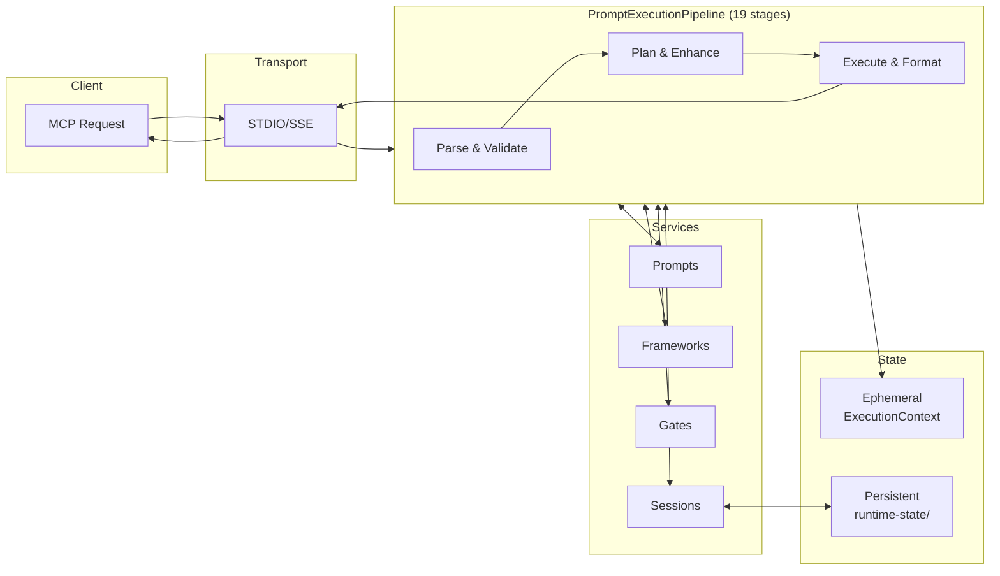
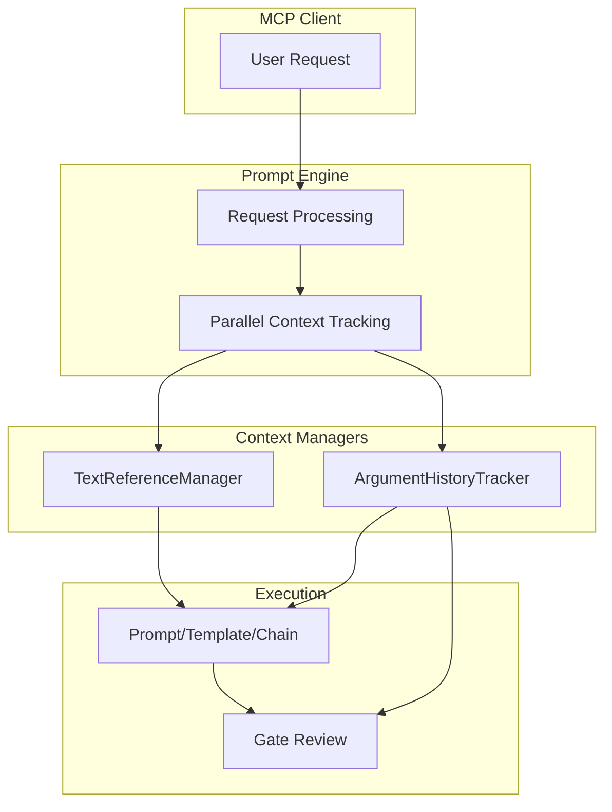

# Architecture Guide

How requests flow from MCP clients through the pipeline to responses.

**Read this when** you want the big picture of transports, runtime, pipeline stages, and state management.

**You'll learn**

- Request flow: Client → Transport → Pipeline → Response
- Where frameworks, gates, and hot-reload plug in
- Which files to inspect when debugging or extending

**Prerequisites**: Server running (see [README Quick Start](../README.md#quick-start)).

---

## System Overview

Three MCP tools. Four methodology frameworks. One 19-stage execution pipeline.

### Request Lifecycle

This is how a `prompt_engine` request actually flows through the system:



### Architectural Layers

```
┌─────────────────────────────────────────────────────────────────┐
│                        MCP Protocol Layer                        │
│  ┌─────────────┐  ┌─────────────┐  ┌─────────────┐              │
│  │prompt_engine│  │prompt_manager│ │system_control│              │
│  └──────┬──────┘  └──────┬──────┘  └──────┬──────┘              │
├─────────┼────────────────┼────────────────┼─────────────────────┤
│         │                │                │   Execution Layer    │
│         ▼                │                │                      │
│  ┌──────────────────┐    │                │                      │
│  │PromptExecution   │    │                │                      │
│  │Pipeline (19 stg) │    │                │                      │
│  └────────┬─────────┘    │                │                      │
├───────────┼──────────────┼────────────────┼─────────────────────┤
│           │              │                │   Service Layer      │
│     ┌─────┴─────┬────────┴────────┬───────┴────┐                │
│     ▼           ▼                 ▼            ▼                │
│ ┌───────┐  ┌─────────┐    ┌───────────┐  ┌─────────┐           │
│ │Prompts│  │Frameworks│    │   Gates   │  │Sessions │           │
│ │Registry│ │ Manager │    │  System   │  │ Manager │           │
│ └───┬───┘  └────┬────┘    └─────┬─────┘  └────┬────┘           │
├─────┼───────────┼───────────────┼─────────────┼─────────────────┤
│     │           │               │             │  Persistence     │
│     ▼           ▼               ▼             ▼                  │
│ prompts/    methodology/    gates/         runtime-state/        │
│ *.md,json   guides/*.yaml   */gate.yaml    *.json                │
│                             */guidance.md                        │
└─────────────────────────────────────────────────────────────────┘
```

### What Each Layer Does

| Layer            | Components            | Responsibility                                             |
| ---------------- | --------------------- | ---------------------------------------------------------- |
| **MCP Protocol** | 3 tools               | Receive MCP requests, validate schemas, return responses   |
| **Execution**    | Pipeline + 19 stages  | Transform request → parse → enhance → execute → format     |
| **Service**      | Managers + registries | Business logic for prompts, frameworks, gates, sessions    |
| **Persistence**  | File system           | Hot-reload sources, runtime state, methodology definitions |

### Why The Pipeline Matters

The `PromptExecutionPipeline` is the architectural centerpiece. Every `prompt_engine` call:

1. Creates fresh `ExecutionContext` (ephemeral state)
2. Flows through 19 stages sequentially
3. Each stage reads/writes to context
4. Services are called as needed by stages
5. Response assembled at the end

This design means:

- **Predictable**: Same stages, same order, every time
- **Debuggable**: Each stage logs entry/exit with timing
- **Extensible**: Add a stage file, register it, done

### Key Design Decisions

| Decision                | Rationale                                             |
| ----------------------- | ----------------------------------------------------- |
| **3-Tool Architecture** | Simple, focused tools instead of 24+ specialized ones |
| **File-Based State**    | Sessions survive STDIO process restarts               |
| **Optional Frameworks** | Disabled by default for performance                   |
| **Hot Reload**          | Prompt changes without server restart                 |
| **Pipeline-First**      | Every request flows through the same staged pipeline  |

---

## Quick Start for Developers

### Codebase Map

```
server/src/
├── runtime/                    # Application lifecycle
│   └── application.ts          # 4-phase startup orchestrator
├── server/transport/           # STDIO + SSE protocol handlers
├── mcp-tools/                  # 3 MCP tools (protocol layer)
│   ├── prompt-engine/          # → PromptExecutionPipeline
│   ├── prompt-manager/         # → PromptAssetManager
│   └── system-control.ts       # → FrameworkStateManager
├── execution/                  # Execution layer
│   ├── pipeline/stages/        # 19 numbered stage files
│   ├── parsers/                # Command parsing strategies
│   ├── context/                # ExecutionContext + type guards
│   └── validation/             # Request validation
├── prompts/                    # Prompt registry + hot-reload
├── frameworks/                 # Methodology system
│   ├── methodology/guides/     # YAML definitions
│   └── framework-manager.ts    # Stateless orchestrator
├── gates/                      # Quality validation
│   ├── core/                   # GateLoader, RuntimeGateLoader, validators
│   ├── registry/               # GateRegistry, GenericGateGuide
│   ├── hot-reload/             # GateHotReloadCoordinator
│   └── services/               # Gate resolution + guidance
├── styles/                     # Response formatting (#id operator)
│   ├── core/                   # StyleDefinitionLoader, schema
│   ├── hot-reload/             # StyleHotReloadCoordinator
│   └── style-manager.ts        # Style orchestration
server/gates/                   # Gate definitions (YAML + MD)
├── {gate-id}/
│   ├── gate.yaml               # Gate configuration
│   └── guidance.md             # Guidance content (inlined at load)
server/styles/                  # Style definitions (YAML + MD)
├── {style-id}/
│   ├── style.yaml              # Style configuration
│   └── guidance.md             # Guidance content (inlined at load)
├── chain-session/              # Multi-step workflow state
├── text-references/            # ArgumentHistoryTracker
└── tooling/contracts/          # Generated Zod schemas
```

### Common Tasks

| Task                  | Where to Look                                                       |
| --------------------- | ------------------------------------------------------------------- |
| Add new prompt        | `server/prompts/[category]/` - create `.md` + update `prompts.json` |
| Modify pipeline stage | `server/src/execution/pipeline/stages/`                             |
| Add methodology guide | `server/src/frameworks/methodology/guides/`                         |
| Add/modify gate       | `server/gates/{id}/` - create `gate.yaml` + `guidance.md`           |
| Add/modify style      | `server/styles/{id}/` - create `style.yaml` + `guidance.md`         |
| Debug session issues  | `server/src/chain-session/` + `runtime-state/chain-sessions.json`   |
| Update configuration  | `server/config.json`                                                |

### Entry Points

| File                                                  | Purpose                   |
| ----------------------------------------------------- | ------------------------- |
| `src/index.ts`                                        | Server startup            |
| `src/mcp-tools/index.ts`                              | Tool registration         |
| `src/execution/pipeline/prompt-execution-pipeline.ts` | Pipeline orchestration    |
| `src/prompts/registry.ts`                             | Prompt management         |
| `src/frameworks/framework-manager.ts`                 | Framework logic           |
| `src/gates/gate-manager.ts`                           | Gate orchestration        |
| `src/gates/registry/gate-registry.ts`                 | Gate lifecycle management |
| `src/styles/style-manager.ts`                         | Style orchestration       |

---

## Execution Pipeline

Every `prompt_engine` call flows through 19 stages in order. Stage files are numbered so filesystem order matches execution order.

### Stage Execution Order

```
┌─────────────────────────────────────────────────────────────────────┐
│                        PARSE & VALIDATE                              │
├─────────────────────────────────────────────────────────────────────┤
│ 00-dependency-injection    Inject framework manager                  │
│ 00-execution-lifecycle     Initialize execution tracking             │
│ 00-request-normalization   Consolidate deprecated params → `gates`   │
│ 01-parsing                 Parse command, extract arguments          │
│ 02-inline-gate             Register `::` criteria as temp gates      │
│ 03-operator-validation     Validate `@framework` overrides           │
├─────────────────────────────────────────────────────────────────────┤
│                        PLAN & ENHANCE                                │
├─────────────────────────────────────────────────────────────────────┤
│ 04-planning                Determine strategy, gates, session needs  │
│ 05-gate-enhancement        Process gates, render guidance            │
│ 06-framework               Resolve active framework                  │
│ 06a-judge-selection        Select evaluation criteria                │
│ 06b-prompt-guidance        Inject methodology guidance               │
│ 07-session                 Chain/session lifecycle                   │
│ 07b-injection-control      Control framework injection per-step      │
├─────────────────────────────────────────────────────────────────────┤
│                        EXECUTE & FORMAT                              │
├─────────────────────────────────────────────────────────────────────┤
│ 08-response-capture        Capture previous step results             │
│ 09-execution               Execute prompts with Nunjucks rendering   │
│ 10-gate-review             Validate gate verdicts (PASS/FAIL)        │
│ 10-formatting              Assemble final response payload           │
│ 11-call-to-action          Add contextual next-step suggestions      │
│ 12-post-formatting-cleanup Clean up temporary state                  │
└─────────────────────────────────────────────────────────────────────┘
```

### Pipeline Behavior

| Behavior         | Description                                                   |
| ---------------- | ------------------------------------------------------------- |
| **Sequential**   | Stages execute in order, no skipping                          |
| **Early exit**   | Pipeline stops when `context.response` is set                 |
| **Stage no-ops** | Stages may skip based on context (e.g., frameworks disabled)  |
| **Metrics**      | Each stage reports timing and memory delta                    |
| **Recovery**     | Errors in a stage are caught, logged, and can trigger cleanup |

---

## Pipeline State Management

Three centralized components prevent bugs from distributed state:

### State Components

| Component                    | Purpose                                          | Access                       |
| ---------------------------- | ------------------------------------------------ | ---------------------------- |
| `GateAccumulator`            | Collects gates with priority-based deduplication | `context.gates`              |
| `DiagnosticAccumulator`      | Collects warnings/errors from stages             | `context.diagnostics`        |
| `FrameworkDecisionAuthority` | Single source for framework decisions            | `context.frameworkAuthority` |

### GateAccumulator

Prevents duplicate gates by tracking source priority:

```typescript
// Priority order (higher wins):
// inline-operator (100) > client-selection (90) > temporary-request (80) >
// prompt-config (60) > chain-level (50) > methodology (40) > registry-auto (20)

context.gates.add("research-quality", "registry-auto");
context.gates.addAll(methodologyGates, "methodology");
const finalGates = context.gates.getAll(); // Deduplicated
```

### FrameworkDecisionAuthority

Resolves framework from multiple sources:

```typescript
// Priority: modifiers (%clean/%lean) > @ operator > client > global
const decision = context.frameworkAuthority.decide({
  modifiers: context.executionPlan?.modifiers,
  operatorOverride: context.parsedCommand?.frameworkOverride,
  clientOverride: context.state.framework.clientOverride,
  globalActiveFramework: "CAGEERF",
});
if (decision.shouldApply) {
  // Use decision.frameworkId
}
```

### DiagnosticAccumulator

Creates audit trail across stages:

```typescript
context.diagnostics.info(this.name, "Gate enhancement complete", {
  gateCount: context.gates.size,
  sources: context.gates.getSourceCounts(),
});
```

---

## Ephemeral vs Persistent State

Understanding which state survives across MCP requests is critical for cross-request features.

### State Lifecycle

| Category               | Lifecycle                        | Storage                | Access                       |
| ---------------------- | -------------------------------- | ---------------------- | ---------------------------- |
| **Ephemeral**          | Dies after each request          | `ExecutionContext`     | `context.state.*`            |
| **Session-Persistent** | Survives across session requests | `ChainSessionManager`  | `chainSessionManager.get*()` |
| **Global-Persistent**  | Survives server restarts         | `runtime-state/*.json` | State managers               |

### Ephemeral State (Per-Request)

Recreated fresh for every MCP tool call:

```typescript
// WRONG: Lost after response
context.state.gates.retryLimitExceeded = true;

// Request 2: Always undefined!
if (context.state.gates.retryLimitExceeded) {
  /* Never runs */
}
```

### Session-Persistent State

Survives across requests for the same session:

```typescript
// CORRECT: Persists to runtime-state/chain-sessions.json
await chainSessionManager.setPendingGateReview(sessionId, review);

// Next request: Works!
const review = chainSessionManager.getPendingGateReview(sessionId);
```

### Global-Persistent State

Survives server restarts:

| State               | Manager                  | File                                   |
| ------------------- | ------------------------ | -------------------------------------- |
| Framework selection | `FrameworkStateManager`  | `runtime-state/framework-state.json`   |
| Gate system enabled | `GateSystemManager`      | `runtime-state/gate-system-state.json` |
| Chain sessions      | `ChainSessionManager`    | `runtime-state/chain-sessions.json`    |
| Argument history    | `ArgumentHistoryTracker` | `runtime-state/argument-history.json`  |

### State Flow Diagram

```
Request 1                          Request 2
─────────                          ─────────
context.state = {}                 context.state = {}  ← Fresh!
    │                                  │
    ▼                                  ▼
Set ephemeral flag                 Ephemeral flag is undefined
context.state.X = true                 │
    │                                  ▼
    ▼                              Read from session manager
Save to session manager            chainSessionManager.get*(sessionId)
chainSessionManager.set*(...)          │
    │                                  ▼
    ▼                              State available!
Response sent
(context.state discarded)
```

### Anti-Patterns

```typescript
// WRONG: Storing cross-request state in context
context.state.gates.retryLimitExceeded = true; // Lost!

// WRONG: Mixing ephemeral and persistent reads
const fromContext = context.state.gates.enforcementMode; // Ephemeral
const fromSession = chainSessionManager.getPendingGateReview(sessionId); // Persistent
// These may be out of sync!

// CORRECT: Single source of truth
const isExceeded = chainSessionManager.isRetryLimitExceeded(sessionId); // Always persistent
```

---

## Context Management

Two context systems serve different purposes:

### TextReferenceManager

- **Purpose**: Chain step outputs, template references, placeholder resolution
- **Scope**: Execution sessions
- **Storage**: In-memory + optional file persistence
- **Use cases**: Multi-step chains, template interpolation, gate review context

### ArgumentHistoryTracker

- **Purpose**: Execution arguments and step results for reproducibility
- **Scope**: Execution sessions
- **Storage**: File-based (`runtime-state/argument-history.json`)
- **Use cases**: Gate reviews, debugging, step replay



---

## Framework Guidance Injection

`InjectionDecisionService` controls what gets prepended to prompts at execution time.

### Injection Types

| Type | Injects | Default Frequency (Chains) |
|------|---------|---------------------------|
| `system-prompt` | Framework methodology (CAGEERF phases, ReACT loop) | Every 2 steps |
| `gate-guidance` | Quality validation criteria | Every step |
| `style-guidance` | Response formatting hints | First step only |

### Resolution Hierarchy

Each injection type resolves independently through a 7-level hierarchy. First match wins:

```
Modifier → Runtime Override → Step Config → Chain Config → Category Config → Global Config → System Default
   ↑              ↑               ↑             ↑              ↑               ↑              ↑
 %clean     system_control    per-step      per-chain     per-category    config.json    hardcoded
```

**Key internals**:
- `HierarchyResolver` walks the config tree for each injection type
- `ConditionEvaluator` handles conditional rules (gate status, step position)
- Decisions are cached per-request in `InjectionDecisionService`
- Frequency modes: `every` (with interval), `first-only`, `never`

For user-facing configuration and examples, see [MCP Tooling Guide → Injection Control](mcp-tools.md#injection-control).

---

## Component Architecture

### Runtime (`src/runtime/`)

Four-phase startup:

1. **Foundation**: Config, environment, logging
2. **Data Loading**: Prompt registry, framework guides
3. **Module Init**: MCP tools, transports, execution engine
4. **Launch**: Health monitoring, graceful shutdown

### Transports (`src/server/transport/`)

| Transport | Protocol                | Use Case       |
| --------- | ----------------------- | -------------- |
| STDIO     | Line-based JSON         | Claude Desktop |
| SSE       | HTTP Server-Sent Events | Web clients    |

Both share unified message handling with automatic protocol detection.

### Prompts (`src/prompts/`)

- **Registry**: Dynamic registration with category organization
- **Hot-Reload**: File watching with debounced updates
- **Templates**: Nunjucks with custom filters and async rendering

### Frameworks (`src/frameworks/`)

- **Manager**: Stateless orchestration, loads definitions from methodology registry
- **State Manager**: Persists active framework to `runtime-state/framework-state.json`
- **Guides**: CAGEERF, ReACT, 5W1H, SCAMPER implementations

### Execution (`src/execution/`)

- **Pipeline**: 19-stage sequential processing (see [Stage Execution Order](#stage-execution-order))
- **Parsers**: Multi-format (symbolic `-->`, JSON, key=value)
- **Context**: `ExecutionContext` with type guards for chain vs single execution
- **Validation**: Request schema validation via generated Zod schemas

---

## Performance Characteristics

| Operation        | Target    | Notes                  |
| ---------------- | --------- | ---------------------- |
| Server startup   | <3s       | 4-phase initialization |
| Tool response    | <500ms    | Most operations        |
| Framework switch | <100ms    | Methodology change     |
| Template render  | <50ms     | Complex Nunjucks       |
| Chain step       | 100-500ms | Depends on complexity  |

### Memory Management

- **Session cleanup**: 24h default for stale sessions
- **Argument history**: Configurable retention limits
- **Template cache**: LRU with size limits
- **Temporary gates**: Auto-expiration

---

## Where to Go Next

| Topic                      | Guide                                               |
| -------------------------- | --------------------------------------------------- |
| MCP command syntax         | [MCP Tooling Guide](mcp-tools.md)           |
| Quality gates & validation | [Gates](gates.md)                                   |
| Multi-step workflows       | [Chains](chains.md)                                 |
| Prompt templates           | [Prompt Authoring Guide](prompt-authoring-guide.md) |
| Common issues              | [Troubleshooting](troubleshooting.md)               |

