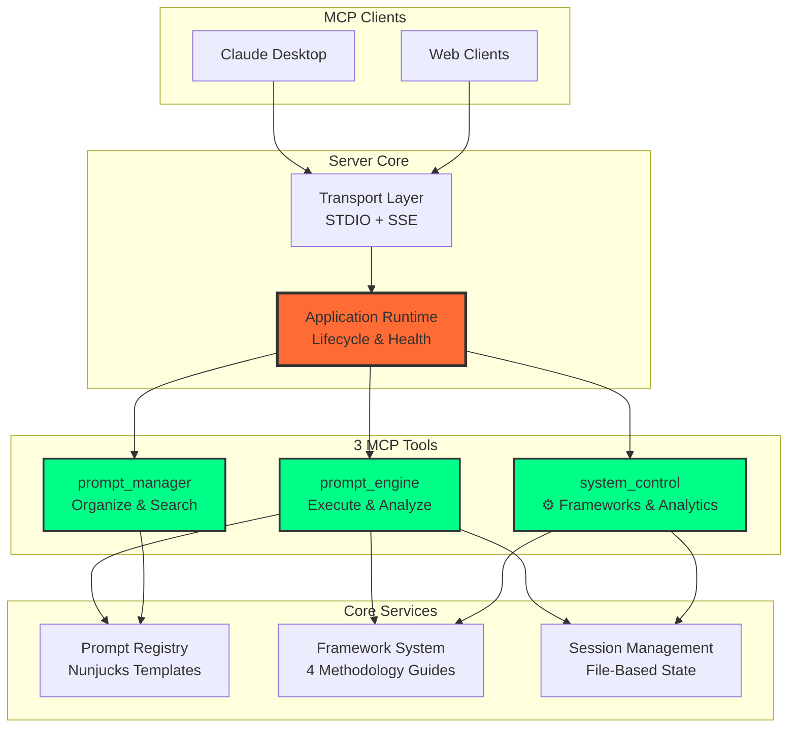
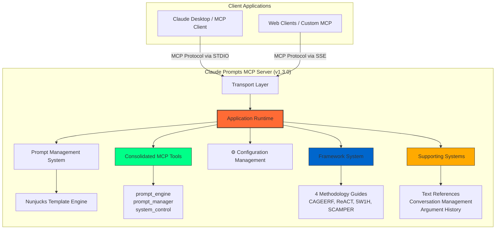
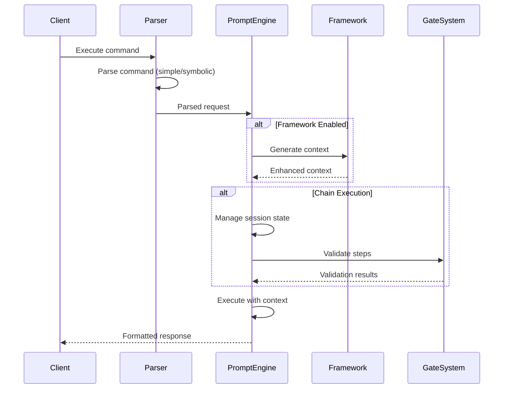
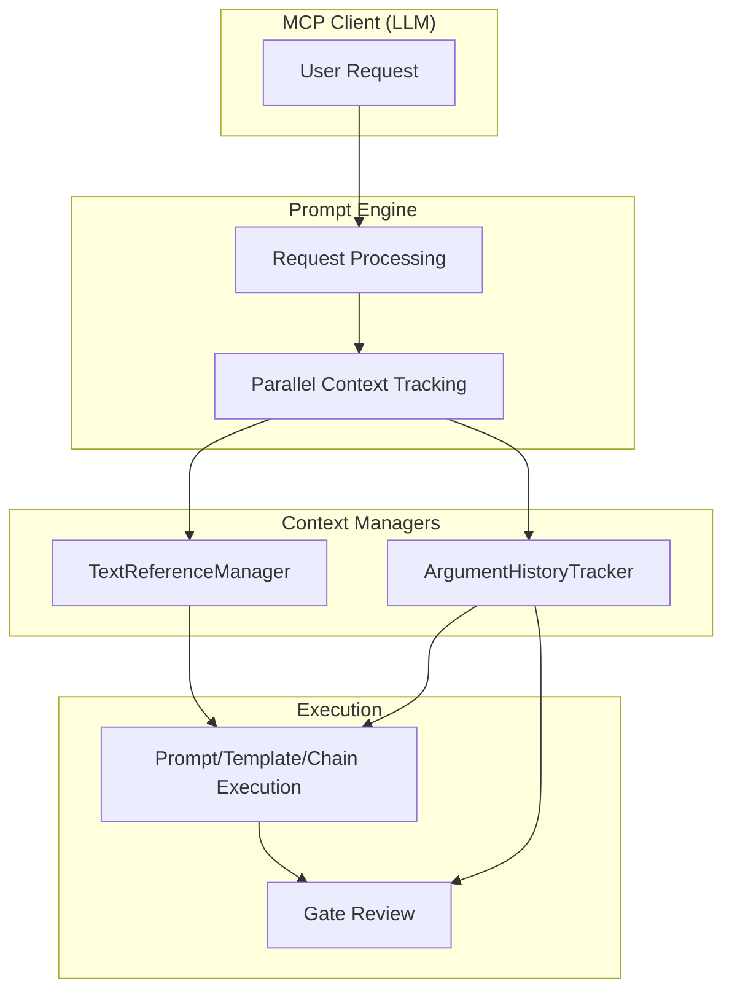

# Architecture Guide

**️ Complete system architecture, performance optimization, and advanced integration**

**Read this when** you want the “big picture” of how transports, the runtime, MCP tools, and methodology frameworks fit together.

**You’ll learn**
- How requests move from clients → transports → PromptExecutionPipeline → LLM responses
- Where frameworks, gates, and hot reload plug into the runtime
- Which files to inspect when customizing execution stages or diagnostics

**Prerequisites**: Comfortable running the server (see [Operations & Deployment Guide](operations-guide.md)) and using MCP tools at least once.

---

## System Philosophy & Design Principles

### Core Architectural Principles

- **Intelligent Command Routing**: Enhanced parser with multi-strategy command detection and automatic tool routing
- **Methodology-Driven Architecture**: Framework behavior driven by methodology guides, not hard-coded logic
- **Pipeline-Orchestrated Execution**: Canonical `PromptExecutionPipeline` stages handle parsing, planning, framework sync, gate enhancement, session management, and formatting for every `prompt_engine` call.
- **LLM-Driven Orchestration**: Chain execution provides instructions to LLMs rather than server-side orchestration
- **Hot-Reload Capability**: Dynamic configuration and prompt reloading without server restart
- **Multi-Transport Protocol**: Support for both STDIO (Claude Desktop) and SSE (web clients)
- **Performance-First Design**: Strategy-based optimizations and conditional processing

### System Architecture

The server uses a **simple, direct architecture** focused on developer experience and maintainability.



### **How It Works**

1. **MCP Clients** connect via STDIO (Claude Desktop) or SSE (web)
2. **Transport Layer** handles protocol communication and routing
3. **Application Runtime** orchestrates all components and manages lifecycle
4. **prompt_engine** builds the `PromptExecutionPipeline` and immediately routes every request through its stages
5. **Pipeline Stages** fan out into core services (prompts, frameworks, gate systems, sessions) before formatting a response
6. **prompt_manager/system_control** interact with the same registries to keep configuration aligned
7. **Frameworks stay manual**: choose a methodology via `system_control` when you need it—structural analysis only detects execution tiers, not tone.

### **Key Design Decisions**

- **3-Tool Architecture**: Simple, focused tools instead of 24+ specialized ones
- **Direct Execution**: No complex strategy patterns or execution tiers
- **File-Based State**: Session persistence survives STDIO process restarts
- **Optional Frameworks**: Methodology guides are opt-in and disabled by default for performance and clarity
- **Hot Reload**: Dynamic configuration and prompt updates without restart
- **Context Engineering First**: Prompts stay in Markdown; Nunjucks + metadata render them into structured MCP requests.

---

## Quick Start for Developers

### **Understanding the Codebase**

```
server/src/
├── runtime/application.ts          #  Main orchestration
├── server/transport/              #  MCP protocol handling
├── mcp-tools/                   #  3 core tools
│   ├── prompt-engine/            #  Execution & analysis
│   ├── prompt-manager/           #  Lifecycle & search
│   └── system-control/           # ⚙️ Frameworks & analytics
├── prompts/                      #  Prompt templates & registry
├── frameworks/                   #  Methodology guides
├── text-references/             #  Session & conversation state
└── config.json                  # ⚙️ Server configuration
```

### **How Requests Flow**

1. **Client Request** → `Transport Layer` (STDIO/SSE)
2. **Transport** → `Application Runtime` (orchestration)
3. **Runtime** → **prompt_engine** (for execution requests)
4. **prompt_engine** → **PromptExecutionPipeline** (parsing → gates → planning → framework → session → execution → formatting)
5. **Pipeline Stages** → **Core Services** (templates, frameworks, state) as needed
6. **Response** → Same path back to client

### **Common Development Tasks**

| **Task**             | **File Location**                           | **What to Modify**                           |
| -------------------- | ------------------------------------------- | -------------------------------------------- |
| Add new prompt       | `server/prompts/[category]/`                | Create `.md` template, update `prompts.json` |
| Modify pipeline stage| `server/src/execution/pipeline/stages/`     | Update the relevant stage implementation     |
| Modify tool behavior | `server/src/mcp-tools/[tool]/`              | Tool shim / registration files               |
| Add framework        | `server/src/frameworks/methodology/guides/` | New methodology guide class                  |
| Update configuration | `server/config.json`                        | Server settings and features                 |
| Debug session issues | `server/src/text-references/`               | Conversation and session management          |

### **Entry Points**

- **Main Entry**: `server/src/index.ts` - Application startup
- **MCP Tools**: `server/src/mcp-tools/index.ts` - Tool registration
- **PromptExecutionPipeline**: `server/src/execution/pipeline/` - Canonical staged execution path used by `prompt_engine`
- **Prompt Registry**: `server/src/prompts/index.ts` - Prompt management
- **Framework Manager**: `server/src/frameworks/framework-manager.ts` - Framework logic (loads definitions through `server/src/frameworks/methodology/framework-registry.ts` so any new methodology registered there becomes available across parsers/executors automatically)

### **Where to Go Next**

- **Operate the runtime**: Jump to the [Operations & Deployment Guide](operations-guide.md) for setup, transports, and diagnostics.
- **Use MCP tools**: The [MCP Tooling Guide](mcp-tooling-guide.md) outlines `prompt_manager`, `prompt_engine`, and `system_control`.
- **Author prompts or chains**: Continue with the [Prompt & Template Authoring Guide](prompt-authoring-guide.md) and [Chain Workflows Guide](chain-workflows.md).
- **Reason about gates**: If you’re tuning validation, read the [Enhanced Gate System](enhanced-gate-system.md) after grasping this architecture.



---

## Command System Architecture

### Understanding Command Types

The MCP server supports two distinct command systems with different syntax and capabilities:

#### Built-in Commands (`>>` syntax)

**Lightweight shortcuts** for common information queries, handled directly by the unified command parser:

- `>>listprompts` / `>>listprompt` / `>>list_prompts` - List all available prompts
- `>>help` / `>>commands` - Show help information
- `>>status` / `>>health` - System health and diagnostics
- `>>analytics` / `>>metrics` - Usage metrics and performance data

**Characteristics:**
- Simple, direct execution with minimal overhead
- No complex parameters or state management
- Optimized for quick information retrieval
- Case-insensitive and support multiple aliases

**Example:**
```bash
>>listprompts
>>status
>>help
```

#### MCP Tool Operations (`system_control` syntax)

**Advanced operations** requiring complex parameters and state management, accessed through MCP tools:

**Framework Operations:**
```javascript
// List all frameworks with details
system_control({ action: "framework", operation: "list", show_details: true })

// Switch to a different framework
system_control({ action: "framework", operation: "switch", framework: "ReACT" })

// Enable/disable framework system
system_control({ action: "framework", operation: "enable" })
system_control({ action: "framework", operation: "disable" })

// Get framework status
system_control({ action: "framework", operation: "status" })
```

**Gate Operations:**
```javascript
// List available quality gates
system_control({ action: "gates", operation: "list" })

// Analyze gate performance
system_control({ action: "gates", operation: "analyze" })
```

**Analytics Operations:**
```javascript
// View detailed analytics
system_control({ action: "analytics", operation: "view", include_metrics: true })

// Reset analytics
system_control({ action: "analytics", operation: "reset" })
```

**Characteristics:**
- Supports complex parameter objects and configurations
- Stateful operations with validation and history tracking
- Framework-aware execution with context management
- Comprehensive error handling and rollback capabilities

### Why Two Systems?

**Design Rationale:**

1. **Performance**: Built-in commands bypass MCP tool overhead for simple queries
2. **Complexity**: MCP tools handle operations requiring validation, state, and rollback
3. **User Experience**: `>>` syntax provides quick shortcuts for common tasks
4. **API Design**: MCP tools follow protocol standards for complex operations

### Common Mistake: Framework Commands

**❌ Incorrect** (this syntax doesn't exist):
```bash
>>frameworks
>>framework list
>>switch_framework
```

**✅ Correct** (use MCP tool syntax):
```javascript
system_control({ action: "framework", operation: "list" })
system_control({ action: "framework", operation: "switch", framework: "CAGEERF" })
```

### Framework Registry

The framework system uses a **registry-based validation** approach:

**Available Frameworks:**
- `CAGEERF` - Context → Analysis → Goals → Execution → Evaluation → Refinement → Framework
- `ReACT` - Reasoning and Acting framework
- `5W1H` - Who, What, When, Where, Why, How analysis
- `SCAMPER` - Substitute, Combine, Adapt, Modify, Put to other uses, Eliminate, Reverse

**Validation:**
- All framework IDs are validated against the methodology registry
- Unknown frameworks are rejected with clear error messages listing valid options
- Case-insensitive matching (e.g., `cageerf`, `CAGEERF`, `CaGeErF` all work)

**Discovering Frameworks:**
```javascript
// List all available frameworks
system_control({ action: "framework", operation: "list" })

// Get detailed framework information
system_control({ action: "framework", operation: "list", show_details: true })
```

---

## ️ Component Architecture

### 1. Application Runtime (`src/runtime/`)

#### **Multi-Phase Startup System**

```typescript
// Phase 1: Foundation
- Configuration loading and validation
- Environment detection and setup
- Error handling initialization
- Logging system bootstrap

// Phase 2: Data Loading
- Prompt registry initialization
- Framework guide loading
- Configuration file processing
- Runtime state restoration

// Phase 3: Module Initialization
- MCP tool registration
- Transport layer setup
- Execution engine initialization
- Framework system bootstrap

// Phase 4: Server Launch
- Health monitoring start
- Graceful shutdown handlers
- Performance monitoring activation
- Client connection acceptance
```

#### **Health Monitoring & Graceful Shutdown**

```typescript
interface HealthMetrics {
  uptime: number;
  memoryUsage: NodeJS.MemoryUsage;
  activeConnections: number;
  promptExecutionCount: number;
  errorRate: number;
  responseTime: number;
}

class HealthMonitor {
  private metrics: HealthMetrics;
  private checks: Map<string, HealthCheck>;

  // 30-second health check intervals
  // Automatic degradation on resource pressure
  // Graceful shutdown with connection draining
}
```

### 2. Transport Layer (`src/server/transport/`)

#### **Multi-Transport Architecture**

```typescript
// STDIO Transport (Claude Desktop)
class StdioTransport {
  // Line-based JSON protocol
  // Direct MCP SDK integration
  // Optimized for desktop clients
}

// SSE Transport (Web Clients)
class SseTransport {
  // Server-Sent Events protocol
  // HTTP-based with CORS support
  // Real-time bidirectional communication
}

// Transport Abstraction
interface Transport {
  connect(): Promise<void>;
  send(message: Message): Promise<void>;
  onMessage(callback: (message: Message) => void): void;
  disconnect(): Promise<void>;
}
```

#### **Transport-Aware Features**

- **Automatic protocol detection** based on connection type
- **Transport-specific optimizations** (buffering, compression)
- **Unified message handling** across all transports
- **Graceful transport switching** for failover scenarios

### 3. Prompt Management System (`src/prompts/`)

#### **Hot-Reload Architecture**

```typescript
class HotReloadManager {
  private watchers: Map<string, FSWatcher>;
  private registry: PromptRegistry;

  // File system monitoring with debouncing
  // Incremental registry updates
  // Template recompilation on change
  // MCP client notification system
}

interface PromptRegistry {
  // Dynamic prompt registration/deregistration
  // Category-based organization
  // Search and filtering capabilities
  // Version management and rollback
}
```

#### **Nunjucks Template Engine Integration**

```typescript
class TemplateProcessor {
  private env: nunjucks.Environment;
  private cache: Map<string, CompiledTemplate>;

  // Advanced template features:
  // - Custom filters and functions
  // - Template inheritance and macros
  // - Async template rendering
  // - Error recovery and validation
}
```

### 4. Consolidated MCP Tools (`src/mcp-tools/`)

#### **Three-Tool Architecture**

The MCP server implements a streamlined 3-tool architecture that consolidates all functionality into focused, manageable components. Each tool handles a major functional area with clear responsibilities.

```typescript
// prompt_engine - Universal Execution & Analysis
class PromptEngineTool {
  // Core execution capabilities
  executePrompt(
    promptId: string,
    args: Record<string, any>
  ): Promise<ExecutionResult>;
  executeChain(
    chainId: string,
    args: Record<string, any>
  ): Promise<ChainResult>;

  // Analysis and detection
  analyzePrompt(content: string): Promise<AnalysisResult>;
  detectExecutionType(content: string): ExecutionType;

  // Framework integration
  generateExecutionContext(prompt: any): FrameworkExecutionContext;

  // Chain and session management
  createChainSession(
    chainId: string,
    totalSteps: number
  ): Promise<SessionResult>;
  resumeChainSession(sessionId: string): Promise<SessionResult>;
}

// prompt_manager - Lifecycle & Organization
class PromptManagerTool {
  // CRUD operations
  createPrompt(prompt: PromptData): Promise<PromptResult>;
  updatePrompt(id: string, updates: Partial<PromptData>): Promise<PromptResult>;
  deletePrompt(id: string): Promise<DeleteResult>;

  // Advanced search and filtering
  listPrompts(filter: PromptFilter): Promise<PromptListResult>;
  searchPrompts(query: SearchQuery): Promise<SearchResult>;

  // Category and organization
  listCategories(): Promise<CategoryResult>;
  getPromptsByCategory(category: string): Promise<PromptListResult>;

  // Bulk operations
  bulkCreate(prompts: PromptData[]): Promise<BulkResult>;
  bulkUpdate(updates: BulkUpdateRequest[]): Promise<BulkResult>;
  bulkDelete(ids: string[]): Promise<BulkResult>;
}

// system_control - Framework & System Management
class SystemControlTool {
  // Framework management
  switchFramework(framework: string): Promise<SwitchResult>;
  getActiveFramework(): Promise<FrameworkResult>;
  listFrameworks(): Promise<FrameworkListResult>;
  enableFrameworkSystem(reason?: string): Promise<ControlResult>;
  disableFrameworkSystem(reason?: string): Promise<ControlResult>;

  // Analytics and metrics
  getAnalytics(timeRange?: string): Promise<AnalyticsResult>;
  getPerformanceMetrics(): Promise<PerformanceResult>;
  getUsageStatistics(): Promise<UsageResult>;

  // System diagnostics
  getSystemHealth(): Promise<HealthResult>;
  getServerStatus(): Promise<StatusResult>;

  // Configuration management
  reloadConfiguration(): Promise<ReloadResult>;
  getConfiguration(): Promise<ConfigResult>;
}
```

#### **Tool Implementation Architecture**

**Core Design Principles:**

- **Single Responsibility**: Each tool handles one major functional area
- **Intelligent Filtering**: Advanced search capabilities across all tools
- **Response Consistency**: Standardized `ToolResponse` interface
- **Error Handling**: Comprehensive error boundaries with recovery
- **Performance Monitoring**: Built-in metrics and health checks

**Key Implementation Files:**

- `src/mcp-tools/prompt-engine/` - Execution engine with analysis capabilities
- `src/mcp-tools/prompt-manager/` - Lifecycle management with smart filtering
- `src/mcp-tools/system-control/` - Framework switching and analytics
- `src/mcp-tools/tool-description-manager.ts` - Dynamic MCP tool registration
- `src/mcp-tools/config-utils.ts` - Configuration management utilities
- `src/mcp-tools/constants.ts` - Shared constants and enums

**Tool Registration System:**

```typescript
// Dynamic tool description management
class ToolDescriptionManager {
  loadToolDescriptions(): Promise<ToolDescription[]>;
  updateToolDescription(
    toolId: string,
    description: ToolDescription
  ): Promise<void>;
  registerTool(tool: MCPTool): void;
  unregisterTool(toolId: string): void;
}
```

### 5. Framework System (`src/frameworks/`)

#### **Phase 1 Implementation - Basic Framework Support**

The framework system implements a basic "Phase 1" architecture with methodology-driven design. The system provides structured approaches to prompt creation and processing through four methodology guides.

```typescript
interface IMethodologyGuide {
  guidePromptCreation(prompt: PromptData): PromptEnhancement;
  guideTemplateProcessing(template: string): TemplateEnhancement;
  guideExecutionSteps(context: ExecutionContext): ExecutionSteps;
  enhanceWithMethodology(content: string): EnhancedContent;
  validateMethodologyCompliance(result: any): ComplianceResult;
}

class FrameworkManager {
  private guides: Map<string, IMethodologyGuide>;

  // Stateless orchestration
  loadFramework(frameworkId: string): FrameworkDefinition | null;
  generateExecutionContext(
    prompt: any,
    criteria: FrameworkSelectionCriteria
  ): FrameworkExecutionContext | null;
  listFrameworks(enabledOnly?: boolean): FrameworkDefinition[];

  // Guide-driven behavior
  private loadMethodologyGuides(): Map<string, IMethodologyGuide>;
  private createFrameworkDefinition(
    guide: IMethodologyGuide
  ): FrameworkDefinition;
}
```

#### **Framework State Management**

```typescript
class FrameworkStateManager extends EventEmitter {
  private currentState: FrameworkState;
  private frameworkManager: FrameworkManager;
  private switchHistory: FrameworkSwitch[];

  // Core state management
  getCurrentState(): FrameworkState;
  switchFramework(request: FrameworkSwitchRequest): Promise<boolean>;
  generateExecutionContext(
    prompt: any,
    criteria?: FrameworkSelectionCriteria
  ): FrameworkExecutionContext | null;

  // System control (disabled by default)
  enableFrameworkSystem(reason?: string): void;
  disableFrameworkSystem(reason?: string): void;
  isFrameworkSystemEnabled(): boolean;

  // Health and metrics
  getSystemHealth(): FrameworkSystemHealth;
  getSwitchHistory(limit?: number): FrameworkSwitch[];
}
```

#### **Available Methodology Guides**

**CAGEERF** (Default): Comprehensive analysis framework

- **Purpose**: Systematic content analysis and evaluation
- **Use Cases**: Deep analysis, research, content evaluation
- **Features**: Multi-perspective analysis, evidence-based reasoning

**ReACT**: Reasoning and acting framework

- **Purpose**: Sequential reasoning with action planning
- **Use Cases**: Problem-solving, decision-making, planning
- **Features**: Thought-action-observation cycles

**5W1H**: Question-based framework

- **Purpose**: Comprehensive information gathering
- **Use Cases**: Research, investigation, content creation
- **Features**: Who, What, When, Where, Why, How analysis

**SCAMPER**: Creative thinking framework

- **Purpose**: Creative idea generation and innovation
- **Use Cases**: Brainstorming, creative writing, innovation
- **Features**: Substitute, Combine, Adapt, Modify, Put to other uses, Eliminate, Reverse

#### **Framework Configuration**

**Default State**: Framework system is **disabled by default** for performance

- Can be enabled via `system_control.enableFrameworkSystem()`
- State persists across server restarts via `runtime-state/framework-state.json`

**Framework Switching**:

- Switch between methodologies using `system_control.switchFramework()`
- Maintains switching history and performance metrics
- Validates framework availability before switching

### 6. Execution Engine (`src/execution/`)

#### **Simplified Execution Architecture**

The execution system uses direct execution through the `PromptExecutionService` (the pipeline-backed MCP entry point). Complex strategy patterns have been removed in favor of a unified approach.

```typescript
// Simplified execution orchestration
class ExecutionOrchestrator {
// Delegates all execution to PromptExecutionService
  // No longer manages complex strategy selection
  // Focuses on command parsing and routing
}

// Core execution handled by MCP tools
class PromptExecutionService {
  // Universal prompt execution
  executePrompt(
    promptId: string,
    args: Record<string, any>
  ): Promise<ExecutionResult>;

  // Chain execution with session management
  executeChain(
    chainId: string,
    args: Record<string, any>
  ): Promise<ChainResult>;

  // Analysis and semantic detection
  analyzePrompt(content: string): Promise<AnalysisResult>;
  detectExecutionType(content: string): ExecutionType;
}
```

#### **Command Parsing System**

**Parsing System with Dependency Injection** (`src/execution/parsers/index.ts`):

- Factory function `createParsingSystem(logger)` creates the complete parsing pipeline
- Framework validation handled later via the centralized FrameworkValidator + pipeline stage
- Type-safe dependency propagation through all parser components
- Backward compatibility maintained by keeping parser responsibilities narrow

**Unified Command Parser** (`src/execution/parsers/unified-command-parser.ts`):

- Multi-strategy parsing system optimized for LLM interactions
- Supports: Simple commands (`>>prompt_name`), JSON, Key=value, Symbolic operators
- Built-in commands (>>syntax): `listprompts` / `listprompt` / `list_prompts`, `help` / `commands`, `status` / `health`, `analytics` / `metrics`
- **Note**: Framework operations use MCP tool syntax: `system_control({ action: "framework", operation: "list" })`
- Parser no longer depends on framework manager injection; validation occurs downstream

**Symbolic Command Parser** (`src/execution/parsers/symbolic-command-parser.ts`):

- Chain operator (`-->`) for sequential execution
- Framework operator (`@`) for temporary framework switching with validation handled downstream
- Gate operator (`::`) for inline quality validation
- Session-aware execution with state persistence
- Graceful fallback behavior even when framework metadata isn’t available at parse time

#### **Execution Context Management**

**Context Resolution** (`src/execution/context/`):

- Template variable resolution and substitution
- Framework context injection when enabled
- Chain session state management
- Argument history integration

#### **Dependency Injection Pattern**

The parsing system no longer depends on the framework manager during parsing. Validation
and normalization now occur in a dedicated validation stage, so parser constructors only
require a logger:

**Factory Function Chain:**
```typescript
// 1. Create parsing system (framework validation happens downstream)
const parsingSystem = createParsingSystem(logger);

// 2. Unified command parser wires symbolic + simple strategies
const commandParser = createUnifiedCommandParser(logger);

// 3. Symbolic parser focuses solely on syntax parsing
const symbolicParser = createSymbolicCommandParser(logger);
```

**Benefits:**
- **Clear Responsibilities**: Parser parses; validation occurs later via FrameworkValidator
- **Testability**: No runtime dependency injection needed for parsing unit tests
- **Consistency**: All validation logic shared through centralized validator/pipeline stages

**PromptExecutionService Integration:**
```typescript
// Engine still notifies downstream systems when a framework manager is available
engine.setFrameworkManager(frameworkManager);

// Parsing system recreation no longer requires the manager
this.parsingSystem = createParsingSystem(logger);
this.inlineGateParser = createSymbolicCommandParser(logger);
```

**Key Components:**

- `execution-context.ts` - Unified execution context with type guards
- `context-resolver.ts` - Context resolution and validation
- `framework-injector.ts` - Framework-specific enhancement

**ExecutionContext Type Safety:**

The `ExecutionContext` class provides type-safe access to execution state through type guard methods:

```typescript
class ExecutionContext {
  // Type guards for compile-time safety
  hasChainCommand(): this is ExecutionContext & {
    parsedCommand: ParsedCommand & { commandType: 'chain'; steps: ChainStepPrompt[] };
  }

  hasSinglePromptCommand(): this is ExecutionContext & {
    parsedCommand: ParsedCommand & { commandType: 'single'; convertedPrompt: ConvertedPrompt };
  }

  hasSymbolicOperators(): this is ExecutionContext & {
    parsedCommand: ParsedCommand & { format: 'symbolic' };
  }
}
```

**Design Rationale:**

- **Simplicity**: Enhances existing class instead of complex discriminated union variants
- **Type Safety**: Provides compile-time narrowing for chain vs single prompt execution
- **Low Overhead**: ~30 lines of code vs 579 lines of unused variant infrastructure
- **Practical**: Achieves 80% of type safety benefit with 20% of implementation effort

**Usage Example:**

```typescript
// Pipeline stage with type-safe access
if (context.hasChainCommand()) {
  // TypeScript knows context.parsedCommand.steps exists and is ChainStepPrompt[]
  return context.parsedCommand.steps.length;
}
```

---

## Simplified Execution System

### Direct Execution Architecture

The execution system has been simplified to use direct execution through the `PromptExecutionService`. The complex 3-tier strategy model has been removed in favor of a unified approach.

| **Execution Type**      | **Implementation**                                   | **Performance** | **Use Cases**                           |
| ----------------------- | ---------------------------------------------------- | --------------- | --------------------------------------- |
| **Single Prompt**       | Direct execution via `prompt_engine.executePrompt()` | <50ms           | Simple text generation, quick analysis  |
| **Chain Execution**     | Session-based via `prompt_engine.executeChain()`     | 100-500ms/step  | Multi-step workflows, complex reasoning |
| **Template Processing** | Nunjucks rendering with variable substitution        | 10-100ms        | Dynamic content, conditional logic      |

### Execution Flow Architecture



### Session Management

**Chain Session Manager** (`src/chain-session/manager.ts`):

- File-based persistence for STDIO transport compatibility
- Session state tracking across multiple MCP tool calls
- Integration with Argument History Tracker for context preservation
- Automatic cleanup of stale sessions

**Key Features:**

- Session survival across process restarts
- Step-by-step progress tracking
- Argument history integration
- Gate review session management

---

## Key Implementation Features

### Argument History Tracker (`src/text-references/argument-history-tracker.ts`)

**Purpose**: Track and preserve argument history across chain executions for review context and debugging.

```typescript
class ArgumentHistoryTracker {
  // History management
  trackArguments(sessionId: string, args: Record<string, any>): void;
  getHistory(sessionId: string): ArgumentHistoryEntry[];
  buildReviewContext(sessionId: string): ReviewContext;

  // Session lifecycle
  clearSession(sessionId: string): void;
  cleanupExpiredSessions(): void;

  // Persistence
  saveHistory(): Promise<void>;
  loadHistory(): Promise<void>;
}
```

**Key Features:**

- Session-based argument tracking
- Review context building for gate validation
- File-based persistence across restarts
- Integration with Chain Session Manager
- Automatic cleanup of expired sessions

### Tool Description Manager (`src/mcp-tools/tool-description-manager.ts`)

**Purpose**: Dynamic management of MCP tool descriptions with hot-reload capability.

```typescript
class ToolDescriptionManager {
  // Tool registration
  registerTool(tool: MCPTool): void;
  unregisterTool(toolId: string): void;

  // Description management
  loadToolDescriptions(): Promise<ToolDescription[]>;
  updateToolDescription(
    toolId: string,
    description: ToolDescription
  ): Promise<void>;
  reloadDescriptions(): Promise<void>;

  // Hot-reload support
  enableHotReload(): void;
  disableHotReload(): void;
  handleFileChange(filePath: string): Promise<void>;
}
```

**Key Features:**

- Dynamic tool registration and deregistration
- Hot-reload of tool descriptions
- File watching for automatic updates
- Validation of tool description schemas
- Integration with MCP protocol layer

### Gate System Manager (`src/gates/gate-state-manager.ts`)

**Purpose**: Runtime state management for the gate validation system with enable/disable functionality.

```typescript
class GateSystemManager extends EventEmitter {
  // System control
  enableGateSystem(reason?: string): void;
  disableGateSystem(reason?: string): void;
  isGateSystemEnabled(): boolean;

  // Validation metrics
  recordValidation(success: boolean, executionTime: number): void;
  getValidationMetrics(): ValidationMetrics;

  // Health monitoring
  getSystemHealth(): GateSystemHealth;
  resetMetrics(): void;

  // State persistence
  saveState(): Promise<void>;
  loadState(): Promise<void>;
}
```

**Key Features:**

- Runtime enable/disable of gate system
- Validation metrics tracking
- Health monitoring and reporting
- State persistence across restarts
- Event-driven architecture for state changes

### Lightweight Gate System (`src/gates/core/index.ts`)

**Purpose**: Core gate validation with temporary gate support and framework awareness.

```typescript
class LightweightGateSystem {
  // Temporary gates
  createTemporaryGate(
    definition: TemporaryGateDefinition,
    scopeId?: string
  ): string | null;
  getTemporaryGatesForScope(
    scope: string,
    scopeId: string
  ): TemporaryGateDefinition[];
  cleanupTemporaryGates(scope: string, scopeId?: string): number;

  // Core validation
  getGuidanceText(
    gateIds: string[],
    context: GuidanceContext
  ): Promise<string[]>;
  validateContent(
    gateIds: string[],
    content: string,
    validationContext: ValidationContext
  ): Promise<ValidationResult[]>;

  // System integration
  setGateSystemManager(manager: GateSystemManager): void;
  setTemporaryGateRegistry(registry: TemporaryGateRegistry): void;
}
```

**Key Features:**

- Temporary gate creation and management
- Framework-aware validation
- Integration with system state manager
- Scope-based gate organization
- Automatic cleanup of expired gates

### Performance Considerations

#### **Current Implementation Optimizations**

**Execution Performance**:

- **Direct Execution**: PromptExecutionService eliminates strategy selection overhead
- **Template Caching**: Nunjucks templates cached for repeated use
- **Session Persistence**: File-based state management with minimal memory footprint
- **Hot-Reload Efficiency**: Debounced file watching with incremental updates

**Memory Management**:

- **Session Cleanup**: Automatic cleanup of stale sessions (24h default)
- **Argument History**: Configurable retention limits for argument tracking
- **Gate System**: Temporary gate expiration and memory management
- **Text References**: LRU cache with size limits for reference storage

**Performance Budgets**:

- **Server Startup**: <3 seconds with 4-phase initialization
- **Tool Response**: <500ms for most operations
- **Framework Switching**: <100ms for methodology changes
- **Template Rendering**: <50ms for complex Nunjucks templates
- **Chain Step Execution**: 100-500ms depending on complexity

#### **Monitoring and Analytics**

**Built-in Performance Tracking**:

```typescript
class PerformanceMonitor {
  // Execution timing
  recordExecutionTime(operation: string, duration: number): void;

  // Memory usage tracking
  recordMemoryUsage(component: string, usage: number): void;

  // Error rate monitoring
  recordError(component: string, error: Error): void;

  // Health checks
  getSystemHealth(): SystemHealthMetrics;
}
```

**Key Metrics Tracked**:

- Tool execution times and success rates
- Framework switching performance
- Gate validation execution times
- Session creation and cleanup metrics
- Memory usage patterns and peaks
  // Step parallelization where possible ( PLANNED)
  // private parallelizationEngine: ParallelizationEngine;

  // State compression for long chains
  private stateCompressor: StateCompressor;

  // LLM coordination optimization
  private llmCoordinator: LLMCoordinator;

  // Resource management for concurrent chains
  optimizeChainExecution(chain: Chain): OptimizedChain {
  // TODO: Identify parallelizable steps (Phase 3)
  // Compress state between steps
  // Optimize LLM instruction generation
  // Manage resource allocation
  }
  }

````

---

##  Framework System Architecture

### Methodology Guide Implementation

#### **CAGEERF Guide Implementation**
```typescript
class CageerfGuide implements IMethodologyGuide {
  guidePromptCreation(prompt: PromptData): PromptEnhancement {
    return {
      systemPrompt: this.generateCageerfSystemPrompt(),
      contextEnhancement: {
        phases: ['context', 'analysis', 'goals', 'execution', 'evaluation', 'refinement'],
        methodology: 'systematic-structured-analysis',
        qualityCriteria: ['completeness', 'systematic-approach', 'goal-alignment']
      },
      templateEnhancement: {
        variables: ['context', 'analysis', 'goals', 'execution', 'evaluation', 'refinement'],
        structure: 'six-phase-approach',
        validation: 'phase-completion-check'
      }
    };
  }

  validateMethodologyCompliance(result: any): ComplianceResult {
    // Check for all six phases
    // Validate systematic approach
    // Ensure goal alignment
    // Verify evaluation criteria
    // Check refinement integration
  }

  private generateCageerfSystemPrompt(): string {
    return `You are using the CAGEERF methodology for systematic analysis:

1. CONTEXT: Understand the environment, stakeholders, and constraints
2. ANALYSIS: Break down the problem systematically into components
3. GOALS: Define clear objectives and success criteria
4. EXECUTION: Implement systematic approach with defined steps
5. EVALUATION: Assess results against objectives and metrics
6. REFINEMENT: Improve based on feedback and learning

Ensure each phase is completed thoroughly before proceeding to the next.`;
  }
}
````

#### **ReACT Guide Implementation**

```typescript
class ReactGuide implements IMethodologyGuide {
  guidePromptCreation(prompt: PromptData): PromptEnhancement {
    return {
      systemPrompt: this.generateReactSystemPrompt(),
      contextEnhancement: {
        phases: ["reasoning", "acting", "observation"],
        methodology: "iterative-problem-solving",
        qualityCriteria: [
          "logical-reasoning",
          "action-specificity",
          "observation-accuracy",
        ],
      },
      templateEnhancement: {
        variables: ["reasoning", "action", "observation", "iteration"],
        structure: "reason-act-observe-cycle",
        validation: "iteration-completion-check",
      },
    };
  }

  private generateReactSystemPrompt(): string {
    return `You are using the ReACT methodology for systematic problem-solving:

1. REASONING: Think through the problem systematically, identify patterns and root causes
2. ACTING: Take concrete, specific steps based on your reasoning and analysis
3. OBSERVATION: Evaluate the results of your actions and adjust your approach

Continue this cycle until the problem is resolved. Each iteration should build on previous observations.`;
  }
}
```

### Framework Integration Architecture

#### **Framework-Aware Execution**

```typescript
class FrameworkAwareExecution {
  private frameworkManager: FrameworkManager;
  private templateProcessor: TemplateProcessor;

  async executeWithFramework(
    prompt: PromptData,
    framework: string,
    context: ExecutionContext
  ): Promise<ExecutionResult> {
    // 1. Load methodology guide
    const guide = this.frameworkManager.getGuide(framework);

    // 2. Enhance prompt with framework
    const enhancedPrompt = guide.guidePromptCreation(prompt);

    // 3. Process template with framework variables
    const processedTemplate = await this.templateProcessor.process(
      enhancedPrompt.templateContent,
      {
        ...context.variables,
        framework: enhancedPrompt.contextEnhancement,
      }
    );

    // 4. Execute with framework system prompt
    const result = await this.executeWithSystemPrompt(
      processedTemplate,
      enhancedPrompt.systemPrompt
    );

    // 5. Validate framework compliance
    const compliance = guide.validateMethodologyCompliance(result);

    return {
      ...result,
      frameworkCompliance: compliance,
      framework: framework,
    };
  }
}
```

#### **Framework Switching Architecture**

```typescript
class FrameworkSwitching {
  private stateManager: FrameworkStateManager;
  private validator: FrameworkSwitchValidator;

  async switchFramework(
    newFramework: string,
    reason: string,
    context: ExecutionContext
  ): Promise<FrameworkSwitchResult> {
    // 1. Validate switch request
    const validation = await this.validator.validateSwitch(
      newFramework,
      context
    );
    if (!validation.valid) {
      throw new FrameworkSwitchError(validation.reason);
    }

    // 2. Save current state
    const currentState = this.stateManager.getCurrentState();

    // 3. Perform framework switch
    const switchResult = await this.performSwitch(newFramework, reason);

    // 4. Update state and history
    this.stateManager.updateState(newFramework, reason, switchResult);

    // 5. Notify clients of change
    await this.notifyFrameworkChange(switchResult);

    return switchResult;
  }
}
```

---

## ️ Quality Gate System Architecture

### Multi-Level Quality Validation

#### **Gate Registry and Evaluation**

```typescript
interface QualityGate {
  id: string;
  name: string;
  criteria: QualityCriteria[];
  evaluator: GateEvaluator;
  framework?: string;
  executionMode?: ExecutionMode;
}

class QualityGateRegistry {
  private gates: Map<string, QualityGate>;
  private evaluators: Map<string, GateEvaluator>;

  registerGate(gate: QualityGate): void {
    // Register gate with validation
    // Initialize evaluator
    // Set up framework integration
    // Configure execution mode compatibility
  }

  async evaluateContent(
    content: any,
    gateIds: string[],
    context: ExecutionContext
  ): Promise<GateEvaluationResult> {
    const results: GateResult[] = [];

    for (const gateId of gateIds) {
      const gate = this.gates.get(gateId);
      if (gate && this.isCompatible(gate, context)) {
        const result = await gate.evaluator.evaluate(
          content,
          gate.criteria,
          context
        );
        results.push(result);
      }
    }

    return this.aggregateResults(results);
  }
}
```

#### **Framework-Specific Quality Gates**

```typescript
class CageerfQualityGate implements GateEvaluator {
  async evaluate(
    content: any,
    criteria: QualityCriteria[],
    context: ExecutionContext
  ): Promise<GateResult> {
    const evaluations = {
      contextAnalysis: this.evaluateContextAnalysis(content),
      systematicApproach: this.evaluateSystematicApproach(content),
      goalAlignment: this.evaluateGoalAlignment(content),
      executionQuality: this.evaluateExecutionQuality(content),
      evaluationRigor: this.evaluateEvaluationRigor(content),
      refinementIntegration: this.evaluateRefinementIntegration(content),
    };

    const overallScore =
      Object.values(evaluations).reduce((sum, score) => sum + score, 0) / 6;

    return {
      gateId: "cageerf_compliance",
      passed: overallScore >= 0.8,
      score: overallScore,
      details: evaluations,
      recommendations: this.generateRecommendations(evaluations),
    };
  }

  private evaluateContextAnalysis(content: any): number {
    // Evaluate context section completeness
    // Check stakeholder identification
    // Assess environmental analysis
    // Validate constraint identification
  }

  private evaluateSystematicApproach(content: any): number {
    // Check for systematic breakdown
    // Validate logical flow
    // Assess component analysis
    // Verify analytical rigor
  }
}
```

#### **Adaptive Quality Thresholds**

```typescript
class AdaptiveQualityThresholds {
  private performanceHistory: Map<string, PerformanceHistory>;
  private userPreferences: Map<string, UserQualityPreferences>;

  calculateAdaptiveThreshold(
    gateId: string,
    context: ExecutionContext,
    historicalPerformance: PerformanceHistory
  ): number {
    const baseThreshold = this.getBaseThreshold(gateId);
    const userAdjustment = this.getUserAdjustment(context.userId, gateId);
    const performanceAdjustment = this.getPerformanceAdjustment(
      historicalPerformance
    );
    const contextAdjustment = this.getContextAdjustment(context);

    return Math.max(
      0.5,
      Math.min(
        1.0,
        baseThreshold +
          userAdjustment +
          performanceAdjustment +
          contextAdjustment
      )
    );
  }

  private getPerformanceAdjustment(history: PerformanceHistory): number {
    // Adjust based on historical performance
    // If user consistently produces high quality, increase threshold
    // If user struggles with specific criteria, provide guidance
    // Consider recent improvement trends
  }
}
```

---

## Performance Monitoring & Optimization

### Real-Time Performance Analytics

#### **Performance Metrics Collection**

```typescript
interface PerformanceMetrics {
  execution: {
    promptMode: ExecutionMetrics;
    templateMode: ExecutionMetrics;
    chainMode: ExecutionMetrics;
  };
  frameworks: Map<string, FrameworkMetrics>;
  qualityGates: Map<string, GateMetrics>;
  system: SystemMetrics;
}

class PerformanceMonitor {
  private metricsCollector: MetricsCollector;
  private analyticsEngine: AnalyticsEngine;
  private alertingSystem: AlertingSystem;

  collectMetrics(): PerformanceMetrics {
    return {
      execution: {
        promptMode: this.collectExecutionMetrics("prompt"),
        templateMode: this.collectExecutionMetrics("template"),
        chainMode: this.collectExecutionMetrics("chain"),
      },
      frameworks: this.collectFrameworkMetrics(),
      qualityGates: this.collectGateMetrics(),
      system: this.collectSystemMetrics(),
    };
  }

  analyzePerformance(metrics: PerformanceMetrics): PerformanceAnalysis {
    // Identify performance bottlenecks
    // Detect degradation patterns
    // Analyze resource utilization
    // Generate optimization recommendations
  }
}
```

#### **Performance Optimization Engine**

```typescript
class PerformanceOptimizer {
  private optimizationStrategies: Map<string, OptimizationStrategy>;

  async optimizeSystem(
    analysis: PerformanceAnalysis
  ): Promise<OptimizationResult> {
    const optimizations: Optimization[] = [];

    // Memory optimization
    if (analysis.memoryPressure > 0.8) {
      optimizations.push(await this.optimizeMemoryUsage());
    }

    // Execution time optimization
    if (analysis.averageResponseTime > 1000) {
      optimizations.push(await this.optimizeExecutionTime());
    }

    // Quality gate optimization
    if (analysis.gateFailureRate > 0.2) {
      optimizations.push(await this.optimizeQualityGates());
    }

    return this.applyOptimizations(optimizations);
  }

  private async optimizeMemoryUsage(): Promise<Optimization> {
    // Implement memory pooling
    // Optimize template caching
    // Compress chain state
    // Garbage collection tuning
  }

  private async optimizeExecutionTime(): Promise<Optimization> {
    // Pre-compile frequently used templates
    // Cache framework enhancements
    // Optimize variable substitution
    // Parallelize independent operations
  }
}
```

### Resource Management

#### **Memory Management**

```typescript
class MemoryManager {
  private pools: Map<string, MemoryPool>;
  private gcScheduler: GCScheduler;
  private memoryMonitor: MemoryMonitor;

  // Object pooling for frequent allocations
  private templatePool: MemoryPool<Template>;
  private contextPool: MemoryPool<ExecutionContext>;
  private resultPool: MemoryPool<ExecutionResult>;

  manageMemory(): void {
    // Monitor memory usage patterns
    // Schedule garbage collection
    // Optimize pool sizes
    // Prevent memory leaks
  }

  optimizeForWorkload(workload: WorkloadPattern): void {
    // Adjust pool sizes based on usage
    // Pre-allocate based on patterns
    // Implement adaptive caching
    // Optimize garbage collection
  }
}
```

#### **CPU Optimization**

```typescript
class CPUOptimizer {
  private workerPool: WorkerPool;
  private taskScheduler: TaskScheduler;

  async optimizeCPUUsage(): Promise<CPUOptimizationResult> {
    // Distribute CPU-intensive tasks
    // TODO: Implement task parallelization (Phase 3)
    // Optimize synchronous operations
    // Balance load across workers

    return {
      // TODO: parallelizationGains: this.calculateParallelizationGains(),
      taskDistribution: this.getTaskDistribution(),
      optimizationRecommendations: this.getOptimizationRecommendations(),
    };
  }

  // TODO: Parallel template processing (Phase 3 implementation)
  // private async parallelizeTemplateProcessing(templates: Template[]): Promise<Template[]> {
  //   // Parallel template compilation
  //   // Concurrent variable substitution
  //   // Distributed framework enhancement
  //   // Parallel quality gate evaluation
  // }
}
```

---

## MCP Protocol Integration

### Protocol Implementation Architecture

#### **MCP SDK Integration**

```typescript
class MCPServer {
  private server: Server;
  private tools: Map<string, Tool>;
  private transports: Map<string, Transport>;

  async initialize(): Promise<void> {
    // Initialize MCP server
    this.server = new Server(
      {
        name: "claude-prompts-mcp",
        version: "1.3.0",
      },
      {
        capabilities: {
          tools: {},
          logging: {},
          prompts: {},
        },
      }
    );

    // Register consolidated tools
    await this.registerTools();

    // Set up transport handlers
    this.setupTransportHandlers();

    // Configure error handling
    this.setupErrorHandling();
  }

  private async registerTools(): Promise<void> {
    // Register prompt_engine tool
    await this.server.setRequestHandler("tools/call", async (request) => {
      return this.handleToolCall(request);
    });

    // Register prompt_manager tool
    // Register system_control tool
  }
}
```

#### **Tool Schema Management**

```typescript
class ToolSchemaManager {
  private schemas: Map<string, z.ZodSchema>;
  private validators: Map<string, Validator>;

  generateToolSchema(tool: MCPTool): ToolSchema {
    return {
      name: tool.name,
      description: tool.description,
      inputSchema: this.generateInputSchema(tool),
      outputSchema: this.generateOutputSchema(tool),
    };
  }

  private generateInputSchema(tool: MCPTool): z.ZodSchema {
    // Generate Zod schema from tool parameters
    // Handle nested objects and arrays
    // Support optional and required parameters
    // Include validation rules
  }

  validateToolInput(toolName: string, input: any): ValidationResult {
    const schema = this.schemas.get(toolName);
    const validator = this.validators.get(toolName);

    return validator.validate(input, schema);
  }
}
```

### Transport Layer Architecture

#### **Multi-Transport Support**

```typescript
class TransportManager {
  private transports: Map<string, Transport>;
  private connectionManager: ConnectionManager;

  async initializeTransports(): Promise<void> {
    // STDIO Transport for Claude Desktop
    const stdioTransport = new StdioTransport({
      encoding: "utf-8",
      delimiter: "\n",
    });

    // SSE Transport for web clients
    const sseTransport = new SseTransport({
      port: 3000,
      cors: true,
      authentication: true,
    });

    // Register transports
    this.transports.set("stdio", stdioTransport);
    this.transports.set("sse", sseTransport);

    // Initialize connection management
    await this.connectionManager.initialize(this.transports);
  }

  async handleConnection(
    transportType: string,
    connection: Connection
  ): Promise<void> {
    const transport = this.transports.get(transportType);
    if (!transport) {
      throw new Error(`Unknown transport type: ${transportType}`);
    }

    // Set up connection-specific handlers
    connection.onMessage(async (message) => {
      return this.handleMessage(message, transport);
    });

    connection.onClose(() => {
      this.handleConnectionClose(connection);
    });

    // Start message processing
    await transport.start(connection);
  }
}
```

---

## Configuration Management

### Simplified Configuration Architecture

The server uses a straightforward configuration system with static files and runtime state persistence.

#### **Configuration File Structure**

**Primary Configuration** (`server/config.json`):

```json
{
  "server": {
    "name": "Claude Prompts MCP Server",
    "version": "1.3.0",
    "transport": {
      "type": "stdio",
      "options": {
        "timeout": 30000,
        "retries": 3
      }
    },
    "logging": {
      "level": "info",
      "format": "json",
      "enableConsole": true,
      "enableFile": false
    }
  },
  "prompts": {
    "configPath": "./prompts/promptsConfig.json",
    "hotReload": true,
    "cacheEnabled": true
  },
  "frameworks": {
    "enabled": false,
    "default": "CAGEERF",
    "autoSwitch": false
  },
  "gates": {
    "enabled": true,
    "defaultGates": ["quality", "safety"],
    "strictMode": false
  }
}
```

**Tool Descriptions** (`server/tool-descriptions/tool-descriptions.json`):

```json
{
  "tools": [
    {
      "name": "prompt_engine",
      "description": "Universal prompt execution and analysis",
      "inputSchema": { ... },
      "enabled": true
    },
    {
      "name": "prompt_manager",
      "description": "Prompt lifecycle management and search",
      "inputSchema": { ... },
      "enabled": true
    },
    {
      "name": "system_control",
      "description": "Framework switching and system analytics",
      "inputSchema": { ... },
      "enabled": true
    }
  ]
}
```

**Prompt Configuration** (`server/prompts/promptsConfig.json`):

```json
{
  "categories": [
    "analysis",
    "development",
    "education",
    "documentation",
    "debugging",
    "content_processing",
    "architecture",
    "general",
    "testing",
    "codebase-setup"
  ],
  "registrationMode": "BOTH",
  "hotReload": true,
  "cacheSettings": {
    "enabled": true,
    "maxSize": 1000,
    "ttl": 3600000
  }
}
```

#### **Runtime State Persistence**

**Framework State** (`server/runtime-state/framework-state.json`):

```json
{
  "version": "1.0.0",
  "frameworkSystemEnabled": false,
  "activeFramework": "CAGEERF",
  "lastSwitchedAt": "2025-01-08T10:30:00.000Z",
  "switchReason": "Initial framework selection"
}
```

**Chain Sessions** (`server/runtime-state/chain-sessions.json`):

```json
{
  "sessions": {
    "session_123": {
      "sessionId": "session_123",
      "chainId": "analysis_chain",
      "state": {
        "currentStep": 2,
        "totalSteps": 5,
        "lastUpdated": 1641633000000
      },
      "startTime": 1641630000000,
      "lastActivity": 1641633000000
    }
  },
  "chainMapping": {
    "analysis_chain": ["session_123"]
  }
}
```

**Gate System State** (`server/runtime-state/gate-system-state.json`):

```json
{
  "version": "1.0.0",
  "gateSystemEnabled": true,
  "validationMetrics": {
    "totalValidations": 150,
    "successfulValidations": 142,
    "failedValidations": 8,
    "averageExecutionTime": 45.2
  },
  "lastUpdated": "2025-01-08T10:30:00.000Z"
}
```

#### **Configuration Management Implementation**

```typescript
class ConfigManager {
  private staticConfig: ServerConfig;
  private toolDescriptions: ToolDescription[];
  private promptsConfig: PromptsConfig;

  // Load static configuration
  async loadConfiguration(): Promise<void> {
    this.staticConfig = await this.loadJsonFile("config.json");
    this.toolDescriptions = await this.loadJsonFile(
      "tool-descriptions/tool-descriptions.json"
    );
    this.promptsConfig = await this.loadJsonFile("prompts/promptsConfig.json");
  }

  // Get configuration values
  getServerConfig(): ServerConfig {
    return this.staticConfig;
  }
  getToolDescriptions(): ToolDescription[] {
    return this.toolDescriptions;
  }
  getPromptsConfig(): PromptsConfig {
    return this.promptsConfig;
  }

  // Hot-reload support
  enableHotReload(): void {
    // Watch configuration files for changes
    // Reload and validate on modification
    // Notify components of configuration changes
  }
}
```

---

## Hot-Reload System Architecture

### Dynamic Content Management

#### **File System Monitoring**

```typescript
class HotReloadManager {
  private watchers: Map<string, FSWatcher>;
  private changeQueue: ChangeQueue;
  private debounceTimers: Map<string, NodeJS.Timeout>;

  async initialize(): Promise<void> {
    // Monitor prompt directories
    await this.watchPromptDirectories();

    // Monitor configuration files
    await this.watchConfigurationFiles();

    // Monitor framework guide files
    await this.watchFrameworkGuides();

    // Start change processing
    this.startChangeProcessing();
  }

  private async watchPromptDirectories(): Promise<void> {
    const promptDirs = await this.getPromptDirectories();

    for (const dir of promptDirs) {
      const watcher = chokidar.watch(dir, {
        ignored: /(^|[\/\\])\../, // ignore dotfiles
        persistent: true,
        ignoreInitial: true,
      });

      watcher.on("all", (event, path) => {
        this.handleFileChange(event, path);
      });

      this.watchers.set(dir, watcher);
    }
  }

  private handleFileChange(event: string, filePath: string): void {
    // Debounce rapid changes
    const debounceKey = `${event}:${filePath}`;

    if (this.debounceTimers.has(debounceKey)) {
      clearTimeout(this.debounceTimers.get(debounceKey));
    }

    const timer = setTimeout(() => {
      this.queueChange(event, filePath);
      this.debounceTimers.delete(debounceKey);
    }, 300); // 300ms debounce

    this.debounceTimers.set(debounceKey, timer);
  }
}
```

#### **Incremental Registry Updates**

```typescript
class IncrementalRegistryUpdater {
  private promptRegistry: PromptRegistry;
  private templateProcessor: TemplateProcessor;
  private dependencyAnalyzer: DependencyAnalyzer;

  async processChange(change: FileChange): Promise<void> {
    switch (change.type) {
      case "prompt_added":
        await this.addPrompt(change.filePath);
        break;

      case "prompt_modified":
        await this.updatePrompt(change.filePath);
        break;

      case "prompt_deleted":
        await this.removePrompt(change.filePath);
        break;

      case "template_modified":
        await this.updateTemplate(change.filePath);
        break;

      case "config_modified":
        await this.updateConfiguration(change.filePath);
        break;
    }

    // Process dependent updates
    await this.processDependentUpdates(change);
  }

  private async processDependentUpdates(change: FileChange): Promise<void> {
    // Find all prompts that depend on changed file
    const dependents = await this.dependencyAnalyzer.findDependents(
      change.filePath
    );

    // Update dependent prompts
    for (const dependent of dependents) {
      await this.updatePrompt(dependent);
    }

    // Notify clients of changes
    await this.notifyClientsOfChanges(dependents);
  }
}
```

---

## Advanced Analytics & Reporting

### Usage Analytics

#### **Comprehensive Analytics Engine**

```typescript
class AnalyticsEngine {
  private eventCollector: EventCollector;
  private metricsProcessor: MetricsProcessor;
  private reportGenerator: ReportGenerator;

  async collectUsageData(): Promise<UsageData> {
    return {
      promptUsage: await this.collectPromptUsage(),
      frameworkUsage: await this.collectFrameworkUsage(),
      executionPatterns: await this.collectExecutionPatterns(),
      userBehavior: await this.collectUserBehavior(),
      performanceMetrics: await this.collectPerformanceMetrics(),
      errorPatterns: await this.collectErrorPatterns(),
    };
  }

  async generateAnalyticsReport(
    timeRange: TimeRange
  ): Promise<AnalyticsReport> {
    const data = await this.collectUsageData();

    return {
      summary: this.generateSummary(data, timeRange),
      trends: this.analyzeTrends(data, timeRange),
      insights: this.generateInsights(data),
      recommendations: this.generateRecommendations(data),
      predictions: this.generatePredictions(data),
    };
  }

  private generateInsights(data: UsageData): Insight[] {
    const insights: Insight[] = [];

    // Most popular frameworks
    const popularFrameworks = this.findPopularFrameworks(data.frameworkUsage);
    insights.push(new Insight("popular_frameworks", popularFrameworks));

    // Execution mode preferences
    const modePreferences = this.analyzeModePreferences(data.executionPatterns);
    insights.push(new Insight("execution_preferences", modePreferences));

    // Quality gate effectiveness
    const gateEffectiveness = this.analyzeGateEffectiveness(data);
    insights.push(new Insight("gate_effectiveness", gateEffectiveness));

    return insights;
  }
}
```

#### **Predictive Analytics**

```typescript
class PredictiveAnalytics {
  private modelManager: ModelManager;
  private dataProcessor: DataProcessor;

  async predictUsagePatterns(
    historicalData: UsageData[]
  ): Promise<UsagePrediction> {
    // Train models on historical data
    const frameworkModel = await this.modelManager.trainFrameworkModel(
      historicalData
    );
    const executionModel = await this.modelManager.trainExecutionModel(
      historicalData
    );

    // Generate predictions
    const frameworkPrediction = await frameworkModel.predict();
    const executionPrediction = await executionModel.predict();

    return {
      frameworkTrends: frameworkPrediction,
      executionTrends: executionPrediction,
      confidence: this.calculatePredictionConfidence(
        frameworkPrediction,
        executionPrediction
      ),
      recommendations: this.generatePredictiveRecommendations(
        frameworkPrediction,
        executionPrediction
      ),
    };
  }

  async predictPerformanceBottlenecks(
    currentMetrics: PerformanceMetrics,
    usagePatterns: UsagePatterns
  ): Promise<BottleneckPrediction[]> {
    // Analyze current system state
    const systemLoad = this.analyzeSystemLoad(currentMetrics);
    const resourceUtilization = this.analyzeResourceUtilization(currentMetrics);

    // Predict future bottlenecks based on usage patterns
    const predictions: BottleneckPrediction[] = [];

    if (systemLoad.cpu > 0.8 && usagePatterns.growing) {
      predictions.push(new BottleneckPrediction("cpu", "high", "2 weeks"));
    }

    if (
      resourceUtilization.memory > 0.85 &&
      usagePatterns.complexWorkflowsIncreasing
    ) {
      predictions.push(new BottleneckPrediction("memory", "high", "1 week"));
    }

    return predictions;
  }
}
```

---

## Advanced Features & Future Architecture

### AI-Enhanced Features

#### **Intelligent Prompt Recommendation**

```typescript
class IntelligentPromptRecommender {
  private userProfiler: UserProfiler;
  private contextAnalyzer: ContextAnalyzer;
  private similarityEngine: SimilarityEngine;

  async recommendPrompts(
    userContext: UserContext,
    taskContext: TaskContext
  ): Promise<PromptRecommendation[]> {
    // Analyze user profile and preferences
    const userProfile = await this.userProfiler.analyzeUser(userContext.userId);

    // Analyze current task context
    const taskAnalysis = await this.contextAnalyzer.analyzeTask(taskContext);

    // Find similar successful executions
    const similarExecutions = await this.similarityEngine.findSimilarExecutions(
      userProfile,
      taskAnalysis
    );

    // Generate recommendations
    return this.generateRecommendations(
      similarExecutions,
      userProfile,
      taskAnalysis
    );
  }

  private generateRecommendations(
    executions: SimilarExecution[],
    profile: UserProfile,
    context: TaskAnalysis
  ): PromptRecommendation[] {
    // Rank by relevance and success rate
    // Consider user preferences and skill level
    // Factor in task complexity and requirements
    // Include learning and exploration suggestions
  }
}
```

#### **Adaptive Framework Selection**

```typescript
class AdaptiveFrameworkSelector {
  private performanceTracker: FrameworkPerformanceTracker;
  private contextAnalyzer: ContextAnalyzer;
  private mlModel: FrameworkSelectionModel;

  async selectOptimalFramework(
    prompt: PromptData,
    context: ExecutionContext
  ): Promise<FrameworkSelection> {
    // Analyze prompt characteristics
    const promptAnalysis = await this.analyzePrompt(prompt);

    // Analyze execution context
    const contextAnalysis = await this.contextAnalyzer.analyze(context);

    // Get historical performance data
    const performanceData = await this.performanceTracker.getPerformanceData(
      promptAnalysis.type,
      contextAnalysis.domain
    );

    // Use ML model for prediction
    const prediction = await this.mlModel.predict({
      prompt: promptAnalysis,
      context: contextAnalysis,
      performance: performanceData,
    });

    return {
      recommendedFramework: prediction.framework,
      confidence: prediction.confidence,
      reasoning: prediction.reasoning,
      alternatives: prediction.alternatives,
    };
  }
}
```

### Advanced Chain Orchestration

#### **Dynamic Chain Composition**

```typescript
class DynamicChainComposer {
  private templateLibrary: TemplateLibrary;
  private frameworkManager: FrameworkManager;
  private qualityGateRegistry: QualityGateRegistry;

  async composeChain(
    objective: ChainObjective,
    constraints: ChainConstraints
  ): Promise<ComposedChain> {
    // Analyze objective and break down into steps
    const stepAnalysis = await this.analyzeObjective(objective);

    // Select appropriate templates for each step
    const selectedTemplates = await this.selectTemplates(
      stepAnalysis,
      constraints
    );

    // Determine optimal framework for each step
    const frameworkAssignments = await this.assignFrameworks(selectedTemplates);

    // Insert quality gates at appropriate points
    const qualityGates = await this.insertQualityGates(
      selectedTemplates,
      constraints
    );

    // Optimize chain structure
    const optimizedChain = await this.optimizeChainStructure(
      selectedTemplates,
      frameworkAssignments,
      qualityGates
    );

    return optimizedChain;
  }

  private async optimizeChainStructure(
    templates: Template[],
    frameworks: FrameworkAssignment[],
    gates: QualityGate[]
  ): Promise<ComposedChain> {
    // TODO: Identify parallelizable steps (Phase 3)
    // const parallelGroups = this.identifyParallelSteps(templates);

    // Optimize framework switches
    const optimizedFrameworks = this.optimizeFrameworkSwitches(frameworks);

    // Minimize quality gate overhead
    const optimizedGates = this.optimizeQualityGates(gates);

    // Generate final chain structure
    // TODO: return this.generateChainStructure(templates, optimizedFrameworks, optimizedGates, parallelGroups);
    return this.generateChainStructure(
      templates,
      optimizedFrameworks,
      optimizedGates
    );
  }
}
```

---

---

## Testing & Validation Architecture

### Comprehensive Testing Framework

#### **Multi-Level Testing Strategy**

```typescript
interface TestSuite {
  unit: UnitTestSuite;
  integration: IntegrationTestSuite;
  performance: PerformanceTestSuite;
  endToEnd: EndToEndTestSuite;
}

class TestFramework {
  private testSuites: Map<string, TestSuite>;
  private testRunner: TestRunner;
  private coverageAnalyzer: CoverageAnalyzer;

  async runAllTests(): Promise<TestResults> {
    const results: TestResults = {
      unit: await this.runUnitTests(),
      integration: await this.runIntegrationTests(),
      performance: await this.runPerformanceTests(),
      endToEnd: await this.runEndToEndTests(),
    };

    // Analyze coverage
    results.coverage = await this.analyzeCoverage();

    // Generate report
    results.report = await this.generateTestReport(results);

    return results;
  }

  private async runIntegrationTests(): Promise<IntegrationTestResults> {
    // Test framework integration
    const frameworkTests = await this.testFrameworkIntegration();

    // Test MCP protocol compliance
    const protocolTests = await this.testProtocolCompliance();

    // Test transport layer functionality
    const transportTests = await this.testTransportLayer();

    // Test hot-reload functionality
    const hotReloadTests = await this.testHotReload();

    return {
      framework: frameworkTests,
      protocol: protocolTests,
      transport: transportTests,
      hotReload: hotReloadTests,
    };
  }
}
```

#### **Performance Benchmarking**

```typescript
class PerformanceBenchmark {
  private benchmarks: Map<string, Benchmark>;
  private profiler: Profiler;

  async runBenchmarks(): Promise<BenchmarkResults> {
    const results: BenchmarkResults = {
      executionModes: await this.benchmarkExecutionModes(),
      frameworks: await this.benchmarkFrameworks(),
      qualityGates: await this.benchmarkQualityGates(),
      memoryUsage: await this.benchmarkMemoryUsage(),
      throughput: await this.benchmarkThroughput(),
    };

    return results;
  }

  private async benchmarkExecutionModes(): Promise<ExecutionModeBenchmarks> {
    return {
      promptMode: await this.benchmarkPromptMode(),
      templateMode: await this.benchmarkTemplateMode(),
      chainMode: await this.benchmarkChainMode(),
    };
  }

  private async benchmarkPromptMode(): Promise<BenchmarkResult> {
    const iterations = 10000;
    const times: number[] = [];

    for (let i = 0; i < iterations; i++) {
      const start = process.hrtime.bigint();
      await this.executePromptMode();
      const end = process.hrtime.bigint();
      times.push(Number(end - start) / 1000000); // Convert to milliseconds
    }

    return {
      averageTime: times.reduce((a, b) => a + b) / times.length,
      minTime: Math.min(...times),
      maxTime: Math.max(...times),
      p95Time: this.calculatePercentile(times, 95),
      p99Time: this.calculatePercentile(times, 99),
      throughput: iterations / (times.reduce((a, b) => a + b) / 1000),
    };
  }
}
```

---

## Context Management Architecture

### Dual Context System

The claude-prompts-mcp server maintains two distinct types of context, each serving different purposes:

#### 1. **Step Result Context** (TextReferenceManager)

- **Purpose**: Captures chain step outputs, template references, and inline metadata
- **Scope**: Prompt chain execution, placeholder resolution, reference storage
- **Lifecycle**: Tied to execution sessions; survives transport restarts via runtime-state persistence
- **Storage**: In-memory with optional file persistence under `runtime-state/`
- **Use Case**: Multi-step chains, template interpolation, gate review context, prompt diagnostics
- **Integration Note (Phase D)**: ConversationManager has been removed. TextReferenceManager is now the single source of truth for chain content, while ArgumentHistoryTracker captures execution metadata.

#### 2. **Execution Context** (ArgumentHistoryTracker)

- **Purpose**: Tracks execution arguments and step results for reproducibility
- **Scope**: Prompt inputs, chain step results, execution metadata
- **Lifecycle**: Tied to execution sessions, survives transport restarts
- **Storage**: File-based persistence (independent of transport)
- **Use Case**: Gate reviews, chain execution, argument tracking, step debugging

### Context Architecture Flow



### Context Manager Usage Patterns

#### **TextReferenceManager Use Cases**

- Chain step result storage and replay
- Template reference management
- Placeholder resolution for inline gate instructions
- Context packaging for prompt and gate review workflows

#### **ArgumentHistoryTracker Use Cases**

- Execution argument tracking for reproducibility
- Gate review context provision
- Chain step debugging and analysis
- Cross-session execution state persistence

### API Integration

```typescript
// Track execution arguments
argumentHistoryTracker.trackExecution(sessionId, {
  promptId: "analyze_code",
  originalArgs: { code: "...", language: "javascript" },
});

// Track step results
argumentHistoryTracker.trackStepResult(sessionId, {
  stepNumber: 1,
  result: "Analysis complete",
});

// Build context for gate review
const context = argumentHistoryTracker.buildReviewContext(sessionId);
// Returns: { originalArgs, stepResults }
```

---

## ️ Enhanced Quality Gate System

### Gate System Overview

The Enhanced Gate System provides comprehensive content validation with **7 gate definitions** and **3 configurable check types**, offering flexible validation while integrating seamlessly with the consolidated MCP architecture.

### Gate Precedence System

**5-Level Gate Precedence**:

1. **Temporary Gates** (Highest Priority) - Runtime-created gates
2. **Template Gates** - Prompt configuration gates
3. **Category Gates** - Automatic category-based selection
4. **Framework Gates** - Methodology-specific gates
5. **Fallback Gates** (Lowest Priority) - System defaults

### Gate Definitions

| **Gate ID**            | **Type**   | **Purpose**                         | **Activation**                  |
| ---------------------- | ---------- | ----------------------------------- | ------------------------------- |
| `code-quality`         | validation | Code quality and best practices     | Development prompts             |
| `content-structure`    | validation | Document structure and organization | All categories (fallback)       |
| `educational-clarity`  | validation | Educational content clarity         | Education category, ReACT       |
| `framework-compliance` | validation | Framework methodology compliance    | All frameworks                  |
| `research-quality`     | validation | Research content standards          | Analysis, research, CAGEERF     |
| `security-awareness`   | validation | Security best practices             | Development, security-sensitive |
| `technical-accuracy`   | validation | Technical precision                 | Analysis, research, technical   |

### Validation Check Types

#### **1. content_check**

- Length validation (min/max bounds)
- Required patterns (must be present)
- Forbidden patterns (must not be present)
- Basic content quality assessment

#### **2. pattern_check**

- Regex pattern matching
- Keyword count validation
- Pattern compliance verification
- Structural pattern detection

#### **3. llm_self_check**

- Heuristic-based quality assessment
- Word count and structure analysis
- Configurable pass thresholds
- Quality scoring with improvement hints

### Gate Integration Architecture

```typescript
interface GateEvaluationContext {
  content: string;
  metadata: {
    contentType: string;
    targetAudience: string;
    framework?: string;
    executionMode: ExecutionMode;
  };
  runtime: "development" | "production";
}

class QualityGateRegistry {
  async evaluateContent(
    content: any,
    gateIds: string[],
    context: GateEvaluationContext
  ): Promise<GateEvaluationResult> {
    // 1. Load applicable gates based on precedence
    const applicableGates = await this.resolveGatePrecedence(gateIds, context);

    // 2. Execute gate evaluations
    const results: GateResult[] = [];
    for (const gate of applicableGates) {
      const result = await gate.evaluator.evaluate(
        content,
        gate.criteria,
        context
      );
      results.push(result);
    }

    // 3. Aggregate results and provide feedback
    return this.aggregateResults(results);
  }
}
```

### Temporary Gates System

**Features**:

- **Dynamic Creation**: Create gates on-demand for specific executions
- **Scope Management**: Execution, chain, or step-scoped gates
- **Automatic Cleanup**: Time-based and completion-based cleanup
- **MCP Integration**: Full integration with prompt_manager tool

```typescript
// Create temporary gate via MCP
prompt_manager update \
  id="my_prompt" \
  gate_configuration='{
    "temporary_gates": [{
      "name": "custom_validation",
      "type": "validation",
      "scope": "execution",
      "description": "Extra validation for this run",
      "pass_criteria": ["Criterion 1", "Criterion 2"]
    }]
  }'
```

### Framework-Specific Gates

#### **CAGEERF Quality Gates**

```typescript
class CageerfQualityGate implements GateEvaluator {
  async evaluate(
    content: any,
    criteria: QualityCriteria[],
    context: ExecutionContext
  ): Promise<GateResult> {
    const evaluations = {
      contextAnalysis: this.evaluateContextAnalysis(content),
      systematicApproach: this.evaluateSystematicApproach(content),
      goalAlignment: this.evaluateGoalAlignment(content),
      executionQuality: this.evaluateExecutionQuality(content),
      evaluationRigor: this.evaluateEvaluationRigor(content),
      refinementIntegration: this.evaluateRefinementIntegration(content),
    };

    const overallScore =
      Object.values(evaluations).reduce((sum, score) => sum + score, 0) / 6;

    return {
      gateId: "cageerf_compliance",
      passed: overallScore >= 0.8,
      score: overallScore,
      details: evaluations,
      recommendations: this.generateRecommendations(evaluations),
    };
  }
}
```

### Performance Characteristics

| **Operation**         | **Performance**   | **Memory Impact**       |
| --------------------- | ----------------- | ----------------------- |
| Gate Evaluation       | 50-100ms per gate | ~1KB per gate           |
| Content Analysis      | 30-80ms per gate  | ~500B per evaluation    |
| Pattern Matching      | 20-50ms per gate  | ~200B per pattern       |
| Temporary Gates       | <1ms creation     | ~1KB per temporary gate |
| Precedence Resolution | <5ms total        | Negligible              |

### Gate Review Integration

#### **Structured Review Metadata**

```typescript
interface ReviewMetadata {
  type: "gate-review";
  gateIds: string[];
  attempt: number;
  maxAttempts: number;
  instructions: string[];
  retryHints: string[];
  lastFeedback?: string;
}
```

#### **Review Capability Detection**

Gates advertise their review requirements through the `requiresExplicitReview` flag:

- **Explicit Review Gates**: Require PASS/FAIL confirmation (e.g., `llm_self_check`)
- **Informational Gates**: Provide guidance without blocking (e.g., structure validation)

---

## Development Path & Extensions

**Current implementation complete?** The core system is fully functional with these key areas for future enhancement:

- **Custom Framework Development** - Extend system with new methodology guides
- **Performance Optimization** - Advanced caching and execution optimizations
- **Integration Development** - Build custom integrations with external systems
- **Enhanced Analytics** - Deeper usage insights and predictive analytics
- **Advanced Gate Systems** - Sophisticated validation and quality control

### **Development Priorities**

1. **Framework Extensions** - Develop custom methodology guides for specific domains
2. **Performance Enhancements** - Advanced caching, pooling, and optimization strategies
3. **Integration Framework** - Standardized patterns for external system integrations
4. **Advanced Analytics** - Usage insights, performance trends, and predictive capabilities
5. **Quality Gates** - Sophisticated validation and domain-specific quality controls

---

## Quick Start for Developers

### Understanding the Codebase in 5 Minutes

**1. The Three Main Things to Know:**

- **3 MCP Tools** in `src/mcp-tools/` - All functionality lives here
- **4 Framework Guides** in `src/frameworks/methodology/guides/` - The "brains" of the system
- **Hot-Reload Prompts** in `server/prompts/` - User-facing content

**2. How Requests Flow:**

```
Client → Transport → Runtime → MCP Tool → Framework Guide → Response
```

**3. Key Files to Understand First:**

- `src/index.ts` - Server startup and MCP registration
- `src/mcp-tools/prompt-engine.ts` - Main execution logic
- `src/frameworks/framework-manager.ts` - Framework orchestration
- `src/prompts/registry.ts` - Prompt management and hot-reload

**4. Making Changes:**

- **New prompts**: Add to `server/prompts/[category]/prompts.json` + `.md` file
- **New frameworks**: Create guide in `src/frameworks/methodology/guides/`
- **New tools**: Add to existing 3 tools (don't create new ones)

**5. Testing Your Changes:**

```bash
npm run dev          # Start with hot-reload
npm run test:jest    # Run tests
npm run typecheck    # Validate TypeScript
```

### Common Development Tasks

**Adding a New Prompt:**

1. Create `.md` file in appropriate `server/prompts/[category]/`
2. Add entry to that category's `prompts.json`
3. Test with `>>prompt_name` via MCP client

**Adding a New Framework:**

1. Create new guide implementing `IMethodologyGuide`
2. Add to framework manager's guide list
3. Test with `system_control(action: "switch_framework")`

**Debugging Execution:**

1. Enable verbose mode: `npm run start:verbose`
2. Check chain sessions in `server/runtime-state/chain-sessions.json`
3. Monitor framework state in `server/runtime-state/framework-state.json`

---

** Pro Tip**: This architecture guide serves as blueprint for system optimization and advanced integration. Focus on performance bottlenecks first, then implement advanced features like custom methodology guides and enhanced analytics based on your specific use cases and requirements.

** Expert Path**:

1. Master system architecture and component interactions
2. Implement performance optimizations and monitoring
3. Develop custom methodology guides and framework extensions
4. Build comprehensive testing and validation strategies
5. Contribute to core system evolution and design


## Prompt Engine Execution Pipeline (v2)

The pipeline executes stages in strict sequential order. Stage files are prefixed with numbers (01-10) to make execution order immediately obvious in the file system.

**Pipeline Execution Order:**

1. **CommandParsingStage** (`01-parsing-stage.ts`) – Unified parsing and argument preparation
2. **InlineGateExtractionStage** (`02-inline-gate-stage.ts`) – Registers inline gate criteria as temporary gates
3. **OperatorValidationStage** (`03-operator-validation-stage.ts`) – Validates/normalizes symbolic operators (framework overrides)
4. **ExecutionPlanningStage** (`04-planning-stage.ts`) – Determines execution strategy, gates, and session requirements
5. **GateEnhancementStage** (`05-gate-enhancement-stage.ts`) – Renders gate guidance and footer instructions
6. **FrameworkResolutionStage** (`06-framework-stage.ts`) – Injects methodology/system prompts when frameworks enabled
7. **SessionManagementStage** (`07-session-stage.ts`) – Manages chain/session lifecycle and persistence
8. **StepResponseCaptureStage** (`08-response-capture-stage.ts`) – Captures previous step results for STDIO compatibility
9. **StepExecutionStage** (`09-execution-stage.ts`) – Executes prompts/templates/chains with rendering
10. **ResponseFormattingStage** (`10-formatting-stage.ts`) – Assembles final ToolResponse payloads

**File Organization:**
- Stage files located in `/server/src/execution/pipeline/stages/`
- Numbered prefixes (01- through 10-) ensure alphabetical sorting matches execution order
- Class names remain semantic (e.g., `CommandParsingStage`) for maintainability
- Each stage implements standardized comment headers documenting dependencies and outputs

**Pipeline Behavior:**
- All stages attempt execution in order (no skipping)
- Pipeline can terminate early when `context.response` is set
- Individual stages may no-op based on context state (e.g., frameworks disabled)
- Pipeline is always enabled; legacy engine removed
- Disable temporarily via DISABLE_PIPELINE=true if critical issues arise
