# Claude Prompts MCP Server - Architecture Overview

This document provides a comprehensive overview of the Claude Prompts MCP Server architecture, detailing its modernized component-based design and consolidated system architecture.

## System Philosophy & Design Principles

The server is built around key architectural principles that ensure scalability, maintainability, and performance:

### Core Principles

- **Intelligent Command Routing**: Enhanced parser with multi-strategy command detection and automatic tool routing
- **Methodology-Driven Architecture**: Framework behavior driven by methodology guides, not hard-coded logic
- **3-Tier Execution Model**: Optimized execution strategies (prompt/template/chain) for different complexity levels
- **LLM-Driven Orchestration**: Chain execution provides instructions to LLMs rather than server-side orchestration
- **Hot-Reload Capability**: Dynamic configuration and prompt reloading without server restart
- **Multi-Transport Protocol**: Support for both STDIO (Claude Desktop) and SSE (web clients)
- **Performance-First Design**: Strategy-based optimizations and conditional processing

## System Architecture Overview

The server follows a 4-phase orchestration pattern with clear separation of concerns:

```mermaid
graph TB
    subgraph "Client Applications"
        A[Claude Desktop / MCP Client]
        B[Web Clients / Custom MCP]
    end

    subgraph "Claude Prompts MCP Server (v1.1.0)"
        A -->|MCP Protocol via STDIO| C[Transport Layer]
        B -->|MCP Protocol via SSE| C
        C --> D[🧠 Application Runtime]

        D --> E[📝 Prompt Management System]
        D --> F[🔧 Consolidated MCP Tools]
        D --> G[⚙️ Configuration Management]
        D --> H[🎯 Framework System]
        D --> I[🚀 Execution Engine]

        E --> J[🎨 Nunjucks Template Engine]
        F --> K[3 Intelligent Tools]
        H --> L[4 Methodology Guides]
        I --> M[3-Tier Execution Model]
    end

    style D fill:#ff6b35,stroke:#333,stroke-width:2px
    style F fill:#00ff88,stroke:#333,stroke-width:1px
    style H fill:#0066cc,stroke:#333,stroke-width:1px
    style I fill:#ffaa00,stroke:#333,stroke-width:1px
```



## Core Architecture Components

### Application Runtime (`/server/src/runtime/application.ts`)

The `Application` class serves as the central orchestrator managing the entire system lifecycle through a deterministic 4-phase startup sequence:

#### Phase 1: Foundation Initialization
- **Server Root Detection**: Strategy-based detection with environment variable bypass
- **Configuration Loading**: Central config manager with `config.json` processing
- **Transport Determination**: STDIO/SSE selection based on command-line arguments
- **Enhanced Logging**: Transport-aware logging with conditional verbosity
- **Core Services**: Text reference manager and conversation manager initialization

#### Phase 2: Data Loading & Processing
- **Prompt Manager Initialization**: Central prompt lifecycle management
- **Dynamic Prompt Loading**: Recursive import from `promptsConfig.json` and category directories
- **Template Conversion**: Nunjucks-based template processing with MCP format conversion
- **Path Resolution**: Absolute path handling for Claude Desktop compatibility
- **Hot-Reload Preparation**: File watching and registry update mechanisms

#### Phase 3: Module Initialization
- **Framework System**: Methodology guides and state management initialization
- **Execution Coordination**: 3-tier execution model with ConsolidatedPromptEngine delegation
- **Gate Evaluation**: Quality validation system for template and chain execution
- **Consolidated MCP Tools**: Registration of 3 intelligent tools
- **Semantic Analysis**: Configurable analysis engine with LLM integration capability

#### Phase 4: Server Launch
- **Transport Management**: STDIO/SSE protocol handling
- **API Management**: HTTP endpoint setup for SSE transport
- **MCP Server Startup**: Protocol-compliant server initialization
- **Health Monitoring**: Performance metrics and diagnostic collection

### Framework System (`/server/src/frameworks/`)

The framework system provides methodology-driven prompt execution guidance through a sophisticated multi-component architecture:

#### Framework Manager (`framework-manager.ts`)
- **Stateless Orchestration**: Loads methodology guides and generates framework definitions
- **Dynamic Selection**: Framework selection based on user preference and execution criteria
- **System Prompt Generation**: Framework-specific system prompt injection
- **Execution Context**: Enhanced context with methodology guidance

#### Framework State Manager (`framework-state-manager.ts`)  
- **Stateful Management**: Tracks active framework state and switching history
- **Runtime Switching**: Dynamic framework changes via MCP tools
- **Performance Monitoring**: Framework switching success rates and metrics
- **Event Coordination**: Framework change notifications across system

#### Methodology Guides (`/adapters/`)
Available methodology frameworks with complete implementation:

- **CAGEERF**: Context, Analysis, Goals, Execution, Evaluation, Refinement, Framework
- **ReACT**: Reasoning and Acting pattern for systematic problem-solving
- **5W1H**: Who, What, When, Where, Why, How systematic analysis
- **SCAMPER**: Substitute, Combine, Adapt, Modify, Put to other uses, Eliminate, Reverse

Each methodology guide implements `IMethodologyGuide` interface providing:
- Framework-specific system prompt guidance
- Template processing enhancements
- Execution step guidance
- Quality validation criteria

### Consolidated MCP Tools (`/server/src/mcp-tools/`)

Intelligent MCP tools with enhanced routing and command detection capabilities:

#### Consolidation Benefits
- **~2,100+ lines** of legacy code removed
- **Single source of truth** for each functional area
- **Improved maintainability** with centralized logic
- **Enhanced performance** through reduced complexity

#### Active Consolidated Tools

**1. Prompt Engine (`prompt_engine`)**
- **Unified Execution**: 3-tier execution model (prompt/template/chain)
- **Intelligent Analysis**: Automatic execution mode detection
- **Gate Validation**: Quality assurance with framework-aware validation
- **LLM-Driven Chains**: Instructions for iterative LLM execution

**2. Prompt Manager (`prompt_manager`)**
- **Complete Lifecycle**: Create, update, delete, modify operations
- **Smart Filtering**: Advanced search with category, intent, and confidence filtering
- **Hot-Reload Management**: Dynamic prompt updates without server restart
- **Analysis Integration**: Semantic analysis and template optimization

**3. System Control (`system_control`)**
- **Framework Management**: Runtime framework switching and status
- **Analytics Dashboard**: Execution metrics and performance monitoring
- **Health Monitoring**: System diagnostics and validation
- **Configuration Management**: Dynamic system configuration updates

### 3-Tier Execution Model (`/server/src/execution/`)

Modern execution architecture optimized for different prompt complexity levels:

#### Tier 1: Prompt Execution
- **Basic Variable Substitution**: Fastest execution path
- **Minimal Overhead**: No framework processing
- **Simple Templates**: Direct Nunjucks variable replacement
- **Performance Optimized**: Sub-millisecond execution for simple prompts

#### Tier 2: Template Execution  
- **Framework Enhancement**: Active methodology guidance injection
- **Advanced Processing**: Complex Nunjucks features (conditionals, loops, macros)
- **Gate Validation**: Optional quality assurance
- **System Prompt Injection**: Framework-specific guidance integration

#### Tier 3: Chain Execution
- **LLM-Driven Orchestration**: Instructions for multi-step execution
- **Conversational State**: Persistent context between steps  
- **Progressive Execution**: Step-by-step guidance with metadata
- **Quality Gates**: Mandatory validation for complex workflows

#### ExecutionCoordinator (`execution-coordinator.ts`)
- **Delegation Architecture**: All execution delegated to ConsolidatedPromptEngine
- **State Management**: Execution tracking and analytics
- **Performance Monitoring**: Execution time and success rate metrics
- **Legacy Compatibility**: Maintains interface for existing integrations

### Prompt Management System (`/server/src/prompts/`)

Comprehensive prompt lifecycle management with advanced features:

#### Core Components
- **Registry System**: Dynamic prompt registration and discovery
- **Hot-Reload Manager**: File watching with automatic updates
- **Category Manager**: Hierarchical prompt organization
- **Template Processor**: Nunjucks engine with framework injection
- **Converter System**: Format transformation and MCP protocol compliance

#### Advanced Features
- **Text References**: `{{ref:file.md}}` inclusion system
- **Dynamic Arguments**: Type-safe argument validation and processing
- **Template Tools**: Advanced Nunjucks features with custom filters
- **Validation Pipeline**: Content structure and format validation

### Analysis System (`/server/src/analysis/`)

Configurable semantic analysis with optional LLM integration:

#### Configurable Semantic Analyzer (`configurable-semantic-analyzer.ts`)
- **Execution Mode Detection**: Intelligent 3-tier classification
- **Structural Analysis**: Template complexity and argument analysis  
- **LLM Integration**: Optional external API analysis (when configured)
- **Fallback Systems**: Robust structural analysis when LLM unavailable

#### Framework Integration (`/integration/`)
- **Semantic-Framework Coordination**: Analysis results inform framework selection
- **Context Enhancement**: Framework-aware analysis improvements
- **Execution Strategy**: Analysis-driven execution mode recommendations

### Transport & API Layer (`/server/src/transport/`, `/server/src/api/`)

Multi-transport architecture supporting diverse client types:

#### Transport Manager (`transport-manager.ts`)
- **Protocol Abstraction**: Unified interface for STDIO and SSE
- **Dynamic Selection**: Command-line and configuration-driven transport choice
- **Connection Management**: Active connection tracking and lifecycle

#### STDIO Transport
- **Claude Desktop Integration**: Native MCP protocol over stdin/stdout
- **Process Communication**: Efficient binary protocol handling
- **Error Isolation**: Transport-aware error handling and logging

#### SSE Transport  
- **Web Client Support**: HTTP Server-Sent Events for browser clients
- **API Management**: RESTful endpoints with real-time updates
- **CORS Handling**: Cross-origin request support for web applications

### Configuration System (`/server/src/config/`)

Centralized configuration management with hot-reload capability:

#### Configuration Structure
```json
{
  "server": {
    "name": "Claude Custom Prompts",
    "version": "1.3.0",
    "port": 9090
  },
  "prompts": {
    "file": "prompts/promptsConfig.json"
  },
  "analysis": {
    "semanticAnalysis": {
      "enabled": false,
      "llmIntegration": { /* LLM config */ }
    }
  },
  "transports": {
    "default": "stdio"
  },
  "logging": {
    "directory": "./logs",
    "level": "info"
  }
}
```

#### Environment Variable Support
- **MCP_SERVER_ROOT**: Override server root detection
- **MCP_PROMPTS_CONFIG_PATH**: Direct prompts configuration path
- **Performance Optimization**: Bypass detection strategies for faster startup

### Gate Validation System (`/server/src/gates/`)

Quality assurance system with framework-aware validation:

#### Gate Registry (`/registry/`)
- **Rule Management**: Centralized validation rule storage
- **Framework Integration**: Methodology-specific validation criteria
- **Dynamic Loading**: Runtime gate registration and updates

#### Gate Evaluators (`/evaluators/`)
- **Strategy Pattern**: Pluggable validation strategies
- **Content Analysis**: Length, structure, and quality validation
- **Pattern Matching**: Template variable and format compliance
- **Custom Logic**: Framework-specific validation rules

### Logging System (`/server/src/logging/`)

Advanced logging with transport-aware output:

#### Enhanced Logger Features
- **Transport Awareness**: STDIO-safe logging to prevent protocol interference
- **Conditional Verbosity**: Command-line controlled logging levels  
- **File Logging**: Persistent log files for debugging and monitoring
- **Performance Logging**: Execution time and resource usage tracking

## Technology Stack

### Core Dependencies
- **Runtime**: Node.js 16+ with ES Modules
- **Language**: TypeScript 5.3+ with strict type checking
- **MCP Protocol**: @modelcontextprotocol/sdk 1.6.1
- **Template Engine**: Nunjucks 3.2.4 with full feature support
- **Validation**: Zod 3.22.4 for schema validation
- **HTTP Framework**: Express.js 4.18.2 for SSE transport
- **WebSocket Support**: ws 8.18.1 for real-time communication

### Development Tools
- **Build System**: TypeScript compiler with watch mode
- **Testing Framework**: Jest 29.7.0 with ES module support
- **Code Quality**: madge for circular dependency detection
- **Performance**: Memory profiling and execution monitoring
- **Validation**: Custom architecture and dependency validation scripts

## Development & Testing Infrastructure

### Build System (49 NPM Scripts)
```bash
# Core Operations
npm run build          # TypeScript compilation
npm run typecheck      # Type validation without compilation
npm run start          # Production server startup
npm run dev            # Development with watch mode

# Transport-Specific
npm run start:stdio    # Claude Desktop integration
npm run start:sse      # Web client support  
npm run start:verbose  # Diagnostic mode
npm run start:quiet    # Production mode

# Testing Infrastructure
npm test               # Full test suite
npm run test:unit      # Component testing
npm run test:integration  # System integration
npm run test:e2e       # End-to-end workflows
npm run test:performance  # Performance validation

# Validation Tools
npm run validate:all   # Complete validation suite
npm run validate:circular  # Circular dependency check
npm run validate:architecture  # System architecture validation
```

### Testing Architecture
- **Unit Tests**: Component isolation with mocking
- **Integration Tests**: System component interaction
- **E2E Tests**: Full workflow validation
- **Performance Tests**: Memory usage and execution time
- **CI/CD Integration**: Cross-platform automated testing

### Quality Assurance
- **Strict TypeScript**: Comprehensive type safety
- **Circular Dependency Prevention**: Automated detection with madge
- **Architecture Validation**: Custom scripts ensuring system integrity  
- **Performance Monitoring**: Memory and execution tracking

## Data Flow & Execution Patterns

### Standard Prompt Execution
1. **Command Reception**: MCP client sends tool call via transport layer
2. **Command Parsing**: Unified parsing system extracts prompt ID and arguments  
3. **Mode Detection**: Semantic analysis determines execution tier (prompt/template/chain)
4. **Framework Integration**: Active methodology guide provides system prompt enhancement
5. **Template Processing**: Nunjucks engine with argument substitution and framework injection
6. **Gate Validation**: Quality assurance (if enabled for template/chain modes)
7. **Response Delivery**: Formatted response with execution metadata

### Chain Execution Workflow
1. **Chain Initialization**: ConversationManager creates chain state
2. **Step Instruction**: Generate instructions for current step execution
3. **LLM Execution**: Client LLM executes step with provided context
4. **Progress Tracking**: State advancement and result storage
5. **Context Building**: Previous step results inform subsequent steps
6. **Completion Detection**: Final step completion and context cleanup

### Hot-Reload Process
1. **File Change Detection**: File system watcher triggers reload
2. **Data Reprocessing**: Prompt loading and conversion pipeline re-execution
3. **Registry Updates**: All managers receive updated data
4. **MCP Re-registration**: Prompts re-registered with MCP server instance
5. **Client Notification**: MCP protocol change notifications

## Performance Characteristics

### Startup Optimization
- **Strategy-Based Detection**: Multiple server root detection strategies with early termination
- **Environment Bypass**: Direct path specification for fastest startup
- **Conditional Processing**: Verbosity-aware logging and processing
- **Dependency Ordering**: Optimized initialization sequence

### Runtime Performance  
- **3-Tier Optimization**: Execution complexity matching prompt requirements
- **Template Caching**: Nunjucks template compilation caching
- **Framework State**: Minimal overhead state management
- **Memory Monitoring**: Periodic cleanup and optimization

### Tool Consolidation Benefits
- **Reduced Complexity**: 87.5% fewer tools to maintain and test
- **Lower Memory Usage**: Single tool instances vs multiple scattered tools
- **Faster Registration**: Streamlined MCP tool registration process
- **Improved Caching**: Centralized data references across tool functions

## Security Considerations

### Input Validation
- **Zod Schema Validation**: All MCP tool parameters validated
- **Template Safety**: Nunjucks sandboxing for template execution
- **Path Validation**: Secure file system access patterns
- **Argument Sanitization**: SQL injection and XSS prevention

### Configuration Security
- **Environment Variables**: Sensitive configuration externalized
- **API Key Management**: Optional LLM integration with secure key handling
- **File Permissions**: Restricted access to configuration and prompt files
- **Transport Security**: Protocol-appropriate security measures

## Error Handling & Resilience

### Multi-Level Error Handling
- **Transport Layer**: Protocol-specific error formatting
- **Execution Layer**: Graceful degradation and fallback mechanisms
- **Framework Layer**: Methodology-aware error recovery
- **Tool Layer**: Comprehensive error responses with debugging information

### Health Monitoring
- **System Validation**: Comprehensive health check system
- **Performance Metrics**: Real-time system performance monitoring
- **Diagnostic Collection**: Emergency diagnostic information gathering
- **Recovery Mechanisms**: Automatic recovery from transient failures

## Client Compatibility

### Supported MCP Clients
- **Claude Desktop**: Primary STDIO transport integration
- **Cursor Windsurf**: STDIO transport compatibility
- **Web Clients**: SSE transport with CORS support
- **Custom MCP Implementations**: Standard MCP protocol compliance

### Protocol Features
- **MCP 1.6.1 Compliance**: Full protocol specification support
- **Prompt Discovery**: `listChanged` capability for dynamic prompt updates
- **Tool Registration**: Comprehensive tool metadata and validation
- **Error Propagation**: Standard MCP error response formats

## Migration & Upgrade Path

### From Legacy Versions
- **Tool Consolidation**: Automatic migration from scattered tools
- **Configuration Compatibility**: Backward-compatible configuration format
- **Prompt Format**: Existing prompt formats fully supported
- **API Consistency**: Maintained interface compatibility where possible

### Version Management
- **Semantic Versioning**: Clear version impact communication
- **Breaking Change Management**: Comprehensive migration guides
- **Feature Flags**: Gradual feature rollout and testing
- **Rollback Capabilities**: Safe downgrade procedures

## Future Architecture Considerations

### Planned Enhancements
- **LLM Integration**: Full semantic analysis with external LLM APIs
- **Plugin Architecture**: Extensible methodology guide system
- **Distributed Deployment**: Multi-instance coordination capabilities
- **Advanced Analytics**: Machine learning-based performance optimization

### Scalability Patterns
- **Horizontal Scaling**: Multi-server deployment strategies
- **Caching Layer**: Redis integration for shared state
- **Load Balancing**: Client connection distribution
- **Resource Optimization**: Memory and CPU usage optimization

## Architecture Decision Records

### ADR-006: Framework System Enable/Disable Implementation
**Date**: 2025-01-31
**Status**: Accepted
**Decision Maker**: Claude Code

#### Context
User feedback indicated that framework system could not be completely disabled - framework processing still appeared in execution pipeline when disabled. Need comprehensive framework bypass capability to allow complete non-framework operation.

#### Decision
Implement comprehensive framework enable/disable functionality:
- Add `frameworkSystemEnabled` state to FrameworkStateManager
- Update all framework integration points to check enabled state
- Provide alternative processing paths when framework disabled
- Add MCP tool commands for runtime enable/disable control

#### Rationale
- **User Control**: Users need ability to completely disable framework processing
- **Performance**: Faster execution when framework overhead not needed
- **Debugging**: Easier to isolate issues with framework processing disabled
- **Flexibility**: Support both framework-enhanced and standard execution modes

#### Consequences
- **Positive**: Complete framework bypass, improved performance when disabled, better user control
- **Negative**: Additional complexity in all framework integration points
- **Migration Impact**: Updated 10 files with framework enable/disable checks

#### Components Updated
1. **Core Framework State**: framework-state-manager.ts with enable/disable methods
2. **MCP Tools**: prompt-engine.ts, system-control.ts with enabled checks
3. **Framework Injection**: framework-injector.ts with bypass logic
4. **Integration Points**: framework-semantic-integration.ts, framework-aware-gates.ts
5. **Execution Components**: chain-orchestrator.ts, execution-coordinator.ts
6. **Configuration**: config.json, types.ts, application.ts

### ADR-007: Framework Integration Facade Pattern
**Date**: 2025-01-31
**Status**: Accepted
**Decision Maker**: Claude Code

#### Context
Framework enable/disable functionality required scattered checks across many files. Direct access to FrameworkStateManager leads to repetitive null checks and enable/disable validation throughout the codebase. Need centralized pattern for easier maintenance.

#### Decision
Implement Framework Integration Facade pattern:
- Create centralized interface for all framework operations
- Provide built-in enable/disable checks for all methods
- Return safe defaults when framework system disabled
- Offer helper methods for common framework-dependent operations

#### Rationale
- **Single Responsibility**: One place to manage framework state checks
- **DRY Principle**: Eliminate repetitive enable/disable checks
- **Maintainability**: Easy to add/remove framework parameters
- **Safety**: Impossible to accidentally use framework when disabled
- **Testing**: Easier to mock and test framework integrations

#### Consequences
- **Positive**: Cleaner code, fewer bugs, easier maintenance, better developer experience
- **Negative**: Additional abstraction layer, slight indirection
- **Migration Impact**: Gradual - can migrate components incrementally

#### Implementation
- **Location**: `/server/src/frameworks/integration/framework-integration-facade.ts`
- **Interface**: Comprehensive facade with state checks, context generation, metadata building
- **Usage Pattern**: Replace direct FrameworkStateManager access with facade methods
- **Migration Strategy**: Update high-impact files first, gradual adoption

---

**Version**: 1.3.0
**Last Updated**: January 2025
**Architecture Revision**: Enhanced Command Routing Implementation
**Key Features**: 4-Phase Orchestration, 3-Tier Execution, Framework System, Intelligent Routing