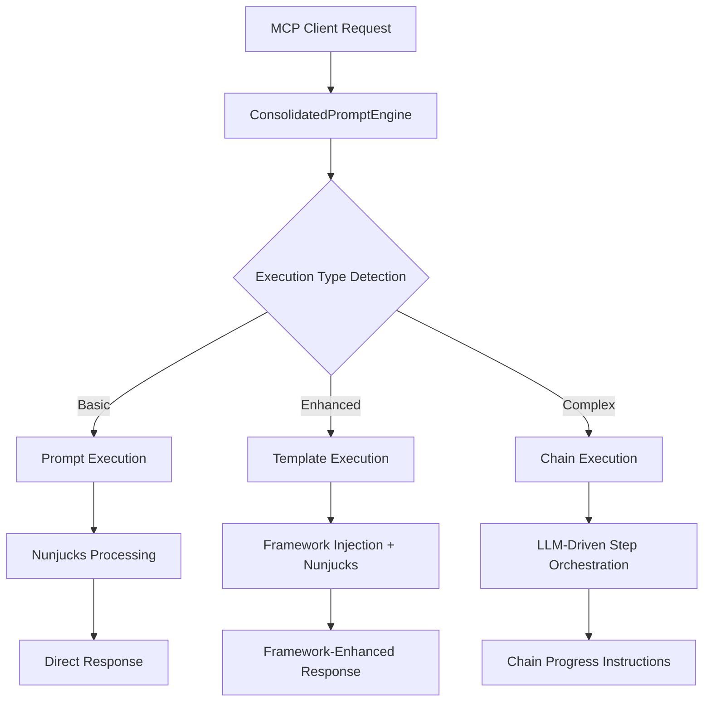

# Three-Tier Execution System Guide

## Overview

The Claude Prompts MCP Server implements a sophisticated **three-tier execution model** designed to handle different levels of complexity and user requirements. This guide explains how the system automatically selects the appropriate execution tier and what each tier provides.

## The Three Execution Tiers

### Tier 1: Prompt Execution (Basic)
**Best for**: Simple variable substitution and straightforward prompts

- **Purpose**: Fast, lightweight execution for basic prompts
- **Processing**: Direct Nunjucks template variable substitution
- **Framework Integration**: Minimal - uses default settings
- **Performance**: Fastest execution with minimal overhead
- **Use Cases**: Quick queries, simple content generation, basic automation

**Example**:
```markdown
# Simple Greeting Prompt
Hello {{name}}, welcome to {{service}}!
```

### Tier 2: Template Execution (Framework-Aware)
**Best for**: Structured prompts requiring methodology guidance

- **Purpose**: Enhanced execution with active framework methodology
- **Processing**: Framework-specific system prompt injection + template processing
- **Framework Integration**: Full integration with CAGEERF, ReACT, 5W1H, SCAMPER
- **Performance**: Moderate overhead for enhanced quality
- **Use Cases**: Structured analysis, systematic problem-solving, quality-assured content

**Example**:
```markdown
# Analysis Template
**🔄 FRAMEWORK EXECUTION**: Uses {{framework}} methodology for systematic analysis

Analyze the following content using structured approach:
{{content}}
```

### Tier 3: Chain Execution (Multi-Step Workflows)
**Best for**: Complex multi-step processes requiring orchestration

- **Purpose**: LLM-driven iterative workflows with state management
- **Processing**: Step-by-step execution with context passing between steps
- **Framework Integration**: Framework guidance applies to each step
- **Performance**: Highest overhead but maximum capability
- **Use Cases**: Complex analysis workflows, multi-phase content creation, research processes

**Example**:
```markdown
# Content Analysis Chain
## Chain Steps

1. promptId: content_analysis
   stepName: Initial Content Analysis
   
2. promptId: deep_analysis  
   stepName: Deep Analysis
   inputMapping:
     initial_analysis: step_0_output
```

## Execution Tier Selection

### Automatic Detection

The system automatically detects the appropriate execution tier based on prompt characteristics:

```typescript
// Execution type detection logic
if (prompt.isChain && prompt.chainSteps?.length > 0) {
  return 'chain';
} else if (hasFrameworkRequirements(prompt)) {
  return 'template';  
} else {
  return 'prompt';
}
```

### Manual Override

You can explicitly specify execution mode using the `execution_mode` parameter:

```bash
# Force template execution
prompt_engine >>my_prompt execution_mode=template

# Force chain execution  
prompt_engine >>my_chain execution_mode=chain auto_execute_chain=true
```

## Architecture Components

### Execution Engine Flow



### Core Components

#### ConsolidatedPromptEngine
**Location**: `server/src/mcp-tools/prompt-engine.ts`

- **Role**: Central execution coordinator
- **Responsibilities**:
  - Execution tier detection and selection
  - Framework integration coordination  
  - Chain state management and instruction generation
  - Quality gate validation

#### ExecutionCoordinator  
**Location**: `server/src/execution/execution-coordinator.ts`

- **Role**: Thin orchestration layer  
- **Responsibilities**:
  - Legacy compatibility
  - Statistics tracking across execution tiers
  - Delegation to ConsolidatedPromptEngine

#### Framework Manager
**Location**: `server/src/frameworks/framework-manager.ts`

- **Role**: Methodology guide orchestration
- **Responsibilities**:
  - Active framework state management
  - System prompt generation for templates
  - Framework-specific quality guidance

## Framework Integration Across Tiers

### Available Frameworks
- **CAGEERF**: Context, Analysis, Goals, Execution, Evaluation, Refinement, Framework
- **ReACT**: Reasoning and Acting systematic approach
- **5W1H**: Who, What, When, Where, Why, How analysis
- **SCAMPER**: Substitute, Combine, Adapt, Modify, Put to other uses, Eliminate, Reverse

### Framework Application by Tier

#### Prompt Tier (Minimal Integration)
- Framework selection tracked but not actively applied
- Uses framework defaults for any quality gates
- No system prompt modification

#### Template Tier (Full Integration)
- Active framework methodology guides applied
- Framework-specific system prompts injected
- Quality gates adapted to framework criteria
- Enhanced validation and guidance

#### Chain Tier (Per-Step Integration)
- Framework guidance applied to each chain step
- Consistent methodology throughout multi-step process
- Framework-aware context passing between steps
- Comprehensive quality validation per step

## Quality Gates by Tier

### Prompt Tier Gates
- Basic content validation (length, format)
- Template variable validation
- Simple structure checks

### Template Tier Gates
- All prompt tier gates
- Framework methodology compliance
- Enhanced content quality validation
- Argument structure validation

### Chain Tier Gates  
- All template tier gates applied per step
- Chain structure validation
- Step dependency validation
- Context continuity validation

## Performance Characteristics

### Execution Time Comparison

| Tier | Typical Execution | Overhead | Best For |
|------|------------------|----------|----------|
| Prompt | 50-200ms | Minimal | Quick queries |
| Template | 200-800ms | Moderate | Structured work |
| Chain | 2-10s per step | High | Complex workflows |

### Memory Usage

- **Prompt**: Minimal memory footprint
- **Template**: Moderate memory for framework context
- **Chain**: Higher memory for state management and step context

## Best Practices

### When to Use Each Tier

#### Choose Prompt Tier When:
- Simple content generation needs
- Performance is critical
- No structural requirements
- Straightforward variable substitution

#### Choose Template Tier When:
- Need systematic methodology application
- Quality validation is important
- Structured output required  
- Working within established frameworks

#### Choose Chain Tier When:
- Multi-step processes required
- Complex workflows with dependencies
- Need context passing between steps
- Iterative refinement processes

### Performance Optimization

#### Prompt Tier Optimization
- Minimize template complexity
- Use simple variable substitution
- Avoid unnecessary processing

#### Template Tier Optimization  
- Choose appropriate framework for task
- Use efficient template structures
- Enable only necessary quality gates

#### Chain Tier Optimization
- Design efficient step sequences
- Minimize context accumulation
- Use auto-execution for simple chains
- Plan for context window management

## Configuration

### Global Execution Settings

```json
{
  "execution": {
    "defaultMode": "auto",
    "enableGateValidation": true,
    "chainAutoExecution": true,
    "performanceMonitoring": true
  }
}
```

### Per-Prompt Configuration

```markdown
# Prompt with tier preference
**⚡ EXECUTION REQUIRED**: This prompt uses template execution for framework integration

Your content here...
```

## Troubleshooting

### Common Issues

#### Wrong Tier Selection
**Problem**: System selects inappropriate execution tier
**Solution**: Use explicit `execution_mode` parameter

#### Performance Issues  
**Problem**: Slow execution times
**Solution**: Check execution tier - consider lower tier for simpler tasks

#### Chain State Issues
**Problem**: Chain execution loses state between steps  
**Solution**: Verify ConversationManager state tracking is active

### Debug Information

Enable verbose logging to see execution tier selection:
```bash
npm run start:verbose
```

This will show:
- Execution tier detection reasoning
- Framework selection process  
- Performance metrics by tier
- State management activities

## Migration Guide

### From Legacy Single-Tier System

If migrating from older single-tier execution:

1. **Review existing prompts** for tier appropriateness
2. **Add framework markers** for prompts needing template tier
3. **Convert multi-step processes** to chain format
4. **Test execution tier detection** with your prompt library

### Updating Existing Prompts

```markdown
# Before (legacy)
Your prompt content

# After (tier-aware)  
**🔄 TEMPLATE EXECUTION**: Framework-aware processing
Your prompt content with {{variables}}

# Chain format
## Chain Steps
1. promptId: step_one
   stepName: First Step
```

This three-tier system provides the flexibility to handle everything from simple queries to complex multi-step workflows while maintaining optimal performance for each use case.