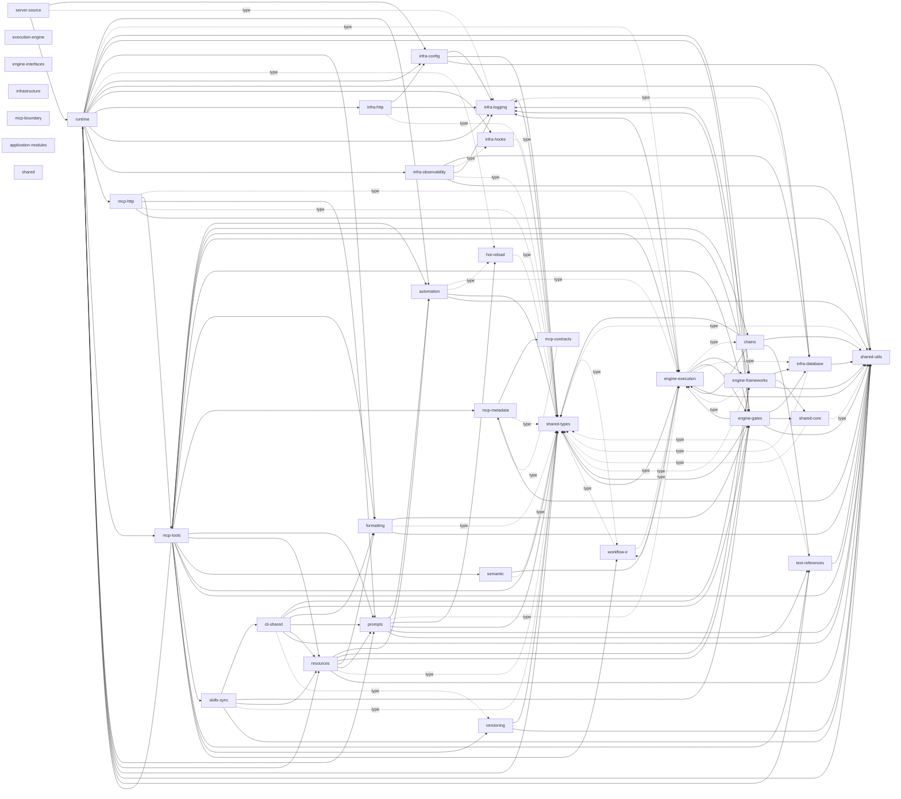

<!-- Generated by server/scripts/generate-module-catalog.ts — do not edit manually. -->

# Semantic Module Catalog

This catalog combines authored boundary meaning from colocated `module.yaml` files with
observed imports from dependency-cruiser. It describes current dependencies; permission policy
remains in `server/.dependency-cruiser.cjs`.

## Boundaries

| Module | Source path | Kind | Lifecycle | Description | Docs | Public entry | Observed dependencies | Imported by |
| --- | --- | --- | --- | --- | --- | --- | --- | --- |
| `server-source` | `src` | application | canonical | Server source composition root. | — | `index.ts` | infra-config infra-logging runtime | — |
| `cli-shared` | `src/cli-shared` | adapter | canonical | Shared implementation used by the standalone CLI integration surface. | — | `index.ts` | engine-frameworks engine-gates formatting prompts resources shared-utils versioning | skills-sync |
| `execution-engine` | `src/engine` | layer | canonical | Client-guided execution, framework, and gate decision logic. | — | — | — | — |
| `engine-execution` | `src/engine/execution` | domain | canonical | Parses commands and coordinates the staged client-guided execution pipeline. | — | — | chains engine-frameworks engine-gates infra-database infra-logging shared-types shared-utils workflow-ir | automation chains engine-frameworks engine-gates mcp-http mcp-tools prompts runtime semantic workflow-ir |
| `engine-frameworks` | `src/engine/frameworks` | domain | canonical | Loads, validates, selects, and applies reasoning frameworks. | — | — | engine-execution infra-database infra-logging shared-core shared-types shared-utils | cli-shared engine-execution mcp-tools resources runtime |
| `engine-gates` | `src/engine/gates` | domain | canonical | Selects, enhances, and evaluates quality-gate guidance. | — | — | engine-execution infra-database infra-logging shared-core shared-types shared-utils | cli-shared engine-execution formatting mcp-tools resources runtime skills-sync |
| `engine-interfaces` | `src/engine/interfaces` | protocol | canonical | Contracts exposed by the execution engine to collaborating layers. | — | — | — | — |
| `infrastructure` | `src/infra` | layer | canonical | Configuration, persistence, transport support, logging, and observability infrastructure. | — | — | — | — |
| `infra-config` | `src/infra/config` | domain | canonical | Loads and resolves server configuration. | — | `index.ts` | infra-logging shared-types shared-utils | infra-http runtime server-source |
| `infra-database` | `src/infra/database` | domain | canonical | Owns SQLite schema, storage adapters, and resource indexing. | — | `index.ts` | infra-logging shared-types shared-utils | engine-execution engine-frameworks engine-gates infra-observability runtime |
| `infra-hooks` | `src/infra/hooks` | adapter | canonical | Integrates server behavior with supported hook surfaces. | — | `index.ts` | shared-types | infra-observability runtime |
| `infra-http` | `src/infra/http` | protocol | canonical | Provides HTTP infrastructure used by the Streamable HTTP transport. | — | `index.ts` | infra-config infra-logging shared-types | runtime |
| `infra-logging` | `src/infra/logging` | shared | canonical | Provides structured logging primitives and configuration. | — | `index.ts` | shared-types | engine-execution engine-frameworks engine-gates infra-config infra-database infra-http infra-observability runtime server-source |
| `infra-observability` | `src/infra/observability` | domain | canonical | Provides tracing and operational telemetry infrastructure. | — | — | infra-database infra-hooks infra-logging shared-types shared-utils | runtime |
| `mcp-boundary` | `src/mcp` | layer | canonical | Model Context Protocol contracts, transports, metadata, and tool adapters. | — | — | — | — |
| `mcp-contracts` | `src/mcp/contracts` | protocol | canonical | Defines runtime-facing MCP contract metadata and generated schemas. | — | — | mcp-metadata | mcp-metadata |
| `mcp-http` | `src/mcp/http` | protocol | canonical | Implements the Streamable HTTP MCP transport boundary. | — | — | engine-execution mcp-tools prompts shared-types shared-utils | runtime |
| `mcp-metadata` | `src/mcp/metadata` | protocol | canonical | Builds MCP server and capability metadata. | `server/src/mcp/metadata/README.md` | — | mcp-contracts shared-types shared-utils | mcp-contracts mcp-tools |
| `mcp-tools` | `src/mcp/tools` | protocol | canonical | Registers and routes the three public MCP tools. | — | `index.ts` | automation chains engine-execution engine-frameworks engine-gates formatting mcp-metadata prompts resources runtime semantic shared-types shared-utils skills-sync text-references versioning workflow-ir | mcp-http runtime |
| `application-modules` | `src/modules` | layer | canonical | Feature modules that own prompt, chain, resource, and authoring behavior. | — | — | — | — |
| `automation` | `src/modules/automation` | domain | canonical | Owns automation-oriented resource and workflow behavior. | — | — | engine-execution hot-reload shared-types shared-utils | mcp-tools prompts resources runtime |
| `chains` | `src/modules/chains` | domain | canonical | Owns chain sessions, execution records, mutation, and persistence behavior. | — | — | engine-execution shared-types shared-utils text-references | engine-execution mcp-tools |
| `formatting` | `src/modules/formatting` | domain | canonical | Owns response styles and output formatting behavior. | — | `index.ts` | engine-gates shared-types shared-utils | cli-shared mcp-tools resources runtime |
| `hot-reload` | `src/modules/hot-reload` | domain | canonical | Coordinates file observation and registry refresh behavior. | — | — | shared-types | automation prompts runtime |
| `prompts` | `src/modules/prompts` | domain | canonical | Owns prompt discovery, schema, registry, and lifecycle behavior. | — | `index.ts` | automation engine-execution hot-reload shared-types shared-utils text-references | cli-shared mcp-http mcp-tools resources runtime |
| `resources` | `src/modules/resources` | domain | canonical | Owns resource verification and mutation transactions. | — | `index.ts` | automation engine-frameworks engine-gates formatting prompts shared-types shared-utils | cli-shared mcp-tools runtime skills-sync |
| `semantic` | `src/modules/semantic` | domain | canonical | Owns semantic indexing and related retrieval behavior. | — | — | engine-execution shared-types | mcp-tools |
| `skills-sync` | `src/modules/skills-sync` | domain | canonical | Exports and synchronizes skills across supported clients. | — | — | cli-shared engine-gates resources shared-types shared-utils | mcp-tools |
| `text-references` | `src/modules/text-refs` | domain | canonical | Tracks and resolves reusable text argument references. | — | `index.ts` | shared-types shared-utils | chains mcp-tools prompts runtime |
| `versioning` | `src/modules/versioning` | domain | canonical | Owns version history, comparison, rollback, and resource snapshots. | — | `index.ts` | shared-types shared-utils | cli-shared mcp-tools |
| `workflow-ir` | `src/modules/workflow-ir` | domain | canonical | Validates and compiles planner-submitted workflow graphs. | `docs/reference/workflow-ir.md` | — | engine-execution shared-types | engine-execution mcp-tools shared-types |
| `runtime` | `src/runtime` | runtime | canonical | Application composition and process lifecycle entrypoints. | — | — | automation engine-execution engine-frameworks engine-gates formatting hot-reload infra-config infra-database infra-hooks infra-http infra-logging infra-observability mcp-http mcp-tools prompts resources shared-types shared-utils text-references | mcp-tools server-source |
| `shared` | `src/shared` | layer | canonical | Foundation types and pure utilities available to every source layer. | — | — | — | — |
| `shared-core` | `src/shared/core` | shared | canonical | Core abstractions shared without importing upper layers. | — | — | shared-types shared-utils | engine-frameworks engine-gates |
| `shared-types` | `src/shared/types` | shared | canonical | Cross-layer TypeScript contracts and data shapes. | — | `index.ts` | workflow-ir | automation chains engine-execution engine-frameworks engine-gates formatting hot-reload infra-config infra-database infra-hooks infra-http infra-logging infra-observability mcp-http mcp-metadata mcp-tools prompts resources runtime semantic shared-core shared-utils skills-sync text-references versioning workflow-ir |
| `shared-utils` | `src/shared/utils` | shared | canonical | Pure cross-layer utility functions. | — | `index.ts` | shared-types | automation chains cli-shared engine-execution engine-frameworks engine-gates formatting infra-config infra-database infra-observability mcp-http mcp-metadata mcp-tools prompts resources runtime shared-core skills-sync text-references versioning |

## Observed boundary graph

Solid arrows include at least one value import. Dotted arrows contain only type imports.

