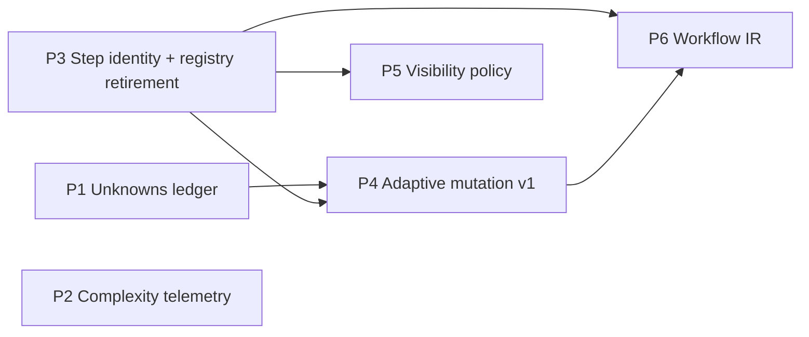

# Adaptive Chain Runtime — Master Plan

**Work Type**: feature (multi-phase initiative)
**Confidence**: high on direction, low on per-phase detail (by design — see D3)
**Scope**: chains module, execution pipeline, injection control, tool contracts. Risk: medium — P3 touches the run registry, everything else is additive.
**Problem Statement**: Chain execution is a linear integer-indexed step counter over an immutable step list. Discoveries made mid-run (blocking unknowns, resolved assumptions) cannot change what executes next, what context a step receives, or what the run records about why it cost what it cost. Desired state: chain runs carry a typed ledger of unknowns, steps have stable identity independent of position, a deterministic policy layer can insert/skip steps in response to typed observations, per-step context visibility is declarative, and a planner-submitted graph can be validated and executed — all within MCP's turn-based, client-driven contract.

**Origin**: distilled from an extended design exploration (ChatGPT transcripts, judged 2026-08-09). The durable residue of ~40k words: typed events, mutable step identity, delegation-as-isolation, record-don't-model complexity. Everything with a Greek letter in it was rejected as pseudo-quantification.

---

## Decisions (most likely to change, first)

### D1 — Workflow IR is NOT a separate MCP tool (decide finally at P6)

**Default: no fourth tool.** Durable workflow definitions become a resource type (managed via `resource_manager`, like prompt/gate/methodology); ad-hoc per-run graphs arrive as a `prompt_engine` parameter.

Rationale:

- The 3-tool surface is the declared public API; adding a tool is a permanent contract commitment, while `prompt_engine` union-member additions are explicitly non-breaking per the handbook's union contract.
- Precedent: chains already ARE workflows, and they live as a resource type executed through `prompt_engine`. IR follows the same split.
- Every additional tool competes for the client model's tool-selection attention; MCP guidance favors fewer, well-described tools.

**Revisit trigger**: if IR needs first-class verbs that fit neither execute nor CRUD semantics (validate / compile / diff / simulate as heavy standalone operations), a dedicated tool becomes defensible. Decide at Phase 6 with real schemas in hand, not before.

### D2 — The model never emits graph edits

Model output carries **typed observations** (`UNKNOWN_DISCOVERED`, `UNKNOWN_RESOLVED`, …); a deterministic server-side policy owns all graph mutations. Same posture as the existing gate-verdict parsing and the "never mutate pipeline arrays directly" constraint. Non-negotiable across all phases.

### D3 — Research is just-in-time, per phase

This document is a skeleton. Each phase opens with its own `>>implementation_plan` run plus targeted discovery, producing a per-phase plan file beside this one. Detail written here in advance would be guessed, not researched — and per the untrusted-inventory lesson, guessed inventory falsifies steps.

### D4 — Complexity is recorded, never modeled (until a consumer exists)

P2 records estimated-vs-actual observables on `execution_records`. No coefficients, no scoring formula, no routing decisions derived from it. A modeling phase may only be proposed once a named consumer of the score exists.

### D5 — P3 rides the planned `chain_run_registry` blob retirement

The registry blob is already slated for retirement post-Tier-10 in favor of per-row tables. Step-identity rework lands **inside** that migration, not as a second rework of the same storage.

### D6 — Enforcement stays advisory by construction

MCP inverts control: the client owns the model and the loop; the server is a turn-based transition function and cannot force re-entry. All adaptive behavior must degrade gracefully when the client abandons the loop. The gate system's advisory/enforce split is the template.

---

## Phase Map

The five upgrade ideas map to six phases (graph mutation splits into an enabling refactor + a first behavior):

P1 and P2 are independent and can run in either order (or interleaved). P3 blocks everything downstream.

---

## Phases

### P0 — Chain-scaffold hygiene (opened 2026-08-09; precedes P1 implementation)

**Goal**: remove the per-step scaffold tax measured live during P1 planning. Repo/prompt maintenance outside the runtime dependency graph — Tier 0 because every subsequent phase runs chains and pays this tax per step.

Findings (live chain run, 2026-08-09):

- (a) **Header drift**: implementation_plan's Phase 2.5/4-6 templates instruct `## context_establishment`-style headers, but the deterministic phase guard (`19-phase-guard-verification-stage.ts`, fed by `resources/frameworks/*/phases.yaml` `section_header`) matches `## Context`/`## Analysis`/`## Goals` — the template drifted from the phases.yaml contract and forced a full-payload retry. The guard already carries a comment about a prior unmatchable-header loop of this same class.
- (b) **Banner bug**: hardcoded `'## 🎯 Framework Framework Active'` string (`chain-operator-executor.ts:561`).
- (c) **Overlay repetition**: framework overlay re-injected on every step and retry despite the documented every-2-steps default for system-prompt injection — diagnose before fixing; evidence-gated.

**Fix posture**: align templates to the phases.yaml headers — single vocabulary; no guard aliasing (aliasing keeps two header dialects alive forever). Prompt edits via `resource_manager` only. **The framework-compliance gate needs NO retirement** — its `pass_criteria` are `inline_guidance` (advisory, never auto-enforced); the enforcement was the phase guard all along.

**Acceptance**: a one-step implementation_plan drive renders templates instructing the real headers; no double-taxonomy requirement remains; banner renders the actual framework name.

**Status (2026-08-09, implemented by opus agent, reviewed + spot-checked in-thread)**:

- DONE — stage-14 injection bypass fixed: the `isBlueprintRestored` early return left `state.injection` undefined on every chain continuation, so configured frequency (`systemPromptFrequency: 3`) and target filtering were bypassed on steps 2..N and all retries. Banner + judge-menu doubled literals fixed. `resource_manager` nested-prompt writer fixed (`toYamlPromptId` basename helper, symmetric with the loader contract; mutation-checked test). Three writer-corrupted prompt ids under `sub_agent_functionality_chain/` repaired and proven loading via live reload (prompt count 7 → 10).
- VALIDATED — build, typecheck, both ratchets, 139 + 198 + 409 targeted tests, `verify:mcp` 12/12.
- OUTSTANDING (operator step) — restart/reconnect the MCP server (live stdio process predates the writer fix), then apply the staged template body (everything after the `<!-- TEMPLATE BODY BEGINS -->` marker in `plans/adaptive-chain-runtime-p0-staged-verification-template.md`) via `resource_manager` update; re-inspect + delete the staged file.
- DECISION SURFACED — the repaired `sub_agent_functionality_chain/{define_task,delegate,evaluate}` nested prompts are orphaned duplicates (the parent chain references the flat `sub_agent_step_*` prompts). Delete vs keep is the owner's call; deletion is one `resource_manager` call each after restart.
- SCOPE NOTE — the Phase 4-6 completion template was verified NOT to be an offender (initial report was wrong); only `implementation_plan/verification` drifted. The chain's own system-message already carried the correct header guidance — the step template contradicted it.

### P1 — Unknowns ledger

**Goal**: chain steps can declare typed unknowns; the ledger persists per run and is surfaced into subsequent step context.
**Pattern**: reuse of the structured `gate_verdict` pipeline — typed model output → parsed → persisted → injected.
**Research questions for its implementation_plan run**:

- Storage: new table (needs full `TableContract` — owner, posture, scope, retention) vs `kv_state` discriminator vs `execution_records` extension? A new table's `readers: []` rule forces naming the consumer up front.
- Parsing: extend `StepCaptureService` or the verdict-pattern layer?
- Context surfacing: which injection-control path carries the ledger into the next step?
- Lifecycle vocabulary: `candidate | active | resolved | irrelevant | contradicted` — which subset earns v1?
  **Acceptance**: a chain step declaring an unknown → visible in next step's context → resolvable by a later step → full lifecycle queryable after the run. No numeric scoring fields anywhere.

### P2 — Complexity telemetry (record-only)

**Goal**: each run records estimated-vs-actual observables (steps planned vs executed, gates fired, retries, unknowns opened/closed).
**Research questions**: which fields belong on `execution_records` vs a view; what the phantom-column gate requires (every declared column needs a writer — no aspirational fields); whether `v_execution_history` should project it.
**Acceptance**: `system_control execution_history` shows the deltas; zero consumers make decisions from them (D4).

### P3 — Step identity + registry retirement (enabling refactor)

**Goal**: steps addressed by stable node ID instead of integer position; run state stored per-row, not blob-encoded.
**Merged with**: the already-planned post-Tier-10 `chain_run_registry` retirement (D5).
**Research questions**:

- Full consumer enumeration of `currentStep`/`totalSteps` (manager, hooks projection `chain_sessions`, `v_execution_status` — which json_extracts step fields — Python hook readers, execution records).
- What `advanceStep(stepNumber) → stepNumber + 1` becomes when order is a list of node IDs.
- Transport parity: mutation state must live in SQLite only — HTTP builds a fresh `McpServer` per request, so nothing may hang off registered instances.
- Contract check: `chain_sessions` columns are declared out-of-contract (PID-scoped derived projection), but the Python hook **module API** return shapes are in-contract — does `load_active_chain_state` leak step integers?
  **Acceptance**: all existing linear chains behave identically end-to-end (`verify:mcp` + the new path actually driven, per the surface-check-≠-end-to-end lesson); both SQLite gates green.

### P4 — Adaptive mutation v1 (one behavior, both directions)

**Goal**: blocking unknown → policy inserts one investigation step → run resumes. And the mirror: a resolved-irrelevant unknown lets the policy **skip** a now-pointless step.
**Acceptance criterion carried from the design review**: the engine must contract as intelligently as it expands — expansion-only is a workflow inflater, not adaptivity. Both directions demonstrated in one E2E test or the phase is not done.
**Research questions**: where the policy layer lives (new decision service under `execution/pipeline/decisions/`, per the domain ownership matrix); mutation audit trail in `execution_records`; interaction with gate enforcement modes; cap on insertions per run (runaway-loop backstop).

### P5 — Visibility policy (context compiler, honest scope)

**Goal**: per-step declarative expose/withhold over server-sourced context, as an extension of injection control.
**Honest ceiling, stated up front**: the server cannot unsee the client's window. Withholding applies only to what the server sources; true isolation remains the `==>` delegation operator (subagent contexts). The phase makes that boundary explicit in docs rather than pretending otherwise.
**Research questions**: schema for expose/withhold on step definitions; interaction with framework overlays and styles; whether delegation should gain a "withheld context" manifest.
**Acceptance**: a step can declare withheld items that a later step receives; a delegated step provably does not receive them.

### P6 — Planner-submitted Workflow IR

**Goal**: a client model can submit a graph (nodes, edges, gate bindings, budget caps) that the server validates against schema + budgets and executes as a chain run.
**Opens with**: the D1 decision, finalized against real schemas.
**Research questions**: IR schema as a contract artifact (`tooling/contracts/`), validation depth (DAG-only, bounded fan-out, max nodes — the bounded-IR posture from the design review); relationship between submitted IR and durable chain resources; whether budget ceilings are enforceable or advisory (D6 says advisory, but token ceilings per step may be checkable server-side against declared costs).
**Acceptance**: malformed IR rejected with actionable errors; valid IR executes through the P3/P4 machinery with no IR-specific execution path (IR compiles TO the runtime, it doesn't bypass it).

---

## Constraints (bind every phase)

| Constraint                                                        | Consequence                                                                                                                         |
| ----------------------------------------------------------------- | ----------------------------------------------------------------------------------------------------------------------------------- |
| MCP inversion of control                                          | Server never calls the model; no scheduler/event-loop designs; enforcement advisory (D6)                                            |
| Transport parity (STDIO pins instance, HTTP rebuilds per request) | All run state in SQLite; nothing mutates a registered `McpServer`                                                                   |
| Contracts as SSOT                                                 | New params: Zod schema (hand-written) + contract JSON + `generate:contracts`; layer alignment Contract→Types→Router→Manager→Service |
| Table contracts + phantom-column gate                             | Every new table/column declared with owner/posture/scope/retention and a real writer                                                |
| Validation suite                                                  | `typecheck && lint:ratchet && typecheck:tests:ratchet && test:ci` minimum; `validate:arch` on module-boundary phases (P3, P4)       |
| Docs lockstep                                                     | `docs/concepts/chains-lifecycle.md`, `docs/reference/mcp-tools.md`, sqlite rules updated in the same PR as behavior                 |

## Open unknowns (carried until their phase)

- Timing/shape of the Tier-10 registry retirement this plan attaches P3 to — reconcile with `plans/techincal_debt/pipeline-followup-2026-08-02.md` before P3 opens.
- Whether the Python hook module API (in-contract) transitively exposes step integers — determines P3's blast radius.
- Whether P1's ledger belongs in a new table at all — the `readers: []` rule may push it into `execution_records`.

## Sources & Inspiration

| Field                                   | Reference                                                                                                                                                                                                                                                                                                     |
| --------------------------------------- | ------------------------------------------------------------------------------------------------------------------------------------------------------------------------------------------------------------------------------------------------------------------------------------------------------------- |
| Design exploration                      | ChatGPT transcripts (2026-08-09 session) — complexity models, state transitions, context trajectories. Kept: typed events, node identity, delegation-as-isolation, contract-vs-expand test. Rejected: learned coefficients, VOI arithmetic, latent-space steering, autonomous scheduler (wrong layer for MCP) |
| Feasibility judgment                    | Assessment in same session, grounded in `modules/chains/manager.ts` (`advanceStep` linearity), no-sampling check across `src/`                                                                                                                                                                                |
| Precedent for typed-observation parsing | `gate_verdict` structured object + `ParsedGateVerdict.source`                                                                                                                                                                                                                                                 |
| Precedent for resource-type addition    | gate/methodology handlers under `resource_manager` (per-type lifecycle/discovery/versioning processors)                                                                                                                                                                                                       |
| Related plans                           | `plans/techincal_debt/pipeline-followup-2026-08-02.md` (T10–T14), `plans/sqlite-layer-remediation-2026-08-03.md`                                                                                                                                                                                              |

## Execution protocol

1. Open a phase → run `>>implementation_plan` with the phase's research questions → per-phase plan file lands beside this one (`adaptive-chain-runtime-p<N>-*.md`).
2. Create `implementation-notes.md` beside the per-phase plan **before the first edit**; deviations logged as they happen.
3. Phase acceptance verified end-to-end (drive the new path, not just `verify:mcp`) before the next phase opens.
4. This file updates phase status + decision revisions only; detail lives in per-phase plans. Republish the artifact on each update — same path, same URL.

**Status**: P0 IMPLEMENTED — code landed; CLOSED — template applied 2026-08-09 (version 3; on-disk basename id confirms writer fix live), staged file deleted. P1 IMPLEMENTED 2026-08-09 — all 6 tiers via subagents (sonnet T1-2/T5-6, opus T3-4), all gates green (typecheck, lint:ratchet, tests:ratchet, test:ci minus 2 pre-existing foreign failures, validate:arch, verify:mcp 12/12); live drive COMPLETE (success signal observed; negative probe confirmed validation-error surface). Deviations + semantics rulings in the P1 implementation-notes file. P2 COMPLETE 2026-08-11 — planned via worker-run `>>implementation_plan` chain, executed by opus subagent, all gates green, live success signal observed (`planned 3 / executed 2 · gates fired 4 (retries 1) · unknowns opened 1 / closed 1` in `execution_history`); 3 main-thread rulings (verdict-submission semantics; `v_execution_history` NOT extended — measured zero readers; `gate_verdicts_json` cleanup deferred) and 3 pre-existing lifecycle defects discovered by the live drive now feed P3 (completion banner precedes terminal state; step-1 render unledgered; post-completion resume re-opens review) — see the P2 implementation-notes file. P3-P6 unopened; P3 next, reconcile with `plans/techincal_debt/pipeline-followup-2026-08-02.md` first.
