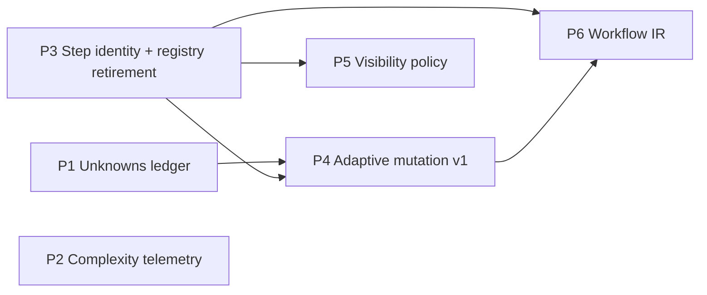

# Adaptive Chain Runtime — Master Plan

**Work Type**: feature (multi-phase initiative)
**Confidence**: high on direction, low on per-phase detail (by design — see D3)
**Scope**: chains module, execution pipeline, injection control, tool contracts. Risk: medium — P3 touches the run registry, everything else is additive.
**Problem Statement**: Chain execution is a linear integer-indexed step counter over an immutable step list. Discoveries made mid-run (blocking unknowns, resolved assumptions) cannot change what executes next, what context a step receives, or what the run records about why it cost what it cost. Desired state: chain runs carry a typed ledger of unknowns, steps have stable identity independent of position, a deterministic policy layer can insert/skip steps in response to typed observations, per-step context visibility is declarative, and a planner-submitted graph can be validated and executed — all within MCP's turn-based, client-driven contract.

**Origin**: distilled from an extended design exploration (ChatGPT transcripts, judged 2026-08-09). The durable residue of ~40k words: typed events, mutable step identity, delegation-as-isolation, record-don't-model complexity. Everything with a Greek letter in it was rejected as pseudo-quantification.

---

## Decisions (most likely to change, first)

### D1 — Workflow IR is NOT a separate MCP tool (FINALIZED at P6, 2026-08-13: owner ruled OQ-P6-1 → `prompt_engine.workflow` parameter; no revisit trigger fired — the IR needed no first-class verbs beyond execute)

**Default: no fourth tool.** Durable workflow definitions become a resource type (managed via `resource_manager`, like prompt/gate/methodology); ad-hoc per-run graphs arrive as a `prompt_engine` parameter.

Rationale:

- The 3-tool surface is the declared public API; adding a tool is a permanent contract commitment, while `prompt_engine` union-member additions are explicitly non-breaking per the handbook's union contract.
- Precedent: chains already ARE workflows, and they live as a resource type executed through `prompt_engine`. IR follows the same split.
- Every additional tool competes for the client model's tool-selection attention; MCP guidance favors fewer, well-described tools.

**Revisit trigger**: if IR needs first-class verbs that fit neither execute nor CRUD semantics (validate / compile / diff / simulate as heavy standalone operations), a dedicated tool becomes defensible. Decide at Phase 6 with real schemas in hand, not before.

### D2 — The model never emits graph edits

Model output carries **typed observations** (`UNKNOWN_DISCOVERED`, `UNKNOWN_RESOLVED`, …); a deterministic server-side policy owns all graph mutations. Same posture as the existing gate-verdict parsing and the "never mutate pipeline arrays directly" constraint. Non-negotiable across all phases.

### D3 — Research is just-in-time, per phase

This document is a skeleton. Each phase opens with its own `>>implementation_plan` run plus targeted discovery, producing a per-phase plan file beside this one. Detail written here in advance would be guessed, not researched — and per the untrusted-inventory lesson, guessed inventory falsifies steps.

### D4 — Complexity is recorded, never modeled (until a consumer exists)

P2 records estimated-vs-actual observables on `execution_records`. No coefficients, no scoring formula, no routing decisions derived from it. A modeling phase may only be proposed once a named consumer of the score exists.

### D5 — P3 rides the planned `chain_run_registry` blob retirement

The registry blob is already slated for retirement post-Tier-10 in favor of per-row tables. Step-identity rework lands **inside** that migration, not as a second rework of the same storage.

### D6 — Enforcement stays advisory by construction

MCP inverts control: the client owns the model and the loop; the server is a turn-based transition function and cannot force re-entry. All adaptive behavior must degrade gracefully when the client abandons the loop. The gate system's advisory/enforce split is the template.

---

## Phase Map

The five upgrade ideas map to six phases (graph mutation splits into an enabling refactor + a first behavior):

P1 and P2 are independent and can run in either order (or interleaved). P3 blocks everything downstream.

---

## Phases

### P0 — Chain-scaffold hygiene (opened 2026-08-09; precedes P1 implementation)

**Goal**: remove the per-step scaffold tax measured live during P1 planning. Repo/prompt maintenance outside the runtime dependency graph — Tier 0 because every subsequent phase runs chains and pays this tax per step.

Findings (live chain run, 2026-08-09):

- (a) **Header drift**: implementation_plan's Phase 2.5/4-6 templates instruct `## context_establishment`-style headers, but the deterministic phase guard (`19-phase-guard-verification-stage.ts`, fed by `resources/frameworks/*/phases.yaml` `section_header`) matches `## Context`/`## Analysis`/`## Goals` — the template drifted from the phases.yaml contract and forced a full-payload retry. The guard already carries a comment about a prior unmatchable-header loop of this same class.
- (b) **Banner bug**: hardcoded `'## 🎯 Framework Framework Active'` string (`chain-operator-executor.ts:561`).
- (c) **Overlay repetition**: framework overlay re-injected on every step and retry despite the documented every-2-steps default for system-prompt injection — diagnose before fixing; evidence-gated.

**Fix posture**: align templates to the phases.yaml headers — single vocabulary; no guard aliasing (aliasing keeps two header dialects alive forever). Prompt edits via `resource_manager` only. **The framework-compliance gate needs NO retirement** — its `pass_criteria` are `inline_guidance` (advisory, never auto-enforced); the enforcement was the phase guard all along.

**Acceptance**: a one-step implementation_plan drive renders templates instructing the real headers; no double-taxonomy requirement remains; banner renders the actual framework name.

**Status (2026-08-09, implemented by opus agent, reviewed + spot-checked in-thread)**:

- DONE — stage-14 injection bypass fixed: the `isBlueprintRestored` early return left `state.injection` undefined on every chain continuation, so configured frequency (`systemPromptFrequency: 3`) and target filtering were bypassed on steps 2..N and all retries. Banner + judge-menu doubled literals fixed. `resource_manager` nested-prompt writer fixed (`toYamlPromptId` basename helper, symmetric with the loader contract; mutation-checked test). Three writer-corrupted prompt ids under `sub_agent_functionality_chain/` repaired and proven loading via live reload (prompt count 7 → 10).
- VALIDATED — build, typecheck, both ratchets, 139 + 198 + 409 targeted tests, `verify:mcp` 12/12.
- OUTSTANDING (operator step) — restart/reconnect the MCP server (live stdio process predates the writer fix), then apply the staged template body (everything after the `<!-- TEMPLATE BODY BEGINS -->` marker in `plans/adaptive-chain-runtime-p0-staged-verification-template.md`) via `resource_manager` update; re-inspect + delete the staged file.
- DECISION SURFACED — the repaired `sub_agent_functionality_chain/{define_task,delegate,evaluate}` nested prompts are orphaned duplicates (the parent chain references the flat `sub_agent_step_*` prompts). Delete vs keep is the owner's call; deletion is one `resource_manager` call each after restart.
- SCOPE NOTE — the Phase 4-6 completion template was verified NOT to be an offender (initial report was wrong); only `implementation_plan/verification` drifted. The chain's own system-message already carried the correct header guidance — the step template contradicted it.

### P1 — Unknowns ledger

**Goal**: chain steps can declare typed unknowns; the ledger persists per run and is surfaced into subsequent step context.
**Pattern**: reuse of the structured `gate_verdict` pipeline — typed model output → parsed → persisted → injected.
**Research questions for its implementation_plan run**:

- Storage: new table (needs full `TableContract` — owner, posture, scope, retention) vs `kv_state` discriminator vs `execution_records` extension? A new table's `readers: []` rule forces naming the consumer up front.
- Parsing: extend `StepCaptureService` or the verdict-pattern layer?
- Context surfacing: which injection-control path carries the ledger into the next step?
- Lifecycle vocabulary: `candidate | active | resolved | irrelevant | contradicted` — which subset earns v1?
  **Acceptance**: a chain step declaring an unknown → visible in next step's context → resolvable by a later step → full lifecycle queryable after the run. No numeric scoring fields anywhere.

### P2 — Complexity telemetry (record-only)

**Goal**: each run records estimated-vs-actual observables (steps planned vs executed, gates fired, retries, unknowns opened/closed).
**Research questions**: which fields belong on `execution_records` vs a view; what the phantom-column gate requires (every declared column needs a writer — no aspirational fields); whether `v_execution_history` should project it.
**Acceptance**: `system_control execution_history` shows the deltas; zero consumers make decisions from them (D4).

### P3 — Step identity + registry retirement (enabling refactor)

**Goal**: steps addressed by stable node ID instead of integer position; run state stored per-row, not blob-encoded.
**Merged with**: the already-planned post-Tier-10 `chain_run_registry` retirement (D5).
**Research questions**:

- Full consumer enumeration of `currentStep`/`totalSteps` (manager, hooks projection `chain_sessions`, `v_execution_status` — which json_extracts step fields — Python hook readers, execution records).
- What `advanceStep(stepNumber) → stepNumber + 1` becomes when order is a list of node IDs.
- Transport parity: mutation state must live in SQLite only — HTTP builds a fresh `McpServer` per request, so nothing may hang off registered instances.
- Contract check: `chain_sessions` columns are declared out-of-contract (PID-scoped derived projection), but the Python hook **module API** return shapes are in-contract — does `load_active_chain_state` leak step integers?
  **Acceptance**: all existing linear chains behave identically end-to-end (`verify:mcp` + the new path actually driven, per the surface-check-≠-end-to-end lesson); both SQLite gates green.

### P4 — Adaptive mutation v1 (one behavior, both directions)

**Goal**: blocking unknown → policy inserts one investigation step → run resumes. And the mirror: a resolved-irrelevant unknown lets the policy **skip** a now-pointless step.
**Acceptance criterion carried from the design review**: the engine must contract as intelligently as it expands — expansion-only is a workflow inflater, not adaptivity. Both directions demonstrated in one E2E test or the phase is not done.
**Research questions**: where the policy layer lives (new decision service under `execution/pipeline/decisions/`, per the domain ownership matrix); mutation audit trail in `execution_records`; interaction with gate enforcement modes; cap on insertions per run (runaway-loop backstop).

### P5 — Visibility policy (context compiler, honest scope)

**Goal**: per-step declarative expose/withhold over server-sourced context, as an extension of injection control.
**Honest ceiling, stated up front**: the server cannot unsee the client's window. Withholding applies only to what the server sources; true isolation remains the `==>` delegation operator (subagent contexts). The phase makes that boundary explicit in docs rather than pretending otherwise.
**Research questions**: schema for expose/withhold on step definitions; interaction with framework overlays and styles; whether delegation should gain a "withheld context" manifest.
**Acceptance**: a step can declare withheld items that a later step receives; a delegated step provably does not receive them.

### P6 — Planner-submitted Workflow IR

**Goal**: a client model can submit a graph (nodes, edges, gate bindings, budget caps) that the server validates against schema + budgets and executes as a chain run.
**Opens with**: the D1 decision, finalized against real schemas.
**Research questions**: IR schema as a contract artifact (`tooling/contracts/`), validation depth (DAG-only, bounded fan-out, max nodes — the bounded-IR posture from the design review); relationship between submitted IR and durable chain resources; whether budget ceilings are enforceable or advisory (D6 says advisory, but token ceilings per step may be checkable server-side against declared costs).
**Acceptance**: malformed IR rejected with actionable errors; valid IR executes through the P3/P4 machinery with no IR-specific execution path (IR compiles TO the runtime, it doesn't bypass it).

### P7 — Resource authoring efficiency (queued 2026-08-11; independent of P5/P6)

**Goal**: editing a prompt costs tokens proportional to the CHANGE, not to the prompt. Measured during the 2026-08-11 vocabulary-taxonomy sweep: every `resource_manager` update requires round-tripping the full `user_message_template`/`system_message` through the operator context (inspect full body → resend full body), so seven prompt edits consumed a large share of a session's budget, and the operator had to be reminded to delegate. Direct file edits stay forbidden (loader/writer contract + `version_history`), so the fix belongs in the tool surface.
**Research questions**: a patch-style `update` mode (anchored old/new-string or section-targeted replacement) with server-side template validation + dry-run render; whether `inspect` needs a section-addressed detail level; interaction with versioning (a patch still snapshots a full version); relationship to the step-level chain CRUD gap already tracked in the chain-management tooling backlog memory.
**Acceptance**: a one-section prompt edit is expressible without transmitting the untouched sections, rejected cleanly on template-syntax error, and produces the same `version_history` entry a full update would.

### P8 — MIGRATED OUT 2026-08-12 → [`subagent-delegation-contract-2026-08-12.md`](subagent-delegation-contract-2026-08-12.md) tier S5

Agent export left this plan intact (goal, both sightings, promotion condition, research questions).
It was queued here because it was noticed here, but this plan is about **chain runtime
adaptivity** and agent export is about **what a sub-agent is and how it ships** — the same subject
as the delegation-envelope defects measured 2026-08-12, and its first candidate is an agent rather
than a chain behavior.

The successor plan also carries the delegation findings this one surfaced: **P5-F1**
(`chainHistory` reader-without-producer) is re-found there as S-F1 with a live differential, and
**P5-F5** (visibility+delegation client-unreachable) binds its Tier S1.

**Defects found 2026-08-11 (worker-verified reproductions; fix in or before P7 — these corrupt real prompts today)**:

| #             | Defect                                                                                                                                                                                                                                                       | Evidence                                                                                                                                                                                                                           |
| ------------- | ------------------------------------------------------------------------------------------------------------------------------------------------------------------------------------------------------------------------------------------------------------ | ---------------------------------------------------------------------------------------------------------------------------------------------------------------------------------------------------------------------------------- |
| P7-D1         | `resource_manager` silently strips per-argument `required: true` — WIDENED 2026-08-12: on `create` as well as `update` (any `arguments` write path), so every prompt authored through the tool ships unenforced arguments                                    | Reproduced twice on chain-step prompts (update); reproduced on `investigate_unknown` create (P4 T3, DEV-T3-1); workers stopped passing `arguments` as workaround                                                                   |
| P7-D2         | `rollback` restores content that does not match what `inspect` showed live before the rollback — version-history snapshots drifted; a rollback intended to undo one edit reverted 4 prompts past an entire prior migration                                   | Confirmed via `compare` (tier_execute v3→v4 diff showed pre-migration content in v4); recovery required rebuilding from captured inspect output, byte-verified against known-good diffs                                            |
| P7-D3 (minor) | `chain_steps` stepName labels still read `(Phase 1)`…`(Phase 4-6)` — old vocabulary in the progress display; a targeted `chain_step_operation:"replace"` exists but replaces whole entries, so mappings must be read first                                   | Deliberate deferral from the vocabulary sweep; decide alongside P7-D1's fix since both touch the same write path                                                                                                                   |
| P7-D4         | `resources/prompts/.gitignore` is `*` with per-category allow-entries (examples/, guidance/, codebase-setup/, workflow/) — `resource_manager create` accepts ANY category and reports success identically whether the prompt ships or is silently gitignored | Found P4 T3 (DEV-T3-2): `investigate_unknown` first created under analysis/ was ignored — would ship to nobody; deleted + recreated under workflow/. Fix: create should warn or refuse when the target category is not allowlisted |

---

## Constraints (bind every phase)

| Constraint                                                        | Consequence                                                                                                                         |
| ----------------------------------------------------------------- | ----------------------------------------------------------------------------------------------------------------------------------- |
| MCP inversion of control                                          | Server never calls the model; no scheduler/event-loop designs; enforcement advisory (D6)                                            |
| Transport parity (STDIO pins instance, HTTP rebuilds per request) | All run state in SQLite; nothing mutates a registered `McpServer`                                                                   |
| Contracts as SSOT                                                 | New params: Zod schema (hand-written) + contract JSON + `generate:contracts`; layer alignment Contract→Types→Router→Manager→Service |
| Table contracts + phantom-column gate                             | Every new table/column declared with owner/posture/scope/retention and a real writer                                                |
| Validation suite                                                  | `typecheck && lint:ratchet && typecheck:tests:ratchet && test:ci` minimum; `validate:arch` on module-boundary phases (P3, P4)       |
| Docs lockstep                                                     | `docs/concepts/chains-lifecycle.md`, `docs/reference/mcp-tools.md`, sqlite rules updated in the same PR as behavior                 |

## Findings Ledger (cross-phase feeds — phase-scoped ids; in-phase findings stay in their phase plan)

**Initiative retired 2026-08-13.** Rows still OPEN below have their live home in
`plans/techincal_debt/adaptive-chain-runtime-residuals-2026-08-13.md`; this ledger is the
full-description record, no longer the queue.

| Id       | Finding                                                                                                                                                                                                                                                                                                                                                                                                                                                                                                                                                                                                                                          | Binds                                                                                   | Status                                                                                                                                                                                                                                                                                                                                                                              |
| -------- | ------------------------------------------------------------------------------------------------------------------------------------------------------------------------------------------------------------------------------------------------------------------------------------------------------------------------------------------------------------------------------------------------------------------------------------------------------------------------------------------------------------------------------------------------------------------------------------------------------------------------------------------------ | --------------------------------------------------------------------------------------- | ----------------------------------------------------------------------------------------------------------------------------------------------------------------------------------------------------------------------------------------------------------------------------------------------------------------------------------------------------------------------------------- |
| P2-F1..3 | Three lifecycle defects surfaced by the P2 live drive (completion banner preceded terminal state; step-1 render unledgered; post-completion resume re-opened review)                                                                                                                                                                                                                                                                                                                                                                                                                                                                             | P3                                                                                      | CLOSED — fixed in P3 (latch :1151, stage-20 ledger-first render, already-complete resume guard)                                                                                                                                                                                                                                                                                     |
| P3-F5    | Each chain step costs 2 prompt_engine calls (render + capture round-trip)                                                                                                                                                                                                                                                                                                                                                                                                                                                                                                                                                                        | P4 design (same-call mutation), P6 IR budgeting                                         | OPEN — honored by P4 T3 fire-point choice; P6 records `declaredCostCeiling` (never enforced, OQ-P6-3); the 2-call-per-step cost itself unaddressed                                                                                                                                                                                                                                  |
| P3-F6    | `target_step_id` declared-but-unread (gates resolve it, nothing selects by it)                                                                                                                                                                                                                                                                                                                                                                                                                                                                                                                                                                   | P4 (mutation-time semantics)                                                            | IN PROGRESS — observation-side target landed P4 T1 ✓; gate-side semantics land T4                                                                                                                                                                                                                                                                                                   |
| P3-F10   | Dormant cold-load resume path unproven under a mutated node list                                                                                                                                                                                                                                                                                                                                                                                                                                                                                                                                                                                 | P4 T4.2                                                                                 | OPEN — dedicated integration test planned                                                                                                                                                                                                                                                                                                                                           |
| P3-OQ5   | Gate scoping is ordinal-keyed; breaks under node re-ordering                                                                                                                                                                                                                                                                                                                                                                                                                                                                                                                                                                                     | P4 T4.1 (ruling OQ-P4-3)                                                                | OPEN — default: re-key by node id                                                                                                                                                                                                                                                                                                                                                   |
| P4-F1    | `persistSessions` catches-and-logs instead of throwing — every ChainSessionStore op (advanceStep, insertNodeAfter, markNodeSkipped, …) can report success after a silent persist failure, against architecture.md's awaited-persistence posture. Pre-existing; measured 2026-08-12 by the T2 worker against the plan's "saveSessions throws" premise                                                                                                                                                                                                                                                                                             | Cross-cutting remediation (post-P4)                                                     | OPEN — detector LANDED: T4.2's real-engine cold-load test fails on any silently-unpersisted mutation                                                                                                                                                                                                                                                                                |
| P4-F2    | `ParsedCommandSnapshot.steps` carries no `nodeId` — the persisted blueprint cannot be addressed by node identity (blocked `getCurrentStepArgs`; stage 18 works around by overriding `input`). Blueprint shape predates node identity                                                                                                                                                                                                                                                                                                                                                                                                             | P6 (Workflow IR compiles to node-addressed runs; blueprint is its natural landing zone) | CLOSED — P6 T2 (2026-08-13): `nodeId` declared on the snapshot (`chain-session.ts:81`) + `resolveHandoffVisibility` switched to node-addressed. Correction (P6 discovery): identity was already PRESENT via JSON round-trip and read through a cast — the live cost was positional handoff resolution (P6-F1), which T2 fixed in BOTH halves (offset + retired-prior withhold leak) |
| P4-F3    | Step-targeted gates enter the run-wide review accumulator before the step loop — targeting scopes guidance INJECTION only; review PARTICIPATION is unscoped, so a gate "on step 3" still reviews every step. Pre-existing for target_step_number, unchanged by mutation                                                                                                                                                                                                                                                                                                                                                                          | P5 (visibility/scoping is exactly this axis)                                            | CLOSED — P5 Tier 4 (2026-08-12): per-step `reviewGateIds`, both readers switched, mutation-proven. Residual: inserted-node fallback = P5-F4                                                                                                                                                                                                                                         |
| P5-F1    | `ExecutionEnvelope.chainHistory` is a reader-without-producer: typed field + renderer branch, ZERO producers in src/ — either the delegation handoff was meant to carry history and never got wired, or the field is dead. P5's envelope filter treats it defensively. Found P5 T3                                                                                                                                                                                                                                                                                                                                                               | Subagent-delegation-contract plan (OQ-P6-6 owner ruling 2026-08-13)                     | RE-ROUTED — delegation-contract plan owns it alongside S-F1; P6 deliberately did not wire a producer                                                                                                                                                                                                                                                                                |
| P5-F2    | `chain_history` withholding cannot reach `outputMapping` NAMED outputs — they are indistinguishable from ordinary args in the flat template context, so a named output re-publishes withheld history under an alias the filter never sees. Airtight visibility needs namespaced named outputs or threading the mapping with the context (data-shape change)                                                                                                                                                                                                                                                                                      | P6 (Workflow IR owns the blueprint/data-shape axis, same landing zone as P4-F2)         | CLOSED — P6 T3 (2026-08-13): named outputs publish under reserved `{{outputs.<name>}}` (OQ-P6-5), withheld with `chain_history` at the `stripChainHistory` chokepoint. Premise correction (P6-F11): zero shipped chains declare `outputMapping`, so the ruling's stated breaking cost never existed                                                                                 |
| P5-F3    | Two write-with-no-reader shapes on the gate path: `step.metadata['gateInstructions']` written by the chain path (`gate-enhancement-service.ts:369`), zero consumers (chain steps read `context.gateInstructions` via blueprint); `state.gates.perGateVerdicts` written twice by `parseGateVerdicts`, zero readers. Plus `hasBlockingGates` remains run-wide while review is now per-step — harmless today, wrong for any future per-step reader                                                                                                                                                                                                  | P6 / reader-without-producer sweep (F14 sibling shapes)                                 | CLOSED — P6 6.3 (2026-08-13) with correction (P6-F4): this was ONE finding, not three — `gateInstructions` and `hasBlockingGates` both HAVE readers; only `perGateVerdicts` was unread and is deleted (with `ChainOperator.hasDelegation`, its sibling shape P6-F3)                                                                                                                 |
| P5-F4    | Inserted-node residual of P4-F3: a mutation-inserted node standing as current step matches no parse-time step, so both review readers fall back to run-wide — the one place the old shape survives. Fix requires ruling what an inserted node's review scope IS (OQ-P4-6 argued `[]`); row 4.4 in the P5 plan carries it                                                                                                                                                                                                                                                                                                                         | P5 row 4.4                                                                              | CLOSED 2026-08-12 — inherit landed (RunStepView.currentNodeOrigin, node-address-only, mutation-proven, 2257/2257). Successor residual CLOSED 2026-08-13: shouldSkip steps trigger NO review (row 4.5 owner-ruled, empty reviewGateIds, discriminating test)                                                                                                                         |
| P5-F5    | The visibility+delegation COMBINATION is client-unreachable: stage 06's no-operator early-exit (06-operator-validation-stage.ts:46-49) returns before `normalizeDelegation`, so YAML `subagentModel` never marks a step delegated on a plain `>>chain` invocation; symbolic `==>` steps carry no visibility declarations. `withheldManifest` is therefore observable only via direct pipeline construction (5.1 test), never from a client. Cheap fix candidate: hoist `markDelegatedStepPrompts` above the operator early-exit — but that CHANGES behavior for every existing YAML chain carrying `subagentModel`, so it needs its own decision | P6 (client-submitted IR carries both axes) or a deliberate stage-06 fix                 | CLOSED — P6 T1 (2026-08-13): OQ-P6-4 owner-ruled the BROAD hoist (all of `normalizeDelegation` above the operators-empty exit); survey measured 1 of 17 shipped chains affected; falsified + proven live over the wire at 6.2 (delegation CTA previewed for a `subagentModel` IR node). Correction (P6-F5): stage 06 has FOUR early exits, not three                                |
| P5-F6    | Gate review renders only at step 1 of a chain under default review/injection frequency — steps 2..N get structural (phase-guard) review only, so a step-2-targeted gate has no review render to appear in, and wire-registered `gates` full-defs with `target_step_number` are undemonstrable to a client even though the scoping is integration-proven. Same axis as the gate-guidance frequency docs contradiction (P5 plan row 5.5: mcp-tools.md says "Every step", injection-control.md says "First step only") — diagnose which behavior is intended before touching either                                                                 | P5 row 5.5 (docs) + injection/review frequency owner                                    | OPEN — found P5 5.3 live drive (runs 1-3, three probe variants)                                                                                                                                                                                                                                                                                                                     |
| P7-F1    | `getVersioningConfig()` reads snake_case keys while `config.json` supplies camelCase — measured stale at Tier 2: the INERT_SPELLINGS fold landed 2026-08-05 in `b4171ca8`, predating P7 planning, which missed the fold table                                                                                                                                                                                                                                                                                                                                                                                                                    | P7 Tier 2                                                                               | CLOSED-BY-`b4171ca8` — Tier 2 added the first real-ConfigLoader tests observing the fold                                                                                                                                                                                                                                                                                            |
| P7-F2    | The prompt write path persisted 10 of 17 `PromptYamlSchema` fields — the `required` strip (P7-D1) was one instance; `injection`, `registerWithMcp`, `mcpPromptMode`, `subagentModel`, `agentType` also vanished on tool updates                                                                                                                                                                                                                                                                                                                                                                                                                  | P7 Tier 1 (OQ-P7-5)                                                                     | CLOSED — Tier 1 (2026-08-12): preservation from on-disk YAML, per-field falsified                                                                                                                                                                                                                                                                                                   |
| P7-F3    | `version_history` numbering labeled PRE-edit content with a POST-edit number — no version row ever held current live content; rollback targets one edit off by construction                                                                                                                                                                                                                                                                                                                                                                                                                                                                      | P7 Tier 2 row 2.4 (OQ-P7-3)                                                             | CLOSED — row 2.4 (2026-08-12): go-forward `recordEditResult` + self-healing bridge rows; refused rollbacks consume nothing                                                                                                                                                                                                                                                          |
| P7-F4    | 13 of 17 prompt categories are untracked and shell `grep` resolves to ripgrep honoring `.gitignore` — probes over `resources/prompts/` silently omit 103 of 131 prompts without `--no-ignore`                                                                                                                                                                                                                                                                                                                                                                                                                                                    | every future discovery pass over resources/                                             | OPEN — standing hazard, in worker briefs                                                                                                                                                                                                                                                                                                                                            |
| P7-F5    | Chain-management backlog memory stale on 2 of 4 gaps: step-level CRUD (`chain_step_operation`) and chain-step schema validation both shipped                                                                                                                                                                                                                                                                                                                                                                                                                                                                                                     | memory hygiene (project_chain_management_tooling)                                       | OPEN — memory update pending                                                                                                                                                                                                                                                                                                                                                        |
| P7-F6    | `required` is not self-enforcing at the ENGINE layer: the validator runs only when `minLength`/`maxLength`/`pattern` exist, and the `REQUIRED_ARGUMENT_MISSING` channel has zero readers (`chain-operator-executor` only warns). Tier 1 made `validation` settable — the first reachable switch; `required` alone still enforces nothing                                                                                                                                                                                                                                                                                                         | engine-layer follow-up (post-P7 or P6 IR validation)                                    | OPEN — found P7 T1 (2026-08-12). Narrowed: the P6 IR validator enforces required args on the `workflow` path (`required-argument-missing` rejection, validator.ts:218); the string-command and YAML paths still do not                                                                                                                                                              |
| P7-F7    | The 5 preserved fields (`injection`, `registerWithMcp`, `mcpPromptMode`, `subagentModel`, `agentType`) survive updates but CANNOT BE SET through the tool — no parameter exists, and MCP-tooling-only forbids file authoring; additive params are non-breaking but are a Public API decision                                                                                                                                                                                                                                                                                                                                                     | P7 OQ-P7-8 (owner ruling)                                                               | CLOSED 2026-08-13 — OQ-P7-8 owner-ruled ALL FIVE settable; landed as snake_case params with freeze-hazard contract text, router+snapshot falsified (mutations A-D)                                                                                                                                                                                                                  |
| P7-F8    | `tools:` is dropped from `prompt.yaml` by BOTH write paths: `update` reads it off `args.tools` (absent unless re-sent) and rollback cannot supply it — `ConvertedPrompt` has no `tools` field (converter resolves ids into `scriptTools` and drops them), so no snapshot records them. Writer wants `ToolDefinitionInput` objects; every source holds ids                                                                                                                                                                                                                                                                                        | P7 Tier 3 awareness + its own fix row                                                   | OPEN — found P7 T2 (2026-08-12)                                                                                                                                                                                                                                                                                                                                                     |
| P7-F9    | Two unreachable `else { warn }` branches left in gate/framework lifecycle processors after saveVersion became throwing — dead code stating the old posture                                                                                                                                                                                                                                                                                                                                                                                                                                                                                       | P7 Tier 5 cleanup or next touch                                                         | OPEN — found P7 T2                                                                                                                                                                                                                                                                                                                                                                  |
| P7-F10   | `cli-shared/version-history.ts` (accepted foreign writer) keeps result-returning posture AND old-era numbering — the two writers of the durable table now diverge on error posture (by design) and on numbering semantics (needs sync at release)                                                                                                                                                                                                                                                                                                                                                                                                | release cycle / cli sync                                                                | OPEN — found P7 T2, widened by row 2.4                                                                                                                                                                                                                                                                                                                                              |
| P7-F11   | A render is not a syntax check: 4 of 286 shipped template bodies fail a naive dry render (Handlebars blocks, undefined-var method calls) — any future template-validation gate must COMPILE and compare against the pre-edit state (differential), or it refuses edits to shipped files                                                                                                                                                                                                                                                                                                                                                          | any future template-validation surface                                                  | OPEN — found P7 T3 (DEV-T3-1)                                                                                                                                                                                                                                                                                                                                                       |
| P7-F12   | The write path verifies produced YAML only AFTER a version row is spent (`file-operations.ts:183`) — the Tier 3 pre-version hop closes it for update; create path still verifies late                                                                                                                                                                                                                                                                                                                                                                                                                                                            | P7 Tier 5/6 review                                                                      | OPEN — found P7 T3 (DEV-T3-3)                                                                                                                                                                                                                                                                                                                                                       |
| P7-F13   | `patch`/`dry_run` silently accepted and ignored on `create` (shared input schema) — accepted-here/ignored-there asymmetry                                                                                                                                                                                                                                                                                                                                                                                                                                                                                                                        | P7 Tier 4 (OQ-P7-9 RULED: reject explicitly; dry_run-on-create = v2 candidate)          | CLOSED — Tier 4 (2026-08-12): create rejects both explicitly, falsified                                                                                                                                                                                                                                                                                                             |
| P7-F14   | `recordEditResult`'s bridge check compared the canonical 10-key snapshot against the RAW loader-shaped `ConvertedPrompt` under order-sensitive JSON equality — every post-reload edit bridged, doubling `version_history` rows in steady state; invisible to every mocked-seam suite, caught by 6.1's first real-engine run                                                                                                                                                                                                                                                                                                                      | P7 Tier 6 (row 2.4 defect)                                                              | CLOSED 2026-08-13 — `canonicalPromptSnapshot` projection feeds beforeContent, promptData base, and rollback's currentSnapshot; regression pinned with loader-shaped fixture; proven live over the wire (consecutive updates v2→v3, no bridge)                                                                                                                                       |
| P7-F15   | The prompt WRITE path resolves its directory package-relative while the LOADER honors `MCP_RESOURCES_PATH`/workspace overlay — a scratch-workspace server accepts a create, writes into the server install tree, and loses the prompt from its own registry on refresh. Same family as the packaged-server `MCP_WORKSPACE` state/logs defect                                                                                                                                                                                                                                                                                                     | packaged-defect initiative (project_mcp_workspace_packaged_defect), NOT P7              | OPEN — found by P7 6.2 live drive 2026-08-13; drives must target a tree where writer and loader agree until fixed                                                                                                                                                                                                                                                                   |
| P6-F10   | A `patch`-mode update rewrites the WHOLE prompt directory, so P7-F8's `tools:` drop and the category-slug rewrite fire against files the call never named; the tool cannot repair its own damage (`tools` is not settable). One shipped prompt required an emergency byte-exact restore from HEAD                                                                                                                                                                                                                                                                                                                                                | its own fix row — routing awaits owner (recommend: standalone fix(mcp-tools) follow-up) | OPEN — found P6 T3 (2026-08-13)                                                                                                                                                                                                                                                                                                                                                     |
| P6-F11   | `outputMapping` has zero shipped producers (measured `rg --no-ignore` over all 131 prompts) — vocabulary drifting ahead of resources, same shape as P6-F9 (visibility, also zero producers at P6 open)                                                                                                                                                                                                                                                                                                                                                                                                                                           | resource-authoring backlog / prompt evolution                                           | RECORDED — falsified OQ-P6-5's stated breaking cost; the namespace landed clean                                                                                                                                                                                                                                                                                                     |
| P6-F12   | `pr_review_chain/user-message.md`'s markdown chain-step block is unreachable prose; four template variables in that shipped example render empty                                                                                                                                                                                                                                                                                                                                                                                                                                                                                                 | shipped-example hygiene (resource_manager fix)                                          | OPEN — found P6 T3 (2026-08-13)                                                                                                                                                                                                                                                                                                                                                     |
| P6-F13   | OQ-P6-8's premise measured wrong: zero TRACKED chains declare `inlineGateIds` (six declarations, all untracked, one naming a registered gate) — the ruling's "behavior change for 3 shipped chains" never existed. Wiring landed safe                                                                                                                                                                                                                                                                                                                                                                                                            | untrusted-inventory record                                                              | RECORDED — premise correction, no residual work                                                                                                                                                                                                                                                                                                                                     |
| P6-F14   | `GateSetResolver.accumulate` admits any non-empty string — unregistered gate ids enter the accumulator and render nothing, run-wide (not inlineGateIds-specific)                                                                                                                                                                                                                                                                                                                                                                                                                                                                                 | gates hygiene follow-up                                                                 | OPEN — found P6 T4 (2026-08-13)                                                                                                                                                                                                                                                                                                                                                     |
| P6-F15   | `generate-contracts` silently skips a contract without `metadata.artifactKind` (logs it as deprecated) — a future resource-shape contract that forgets the marker vanishes                                                                                                                                                                                                                                                                                                                                                                                                                                                                       | candidate gate: `validate:contracts` asserts every contract yields ≥1 artifact          | OPEN — found P6 T4 (2026-08-13)                                                                                                                                                                                                                                                                                                                                                     |

## Open unknowns (carried until their phase)

- ~~Timing/shape of the Tier-10 registry retirement this plan attaches P3 to~~ **RECONCILED 2026-08-11**: the retirement's owner was the execution-ledger initiative's Tier 10, whose plan file (`~/.claude/plans/execution-ledger-evidence-contracts-2026-04-27.md`) no longer exists; the pipeline-followup plan this line pointed at (now `plans/reference/techincal_debt/pipeline-followup-2026-08-02.md` — moved) is complete (T10-T14 ✓ 2026-08-03) and never owned the retirement. **D5 amended: P3 absorbs the registry retirement outright — no external spec to ride.** Surviving constraints: `persistSessions()` already dual-writes both tables in one transaction (sqlite-remediation #2, option 3A landed; 3B/3C normalization is now P3's to design); `chain_sessions` stays a derived projection for the Python hook; the execution-ledger memory's cumulative deviations (manager.ts is the real store, `promoteSessionLifecycle` single-point resume guard) still bind.
- Whether the Python hook module API (in-contract) transitively exposes step integers — determines P3's blast radius.
- Whether P1's ledger belongs in a new table at all — the `readers: []` rule may push it into `execution_records`.

## Sources & Inspiration

| Field                                   | Reference                                                                                                                                                                                                                                                                                                     |
| --------------------------------------- | ------------------------------------------------------------------------------------------------------------------------------------------------------------------------------------------------------------------------------------------------------------------------------------------------------------- |
| Design exploration                      | ChatGPT transcripts (2026-08-09 session) — complexity models, state transitions, context trajectories. Kept: typed events, node identity, delegation-as-isolation, contract-vs-expand test. Rejected: learned coefficients, VOI arithmetic, latent-space steering, autonomous scheduler (wrong layer for MCP) |
| Feasibility judgment                    | Assessment in same session, grounded in `modules/chains/manager.ts` (`advanceStep` linearity), no-sampling check across `src/`                                                                                                                                                                                |
| Precedent for typed-observation parsing | `gate_verdict` structured object + `ParsedGateVerdict.source`                                                                                                                                                                                                                                                 |
| Precedent for resource-type addition    | gate/methodology handlers under `resource_manager` (per-type lifecycle/discovery/versioning processors)                                                                                                                                                                                                       |
| Related plans                           | `plans/techincal_debt/pipeline-followup-2026-08-02.md` (T10–T14), `plans/sqlite-layer-remediation-2026-08-03.md`, `plans/subagent-delegation-contract-2026-08-12.md` (P8 successor + delegation envelope)                                                                                                     |

## Execution protocol

1. Open a phase → run `>>implementation_plan` with the phase's research questions → per-phase plan file lands beside this one (`adaptive-chain-runtime-p<N>-*.md`).
2. Create `implementation-notes.md` beside the per-phase plan **before the first edit**; deviations logged as they happen.
3. Phase acceptance verified end-to-end (drive the new path, not just `verify:mcp`) before the next phase opens.
4. This file updates phase status + decision revisions only; detail lives in per-phase plans. Republish the artifact on each update — same path, same URL.

**Status** (detail lives in each phase's plan + implementation-notes files; this table is the only status authority here):

| Phase | Status                                                                                                                                                      | Record                                                                                                                                                                                                                                                                                                                                                                                                                                                                                                                                                                                                                                         |
| ----- | ----------------------------------------------------------------------------------------------------------------------------------------------------------- | ---------------------------------------------------------------------------------------------------------------------------------------------------------------------------------------------------------------------------------------------------------------------------------------------------------------------------------------------------------------------------------------------------------------------------------------------------------------------------------------------------------------------------------------------------------------------------------------------------------------------------------------------- |
| P0    | CLOSED 2026-08-09                                                                                                                                           | Injection bypass + banner + writer fixes; template v3 applied live                                                                                                                                                                                                                                                                                                                                                                                                                                                                                                                                                                             |
| P1    | COMPLETE 2026-08-09                                                                                                                                         | Unknowns ledger; 6 tiers via subagents; live drive green + negative probe. `…p1-unknowns-ledger…` plan + notes                                                                                                                                                                                                                                                                                                                                                                                                                                                                                                                                 |
| P2    | COMPLETE 2026-08-11                                                                                                                                         | Record-only run telemetry; live success signal in `execution_history`; 3 lifecycle defects found → fed P3. `…p2-complexity-telemetry…` plan + notes                                                                                                                                                                                                                                                                                                                                                                                                                                                                                            |
| P3    | COMPLETE — committed `951db98d`                                                                                                                             | Node identity + registry retirement (SCHEMA_VERSION 22, per-row `chain_runs`/`chain_run_nodes`); all 4 acceptance criteria observed live; 2 pre-existing infra defects fixed (stale views, dead persistence late-bind). `…p3-step-identity-2026-08-11.md` + notes (D1-D42)                                                                                                                                                                                                                                                                                                                                                                     |
| P4    | COMPLETE — committed `951db98d`                                                                                                                             | Adaptive mutation v1: both directions in one E2E + observed live (`nodes inserted 1 / skipped 1` in execution_history); node-driven rendering (3 stages), gate re-key by node id, cold-load proof over real engine; 40 deviations, 7 OQs ruled, 4 ledger promotions. `…p4-adaptive-mutation-2026-08-11.md` + notes                                                                                                                                                                                                                                                                                                                             |
| P5    | P5 FULLY CLOSED 2026-08-13 — every row ✓ (core committed `c07a80c1`; 4.4 inherit, 4.5 no-review-for-skipped, 5.5 docs all landed, uncommitted)              | Visibility policy: per-step withhold/expose over 3 server-sourced items, delegation manifest, P4-F3 closed via per-step `reviewGateIds` with BOTH residual fallbacks closed (4.4 inherit; 4.5 owner-ruled no-review-for-skipped); 5.5 measured frequency ground truth (first-only) + full 12-field chain-schema table. `…p5-visibility-policy-2026-08-12.md` + notes; ledger P5-F1..F6                                                                                                                                                                                                                                                         |
| P6    | COMPLETE 2026-08-13 — all 6 tiers + rows 6.1-6.5 ✓ (uncommitted; commit approval pending)                                                                   | Workflow IR: `prompt_engine.workflow` param (OQ-P6-1, D1 finalized — no fourth tool), nodes[]+edges[] linearized (Kahn, declaration-order tiebreak), 10-reason typed rejections, caps 32/8/3 enforced narrow-only + `declaredCostCeiling` recorded, structural write-nothing-on-reject; delegation hoist (P5-F5 closed), node-addressed handoff (P6-F1 both halves), `{{outputs.<name>}}` namespace (P5-F2 closed), 2 write-no-reader fields deleted (P5-F3/P6-F3), first resource-shape contract artifact + `docs/reference/workflow-ir.md`; 6.2 live drive 20/20 both transports. `…p6-workflow-ir-2026-08-12.md` + notes; ledger P6-F1..F15 |
| P8    | MIGRATED OUT 2026-08-12                                                                                                                                     | Agent export → `subagent-delegation-contract-2026-08-12.md` tier S5, verbatim scope. Delegation-envelope defects measured live the same day are its S-F1..S-F8                                                                                                                                                                                                                                                                                                                                                                                                                                                                                 |
| P7    | COMPLETE — committed 2026-08-13 (9-commit milestone: `1210977f` T1/T3/T4+OQ-P7-8, `08b001f2` T2 versioning, `15462ed5` planning/ ships, + docs/plan slices) | All 6 tiers + OQ-P7-8 landed: patch mode, go-forward versioning, five settable fields, ship-signal, (Step N) labels, real-engine acceptance + dual-transport live drive 18/19. P7-F1..F15 in ledger (F14 found+fixed, F15 → packaged-defect initiative). `…p7-resource-authoring-2026-08-12.md` + notes                                                                                                                                                                                                                                                                                                                                        |

Consolidated commit LANDED 2026-08-12 as `951db98d` (100 files, +9260/−795): single feat(chains) covering P3+P4+infra fixes, staged by a manifest-briefed commit agent, hunk-split verified (foreign getInstance/claimStateDatabase workstream excluded on positive attribution; HEAD typechecks standalone in an isolated worktree). Commit-agent pattern = P8 sighting one.
