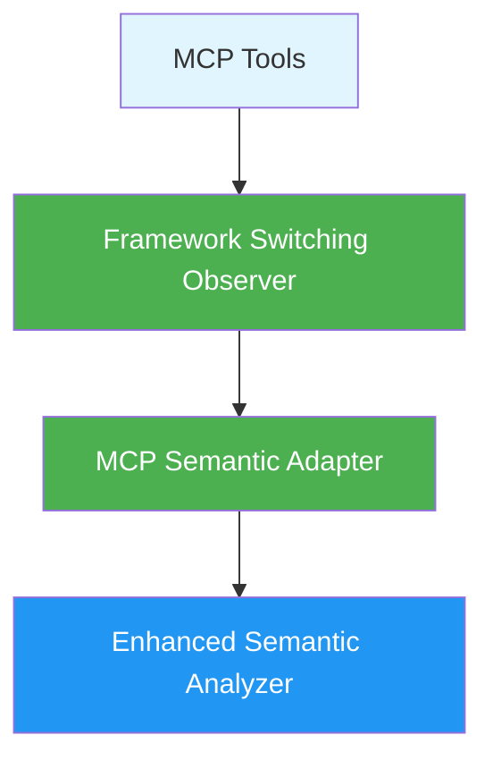

# MCP Semantic Adapter - Phase 3 Simplified Architecture

## Overview

The MCP Semantic Adapter provides enhanced semantic analysis capabilities for MCP tools. Following Phase 3 simplification, it now serves as the core component for direct enhanced analyzer access through the simplified framework system.

## Architecture (Phase 3)



## Key Features

### 1. **Direct Enhanced Analysis**
- Single enhanced analyzer access
- Simplified event-driven architecture
- Framework switching observer pattern
- No legacy fallbacks needed

### 2. **Performance Optimized**
- Streamlined analysis pipeline
- Reduced complexity overhead
- Direct analyzer access
- Simplified error handling

### 3. **Event-Driven Integration**
- Framework switching observer for management
- Consistent FileObserver pattern
- Simplified configuration
- Direct analyzer initialization

## Usage Examples

### Current Usage (Phase 3)

```typescript
// Access via Framework Switching Observer
import { getFrameworkSwitchingObserver } from "../../runtime/observers/framework-switching-observer.js";

const frameworkObserver = getFrameworkSwitchingObserver(logger);
await frameworkObserver.initialize();

// Direct enhanced analysis
const result = frameworkObserver.analyzePrompt(prompt, true);
```

### Direct Adapter Usage

```typescript
import { McpSemanticAdapter } from "../frameworks/adapters/mcp-semantic-adapter.js";

const adapter = new McpSemanticAdapter(logger, {
  enableMultiFramework: false, // Simplified - single framework only
  maxFrameworks: 1,
  preferredFrameworks: ['cageerf']
});

const result = adapter.analyzePrompt(prompt, true);
```

## API Reference

### McpSemanticAdapter Class

#### Constructor
```typescript
constructor(logger?: Logger, config?: Partial<FrameworkAnalysisConfig>)
```

#### Core Methods

##### `analyzePrompt()` - Primary Analysis Method
```typescript
analyzePrompt(
  prompt: ConvertedPrompt, 
  includeFrameworkAnalysis: boolean = true, 
  frameworkId?: string
): PromptClassification
```

### Configuration Options (Simplified)

```typescript
interface FrameworkAnalysisConfig {
  enableMultiFramework?: boolean;      // Always false in Phase 3
  maxFrameworks?: number;              // Always 1 in Phase 3
  consensusThreshold?: number;         // Default: 0.7
  performanceMonitoring?: boolean;     // Default: true
  cacheResults?: boolean;              // Default: true
  timeoutMs?: number;                  // Default: 5000
  preferredFrameworks?: string[];      // Default: ['cageerf']
  conflictResolutionStrategy?: string; // Default: 'weighted'
}
```

## Framework Switching Observer Integration

The adapter is primarily accessed through the Framework Switching Observer:

```typescript
import { getFrameworkSwitchingObserver } from "../../runtime/observers/framework-switching-observer.js";

// Get observer instance
const observer = getFrameworkSwitchingObserver(logger);

// Initialize (creates MCP Semantic Adapter internally)
await observer.initialize();

// Check if ready
if (observer.isReady()) {
  // Direct enhanced analysis
  const result = observer.analyzePrompt(prompt, true);
  
  // Get underlying adapter if needed
  const adapter = observer.getAnalyzer();
}
```

## Performance Considerations

### Simplified Architecture Benefits

- **Single Framework**: No consensus building overhead
- **Direct Access**: No adapter layer complexity  
- **Event-Driven**: Consistent observer pattern
- **Optimized Config**: MCP-specific defaults

### Monitoring

```typescript
const stats = observer.getStats();
console.log({
  analysisCount: stats.analysisCount,
  successfulAnalyses: stats.successfulAnalyses,
  averageAnalysisTime: stats.averageAnalysisTime,
  uptime: stats.uptime
});
```

## Best Practices

1. **Use Framework Switching Observer**: Primary access pattern for MCP tools
2. **Initialize Once**: Call `initialize()` during application startup
3. **Check Readiness**: Use `isReady()` before analysis
4. **Monitor Performance**: Track analysis statistics
5. **Handle Errors**: Simple fallback to basic classification

## Migration from Phase 2

Phase 3 removed:
- Legacy analyzer fallbacks
- Multi-framework consensus
- Complex registry systems
- Migration helpers
- Feature flags

Simplified to:
- Single enhanced analyzer
- Framework switching observer pattern
- Direct adapter access
- Event-driven architecture

## Testing

```bash
# Run adapter tests
npm test -- --testPathPattern=mcp-semantic-adapter.test.ts
```

This simplified architecture provides enhanced analysis capabilities while maintaining the stability and performance needed for MCP operations.