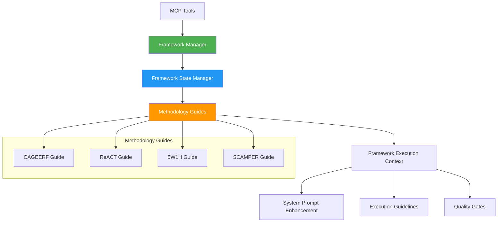

# Framework Methodology Guides

## Overview

The Framework Methodology Guides provide systematic, methodology-driven enhancement for prompt execution in the Claude Prompts MCP Server. Rather than performing analysis, these guides provide constitutional guidance on HOW to execute prompts according to established methodologies.

## Architecture



## Core Components

### Framework Manager (`framework-manager.ts`)
- **Stateless Orchestration**: Loads methodology guides and generates framework definitions
- **Dynamic Selection**: Framework selection based on user preference and execution criteria  
- **System Prompt Generation**: Framework-specific system prompt injection
- **Execution Context**: Enhanced context with methodology guidance

### Framework State Manager (`framework-state-manager.ts`)
- **Stateful Management**: Tracks active framework state and switching history
- **Runtime Switching**: Dynamic framework changes via MCP tools (`system_control`)
- **Performance Monitoring**: Framework switching success rates and metrics
- **Event Coordination**: Framework change notifications across system

### Methodology Guides (`/adapters/`)
Each methodology guide implements the `IMethodologyGuide` interface providing:
- Framework-specific system prompt guidance
- Template processing enhancements  
- Execution step guidance
- Quality validation criteria
- Methodology compliance validation

## Available Methodologies

### 1. CAGEERF Framework
**File**: `cageerf-methodology-guide.ts`  
**Approach**: Context, Analysis, Goals, Execution, Evaluation, Refinement, Framework

Comprehensive structured approach for complex analytical and problem-solving tasks.

**Best for**: Complex analysis, strategic thinking, comprehensive problem-solving

### 2. ReACT Framework  
**File**: `react-methodology-guide.ts`  
**Approach**: Reasoning and Acting pattern for systematic problem-solving

Iterative approach combining reasoning steps with concrete actions.

**Best for**: Multi-step problem solving, debugging, systematic investigation

### 3. 5W1H Framework
**File**: `5w1h-methodology-guide.ts`  
**Approach**: Who, What, When, Where, Why, How systematic analysis

Comprehensive information gathering and analysis using fundamental questions.

**Best for**: Information analysis, requirement gathering, comprehensive understanding

### 4. SCAMPER Framework
**File**: `scamper-methodology-guide.ts`  
**Approach**: Substitute, Combine, Adapt, Modify, Put to other uses, Eliminate, Reverse

Creative problem-solving framework for innovative thinking.

**Best for**: Creative tasks, innovation, alternative solution generation

## Usage Examples

### Framework Manager Usage

```typescript
import { createFrameworkManager } from '../framework-manager.js';

// Initialize framework manager
const frameworkManager = await createFrameworkManager(logger);

// Generate execution context for a prompt
const executionContext = frameworkManager.generateExecutionContext(prompt, {
  userPreference: "CAGEERF"
});

// Access framework-enhanced system prompt
const systemPrompt = executionContext.systemPrompt;
const guidelines = executionContext.executionGuidelines;
```

### Framework State Management

```typescript
import { createFrameworkStateManager } from '../framework-state-manager.js';

// Initialize state manager
const stateManager = await createFrameworkStateManager(logger);

// Get current active framework
const activeFramework = stateManager.getActiveFramework();
console.log(`Active: ${activeFramework.name}`);

// Switch frameworks
const result = await stateManager.switchFramework('ReACT');
if (result.success) {
  console.log(`Switched to: ${result.newFramework}`);
}
```

### Direct Methodology Guide Usage

```typescript
import { CAGEERFMethodologyGuide } from './cageerf-methodology-guide.js';

// Create methodology guide instance
const guide = new CAGEERFMethodologyGuide();

// Get system prompt guidance
const systemPrompt = guide.getSystemPromptGuidance({
  promptType: 'analysis',
  complexity: 'high'
});

// Guide template processing
const processingGuidance = guide.guideTemplateProcessing(
  template, 
  'template' // execution type
);

// Enhance prompt with methodology
const enhancement = guide.enhanceWithMethodology(prompt, context);
```

## API Reference

### IMethodologyGuide Interface

All methodology guides implement this interface:

```typescript
interface IMethodologyGuide {
  // Framework identification
  readonly frameworkId: string;
  readonly frameworkName: string;
  readonly methodology: string;
  readonly version: string;
  
  // Core methods
  guidePromptCreation(intent: string, context?: Record<string, any>): PromptCreationGuidance;
  guideTemplateProcessing(template: string, executionType: string): ProcessingGuidance;
  guideExecutionSteps(prompt: ConvertedPrompt, semanticAnalysis: ConfigurableSemanticAnalysis): StepGuidance;
  enhanceWithMethodology(prompt: ConvertedPrompt, context: Record<string, any>): MethodologyEnhancement;
  validateMethodologyCompliance(prompt: ConvertedPrompt): MethodologyValidation;
  getSystemPromptGuidance(context: Record<string, any>): string;
}
```

### Framework Manager Methods

```typescript
class FrameworkManager {
  // Framework selection and context generation
  selectFramework(criteria: FrameworkSelectionCriteria): FrameworkDefinition;
  generateExecutionContext(prompt: ConvertedPrompt, criteria?: FrameworkSelectionCriteria): FrameworkExecutionContext;
  
  // Framework management
  getFramework(methodology: string): FrameworkDefinition | undefined;
  listFrameworks(enabledOnly?: boolean): FrameworkDefinition[];
  getMethodologyGuide(frameworkId: string): IMethodologyGuide | undefined;
}
```

### Framework State Manager Methods

```typescript
class FrameworkStateManager {
  // State management
  getActiveFramework(): FrameworkInfo;
  switchFramework(frameworkId: string): Promise<FrameworkSwitchResult>;
  
  // History and monitoring
  getFrameworkHistory(): FrameworkHistoryEntry[];
  getFrameworkMetrics(): FrameworkMetrics;
  isHealthy(): boolean;
}
```

## Integration with MCP Tools

### Framework Switching via system_control

```bash
# Switch to CAGEERF framework
system_control switch_framework --framework CAGEERF

# Check current framework status
system_control status

# List available frameworks  
system_control list_frameworks
```

### Framework-Enhanced Execution via prompt_engine

The framework system automatically enhances prompt execution:

```bash
# Framework enhancement applied automatically based on active framework
prompt_engine >>analyze_data input="sales data" --execution_mode template
```

## Configuration

### Framework Selection Criteria

```typescript
interface FrameworkSelectionCriteria {
  promptType?: string;           // Type of prompt being executed
  complexity?: 'low' | 'medium' | 'high';  // Complexity level
  domain?: string;               // Domain-specific considerations
  userPreference?: FrameworkMethodology;    // Explicit user preference
  executionType?: 'template' | 'chain';    // Execution strategy
}
```

### Framework Definitions

Each framework provides:
- **System Prompt Template**: Methodology-specific guidance
- **Execution Guidelines**: Step-by-step methodology application
- **Applicable Types**: Suitable execution modes
- **Priority**: Selection priority when criteria match

## Quality Enhancement

### Template Enhancements

Methodology guides provide template enhancements:
- **System Prompt Additions**: Methodology-specific guidance
- **User Prompt Modifications**: Template structure improvements
- **Contextual Hints**: Execution context enhancements

### Quality Gates

Framework-specific quality gates ensure methodology compliance:
- **Validation Criteria**: Methodology-specific validation rules
- **Compliance Scoring**: Quantitative compliance assessment  
- **Improvement Suggestions**: Specific enhancement recommendations

## Performance Considerations

### Framework Switching
- **Runtime Switching**: No server restart required
- **State Persistence**: Framework state maintained across sessions
- **Performance Monitoring**: Switching success rates tracked

### Template Processing  
- **Guide Caching**: Methodology guides initialized once
- **Context Reuse**: Execution contexts cached for performance
- **Selective Enhancement**: Framework enhancement applied only when beneficial

## Best Practices

### 1. Framework Selection
- Use **CAGEERF** for comprehensive analysis and strategic thinking
- Use **ReACT** for multi-step problem-solving and debugging
- Use **5W1H** for information gathering and requirement analysis
- Use **SCAMPER** for creative and innovative thinking tasks

### 2. Integration Patterns
- Let the framework manager handle framework selection
- Use framework state manager for runtime switching
- Access methodology guides directly only for specialized use cases

### 3. Quality Assurance
- Validate methodology compliance for important prompts
- Use framework-specific quality gates for critical executions
- Monitor framework switching success rates

### 4. Development
- Implement `IMethodologyGuide` interface completely for new methodologies
- Provide comprehensive system prompt guidance
- Include methodology validation and enhancement capabilities

## Testing

```bash
# Test methodology guides
npm run test:methodology-guides

# Test framework manager
npm test -- --testPathPattern=framework-manager.test.ts

# Test framework state manager
npm test -- --testPathPattern=framework-state-manager.test.ts
```

## Extension Points

### Adding New Methodologies

1. Create new methodology guide class implementing `IMethodologyGuide`
2. Add to `/adapters/index.ts` exports
3. Update Framework Manager to include new guide
4. Add tests for new methodology

### Custom Framework Integration

The system supports custom methodology guides by implementing the `IMethodologyGuide` interface and registering with the Framework Manager.

---

This framework system provides systematic methodology-driven enhancement for prompt execution while maintaining flexibility and performance. Each methodology guide serves as a constitutional guide for HOW to approach different types of tasks, rather than performing analysis of WHAT the task requires.